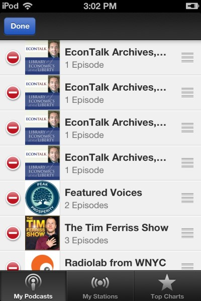
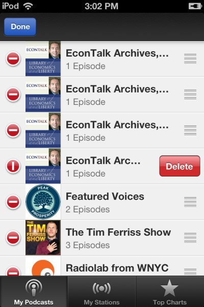

For a long time, I have been unable to figure out how to remove a podcast from my iPod. I can delete episodes, but not remove the actual podcast. You'd think this would be something you could manage easily from iTunes, but nothing with iTunes is easy. I consider iTunes to be the second worst piece of software ever written. Adobe Shockwave Flash is first.

Anyway, it was a comment buried on a forum that finally answered this riddle. I decided to share what worked along with screen shots. Hopefully this post helps someone.

### #1 Run Podcast Application

The list of My Podcasts will appear.

### #2 Pull Down on the Screen With Finger

Doing this non-intuitive move will uncover the Edit button and the key to removing podcast. This is awful user interface design. Dear Apple, if you are going to be cool and bury the Edit button at the list level, at least offer a second method of deleting the podcast at the record level.

### #3 Click Edit button in upper left

Doing this will place a red icon beside each podcast.

### #4 Click the Red Icon of the podcast you wish to delete

Once the red circle is pressed a Delete button will appear. Press Delete and then the Done button at the top.

That is it. Those zombie podcasts you unsubscribed to months ago can now be removed. The above screenshots are examples. I would never remove EconTalk.

---

## Comments

### Mike
*June 28 at 2014 at 2:41 AM*

with you on this one. Recently had to buy a new Ipod when my old one died.
Got a new Ipod Nano and found out they eliminated the alarm clock function.
And speaking of non intuitive had to go online to figure out how to program the clock to turn off  ipod when in sleep mode. The instructions that come with it are useless.  You would think at least they could have a comprehensive set of instructions as a text file on the ipod.
For gods sakes! Apple is supposed to be king of intuitive.

---

