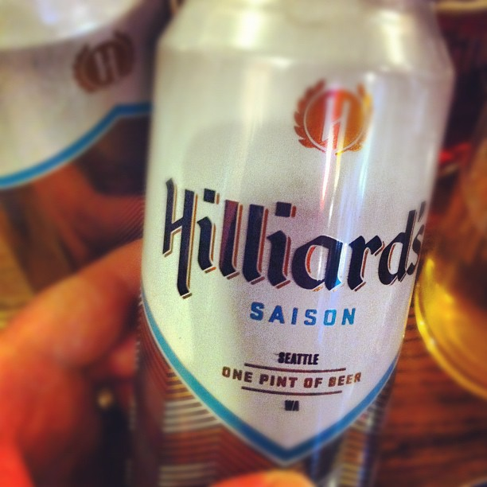

Up until Friday, my [last full beer](/2010/03/saying-goodbye-to-beer/) was in September 2009. When I discovered gluten was causing me issues, I stopped drinking beer. Other types of alcohol didn't really interest me, so I stopped drinking completely. I never drank that much, so it was no big loss. But starting last year, I started missing the microbrewery experience.

I live in the Ballard neighborhood of Seattle, which has become one of the hottest areas in the country for craft beer. There are now 10 microbreweries in a 2 mile radius. That is a lot.

Last autumn I started testing my gluten sensitivities (see [Was I Wrong About Gluten?](/2013/09/wrong-gluten/) for reasons). First with trace amounts of soy sauce and restaurant gochujang. No problems. Then I started to experiment with a few ounces of beer. I had mixed results. Once I drank 10 ounces of beer and felt horrible. So for the past few months I've had a few ounces of beer maybe once a month.

On Friday I decided to drink a full beer. Prior to drinking the beer I ate a [raw carrot](https://www.functionalps.com/blog/2012/09/28/ray-peat-phd-on-the-benefits-of-the-raw-carrot/) and took some activated charcoal. I also decided not to stress about it. I told myself I was going to be fine and I was. My face didn't turn red. No headache. I slept fine.

_[Photo](https://www.flickr.com/photos/luxuryluke/6887498138/) by Luke Dorny. Hilliard's Saison was my first beer back. Brewed in Ballard and my favorite style of beer._ 

Avoiding gluten if you find yourself gluten sensitive is an excellent goal. Doing this will give your body a chance to heal from whatever damage the gluten caused. However, unless you are Celiac, your next goal should be to cure the underlying problem that caused the gluten sensitivity to begin with. It might take months, years or it maybe it will never happen.

My health goals are not about seeking optimal, but about being [resilient](/2012/05/healthy-vs-resilient/). Although I have zero plans to eat bread anytime soon, I would like to enjoy an Asian meal without stressing out about the tiny amount of wheat in the soy sauce or gochujang. And I'd like to share a beer with friends. Last Friday I did both.

---

## Comments

### sheila
*June 3 at 2014 at 9:11 PM*

YAYYY!  sorry, but i just love beer!

---

### Angelo
*June 3 at 2014 at 10:41 PM*

Just curious...why not test your resilience with bread, too? Rainier Organic Bakery (http://www.rainierorganicbakery.com/about-us/) is a small(ish), local, family-owned bakery that makes organic, sprouted grain products.

---

### MAS
*June 4 at 2014 at 12:09 AM*

@Angelo - I could. Let me do some more beer tests first. :) Seriously, I've never really cared much for bread.

---

### thomas
*June 5 at 2014 at 2:05 AM*

drinking is just stupid.  I used to do it as well but then asked myself 'who am I trying to please?' when I drank socially.  Finally, once I was drinking and due to the bartender making doubles and triples I got unexpectedly drunk.  I was so out of it I needed a breath of fresh air and ended up falling and cutting my hand.  That could have been my nose or jaw and from then on just haven't drank at all.  

Anyways, drink if you wish but just be conscious of "why?" are you drinking.  Most people arent' as it sometimes a painful and depressing question to face (escapism, not be held accountable, naturally inhibited, etc.).

---

