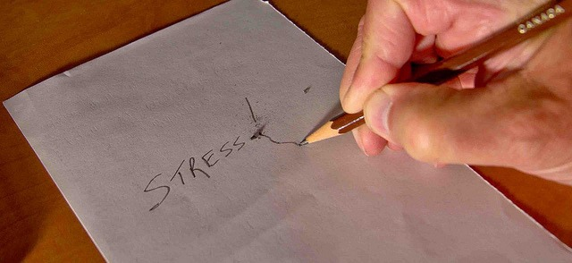

It isn't very often that a true insight into our own health hits, but I believe I had one a few weeks ago.

Longtime readers of this blog know that I tackled and overcame my back pain issues years ago. After I admitted that I didn't understand what caused my back pain, I did a lot of research and came to the conclusion that the pain was [rooted in stress](/2011/02/the-psychology-of-back-pain/).

The back pain was most likely to flare up when I tried unsuccessfully to control something beyond my control. Once I saw the pattern I was able to learn how to release control and the back pain went away. Then for a few years, I rarely got any back pain. When I did, I would reflect on what I was trying to control, change my response and the pain would go away.

After tackling the back pain, I went after headaches. After 3.5 years of quantified self-tracking, I came to the conclusion that stress was likely the cause of my headaches. In that case, it was the tracking that made things worse. [My Last Post on Headaches](/2014/04/last-post-headaches/) goes into more detail on my thoughts.

### Some Questions

Earlier this month the back pain started up again. This wasn't a concern since I was confident that I could address it in a way to make it go away. But some interesting questions popped into my head.

1.  I believe stress is the root of both my back pain and headaches. Yet I can't recall a single time where I had both back pain and a headache simultaneously. Why?
2.  Is the stress associated with back pain different from the stress associated with headaches?
3.  My headache pain typically starts very early in the morning (~3 AM). My back pain would most likely hit in the early afternoon (~ 3 PM). Why?

I chewed on these questions for a few days and I think I discovered the answers.

_[Photo](https://flic.kr/p/cWzfm3) by Light Collector_

### Back Pain = Stress Triggered by Environment

The back pain was triggered by an environmental or external stress. It was me pushing against the world and not getting the response I desired. From my January 2011 post [How I Figured Out the Cause of My Back Pain](/2011/01/how-i-figured-out-the-cause-of-my-back-pain/):

> Every date that I wrote down was during a period that I didn't feel in control. The stock market went against me or I got stuck in traffic or something similar.

The two examples that came to mind the quickest were stressful events triggered by something external and outside my control: the stock market and traffic. Earlier this month I was forced to [leave both my home](/2014/06/leaving-seattle-months/) and venture off into an area of the country unknown to me. This explains the back pain as my response to an external stressor.

### Headaches = Stress Triggered By Self

The headaches were frequent when I was trying to force an internal change. Primarily and ironically, getting rid of the headaches. Endless n=1 tests compounded the stress that I was failing at solving the riddle of the headaches. Once I gave up the pressure to solve the headaches, they almost completely went away. And this is why I rail [against Quantified Self](/2014/04/honesty-quantified-self/).

Headaches were common when I was trying to change myself. They occurred when I didn't see an external barrier. Like the back pain, the roots were the inability to accept things outside my control. The solution lies in acceptance.

### Just a Theory

This is my first pass at a theory to explain the differences between stress-induced back pain and headaches. It might be incomplete or wrong. I'd love to hear from others that have dealt with both back pain and headaches and if they've noticed a pattern. I'm also interested in neck pain, as it doesn't line up neatly with either side.

As for the first question. Why don't I ever get both at the same time? Just a guess but I'd bet that my subconscious is assigning a primary source of blame and pursues the path of pain that accomplishes its goal of distracting me from what it sees as a greater pain - which is the feeling of being powerless.

---

## Comments

### Pauline
*July 30 at 2014 at 10:03 AM*

That's very insightful.  I think resistance is a main stressor.  Whether you are resisting something you encounter in life or feel resistance to something you are aware of within.  Sometimes the act of consciously letting it go for now (even after some struggle), brings some relief.  When I give up trying to solve something and live with the conundrum - that seems to free up things.  Sometimes surprising things happen, some understanding appears out of the blue.  Or things spontaneously settle down.

---

### MAS
*July 30 at 2014 at 4:08 PM*

@Pauline - Well said. Like the use of the word resistance.

---

### Bill
*July 30 at 2014 at 5:53 PM*

Interesting points about stress, resistance, and letting go.  I've dealt with significant back pain for years and while I have a herniated disc, what I deal with the most is very tight muscles, which ends up manifesting itself as back pain.  The problem has become that I'm consumed with trying to "figure it out" and as yet have been unable to let it go.  When you are constantly feeling pain it's so hard to not think about it.  I had a brief break after reading one of Dr. Sarno's books but a bad episode ended that and I haven't been able to let it go again.  I'll have to really think about your points about pushing back or not getting what I want MAS.

---

### Geoff
*July 31 at 2014 at 4:47 PM*

Very interesting hypothesis.  I know my headaches (migraines) had some very specific environmental triggers but internal stress would also trigger them.  Perhaps your explanation also explains why meditation was effective for me. Did focusing on the pain without judging or trying to control it mitigate my migraine-inducing stress?  So glad I no longer get frequent headaches.  Hope this idea of yours helps you work through your headache issues.

---

### MAS
*July 31 at 2014 at 5:54 PM*

@Geoff - When I first get pain now, my focus is not on "how do I fix this", because that acknowledges the pain as valid. First I question the validity of the pain. If I injured myself, then it is obvious and I will pursue a rest and recovery strategy. Otherwise, I will begin to question the true source. That act of questioning usually reduces or eliminates the pain - either in intensity or frequency or both.

---

