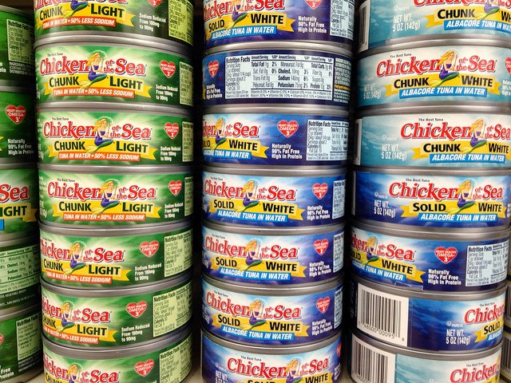

Two days ago I posted [Just Count Protein For Fat Loss](/2014/07/just-count-protein-fat-loss/), which theorizes that the minimum effort one needs to do to lose weight is increase protein. Get the grams you need and that should reduce appetite, create a caloric deficit and trigger fat loss.

Now I am thinking about timing. If I need to consume 143-191 grams of protein a day and I know roughly how many meals and snacks I will eating, then I need to be cognizant of my running protein total as the day progresses. My first day I raced to hit 144 grams before bed. Yesterday I hit 210 grams. This will take a little practice, but I am carrying around a notepad to help me.

### 30 grams of Protein First

To ensure I am both getting a high level of protein and that the protein I am getting has the best chance to curb my appetite, I've created a rule that I will eat Protein and Veggies first. I will shoot for a 30 gram minimum goal when I eat. After eating protein and veggies, I will then wait before reaching for carbs and fat.

I don't think carbs and fat are bad, but I want to make sure that I am truly hungry. Several sites recommend waiting 20 minutes before getting a second helping of food. So I will consider Protein + Veggies to always be serving #1.

### Eat Staples

I'm a food explorer, so the idea of eating the same foods over and over is not appealing on the surface. However, I've learned from a few fitness professionals that athletes that carry a low amount of body fat tend to eat many staples. In my case, I am trying to eat more protein. As many food options as there are, there isn't a lot of 30+ gram protein options. Meat, eggs, fish, protein powder and some dairy.  To get 144-191 grams of protein consumed a day will require staples.

I can still be a food explorer while I get lean, I just need to eat the protein first.

_[Photo](https://www.flickr.com/photos/113026679@N03/14004094666/) by David Mulder._

---

## Comments

### Angus
*July 9 at 2014 at 7:13 PM*

Hey, first time I comment, nice blog, one of the few that doesn't treat diets as a religion.
Have you thought about trying sprouted lentils? They are a complete protein source, pretty low carb and high in fiber (a higher fiber intake means less calories absorbed).
I wouldn't feast on tuna, too much mercury to be eaten regularly, also BPA, bad processing methods and other things that don't really concern me.

---

### MAS
*July 9 at 2014 at 7:41 PM*

@Angus - Thanks. Yes, I was looking at lentils the other day. Need to add them back into the routine. I'm not concerned about mercury, because I supplement with selenium.
https://chriskresser.com/is-eating-fish-safe-a-lot-safer-than-not-eating-fish/

Plus this is **hopefully** just a short term diet.  Tuna isn't that tasty to me.

---

### Jim
*July 9 at 2014 at 11:08 PM*

A few years back I followed a blog of a guy who only ate meat for a year (I can't remember the name).  He was surprised that he didn't lose any weight.  Much of the "meat" was home made pemmican though, which I assume encourages greater calorie consumption than plain meat.  I know you're not doing anything like this, but your protein comments made me think of it.

---

### Angus
*July 10 at 2014 at 11:58 AM*

Didn't know about selenium effects on mercury, nice.
By the way, I would look into this: https://dl.dropboxusercontent.com/u/10924601/31minutes%27%20AMA%20for%20r_leangains.pdf
I'm following it with strong results, already lost 6 pounds at 14% bodyfat, started 4 weeks ago, half of the pounds were water weight, the others are hopefully fat.
Good luck with your cut!

---

### Pauline
*July 10 at 2014 at 1:13 PM*

Just out of interest, my partner has being following a fast 5 diet, coffee with milk on waking in the morning and not eating until suppertime in the latter part of the day, a 5 hour eating window.  So far lost 13 pounds, and he restricts nothing - not carbs, wine or sugar.  Its the long period without eating that drives insulin down and gets the body burning fat stores creating insulin sensitivity I think.  So far working well for him, he is very busy in the day and doesn't notice or really miss not eating, he says he has more clarity/energy at work and really looks forward to night time extended meal with no guilt and no worry.  I cannot go that long without food so I am eating within a longer window more like 7 to 8 hours, with some flexibility each day.  The fast 5 diet is available as a free e-book online.  Very simple to follow, because we no longer eat breakfast and cooking one meal a day is much easier and shopping a lot simpler too.   We eat high protein and fat and some carbs in that evening meal.  He reckons this way he is cutting out about 500 calories a day or on average eating one less meal a day.  The weight has been coming off steadily at an average of a pound a week.

---

### MAS
*July 10 at 2014 at 3:02 PM*

@Angus - Looked it over. I disagree with several of the recommendations. High protein for bulking? Nope. I do think that high protein for fat loss is accurate for reasons I cited in the previous post, but 40% might be too much. Getting 40% of calories as protein is going to be difficult for me. I'm already finding it hard to hit 30%.

@Pauline - That much fasting would destroy me. When I did Leangains (16 hours) for 70 days, I felt awful by the end. Cold and tired.

---

### Pauline
*July 10 at 2014 at 6:45 PM*

Yes, this Fast 5 style of eating is for a period of weight loss, probably another 6 weeks or so, and then settling down into finding out how the body has adapted and figuring out what to do next.  Fast 5 says that if you are not doing well in that eating window, to either increase your food consumption, or increase the hours you are eating, or do fasting on a more intermittent basis once or twice a week.  Its quite possible with no restrictions or limitations on what you eat, to eat more than you require in those 5 hours, if you want.  But keeping the fasting period a bit longer each day is mainly about giving the body time to heal and repair (for me that is the focus at the moment).  Then eating nutritional very well in the eating window.  I find 7 to 8 hours of eating is easy for me.  There is a lot of talk in the UK on fasting for health benefits, i.e. arthritis, inflammation or other diseases.  Free the animal, has a post on fasting for longevity and health benefits today.  Fascinating stuff.

---

### MAS
*July 10 at 2014 at 7:02 PM*

@Pauline - Just read the FTA post. This part rings true to me.

<blockquote>Chronic under eating comes with a whole host of problems, not the least of which is that your body gets very good at making you not exert much energy, all while it guards every molecule of energy it can keep. In short, it can really mess up a metabolism, along with hormonal regulation.</blockquote>

I also now believe the fasting for repair argument only tells half the story. I cover my thoughts more in this post:
https://criticalmas.org/2014/02/intermittent-fasting-paleo-didnt-teach/

---

### Pauline
*July 10 at 2014 at 7:17 PM*

I think we are all so unique in our responses to food or fasting.   The main reason I am reading up on it again is to isolate the foods that are probably part of an inflammation response for me - white potatoes, chocolate, cheese, wheat, wine and even caffeine.  The coffee will be hardest to eliminate.  Milk too.  Its easier to identify the responses, i.e. if I don't have milk in the morning but have it had midday, my body has had longer break overnight and I get an immediate response, stuffy nose etc.  Sore wrists, white potatoes seem to be implicated. So 18 to 24 hours without eating a particular food, then eating it and noticing any response.  I have found daily probiotics do help but still there seems to be some sort of cycle of food intolerance/allergy/craving involved along with signs of inflammation.  Wheat is easy to eliminate but all the other stuff is tougher.

---

### MAS
*July 10 at 2014 at 7:23 PM*

@Pauline - Been reading about the anti-inflammatory benefits of glycine. Might help?  
http://freetheanimal.com/2014/07/evidence-therapeutic-benefits.html

---

### Pauline
*July 10 at 2014 at 7:35 PM*

Yes, glycine/gelatine is something I have read about too.  I tend to make soups and put in dissolving gelatine but its summer here so haven't made soup for a few weeks.  What form do you take it in or have heard recommended?

---

### MAS
*July 10 at 2014 at 7:37 PM*

@Pauline - So far just Great Lakes Gelatin in water and beef stock. Will likely experiment with glycine directly later this year.

---

### James
*July 11 at 2014 at 9:50 AM*

Lunch for me today consists of chickpea and lentil soup and chard salad (from the allotment) with kimchee and a tin of tuna.

Tinned fish is a staple for me personally, though I usually prefer tinned mackerel or sardines in either brine or tomato/spicy sauce.

---

### BigTex
*July 11 at 2014 at 1:56 PM*

@Pauline-  its called the Warrior Diet...

---

### BigTex
*July 11 at 2014 at 2:02 PM*

There are plenty of high class athletes (especially older ones) that do just fine on 1 meal a day...it is just a matter of SLOWLY conditioning yourself to it...

---

### BigTex
*July 11 at 2014 at 2:10 PM*

One great example is Nolan Shaheed...look him up!

---

### Pauline
*July 12 at 2014 at 1:51 PM*

The Warrior and Fast 5 are very similar, the Warrior Diet advocates fruit/vegetables/salads and small amounts of protein, probiotics and vitamin supplements during the day (i.e. undereating in the day) then overeating or eating until full satisfaction in the evening meal but having protein, fat and keeping the rest of the meal preferably low glycemic where possible.  The fast 5 diet advocates an eating period of 5 hours (any time you choose) and includes fasting for 19 hours.  There are no restrictions of any food groups in the The fast 5 diet - the book is free to download online.

---

### MAS
*July 12 at 2014 at 1:55 PM*

Speaking of the Warrior Diet, I did a post on it and linked to my notes from the book here:
https://criticalmas.org/2009/04/revisiting-the-warrior-diet/

---

### Angus
*July 13 at 2014 at 6:40 PM*

At the end of the day, meal timing is almost irrelevant. Fasting is just a way to manage your hunger. The hormonal and cellular impact is just a drop in the ocean.

For me, it's just the convenience of eating one big meal a day, I really enjoy eating 2300 kcal at the end of the day. :D

---

### MAS
*July 14 at 2014 at 2:59 AM*

@Angus - I agree with you. However the one edge fasting does provide is it teaches one to be OK with hunger. This I believe helps one pause when it comes time to make a food choice. The pause can provide time to prepare something healthy instead of reaching for quick calories. Before I ever started fasting, I HAD TO EAT as soon as I got hungry and this at times lead to poor food choices, including hyper-palatable foods that easy to eat in excess.

---

### Pauline
*July 15 at 2014 at 8:17 AM*

I like your last comment on fasting/hunger, learning to be ok with some hunger by skipping a meal or two- nice summary.

The ease of eating less meals is also a factor, less thinking about food is a bonus.

---

### Henry
*August 3 at 2014 at 5:57 PM*

I follow a similar rule(s), though take a slightly different approach. I try to sequence my meal(s) to the following order:

1) Water with raw apple cider vinegar / half a lemon
2) most of the meal's fiber + fat, less protein
3) protein (most of the meal's protein)
4) any significant carbohydrates (starch/fruit) 

http://perfecthealthdiet.com/2011/10/how-to-minimize-hyperglycemic-toxicity/

I sequenced this by the effect on lowering the insulin response from fiber as well as fat have; and, eating the foods that raise the insulin response (carbs, of course, but even protein) to the latter part of the meal.

I make an effort to space out my meal, as well as make following these rule(s) more of a priority as the calorie content of a meal / carbohydrate source increases. 

Thoughts?

Glad to see you blogging again.

Henry

---

### MAS
*August 4 at 2014 at 12:24 AM*

@Henry - Does lowering the insulin response affect appetite? I don't believe there is a consensus on that. Since I no longer believe in the insulin theory of obesity, I stopped looking at reducing insulin response.

http://gettingstronger.org/2011/02/does-insulin-make-you-fat/

What do you think the ACV is doing? I've heard concerns it is bad for the enamel of your teeth, but I never investigated. I suppose one could use a straw.

---

