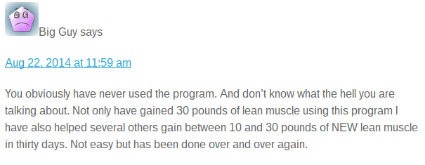

_Most of the 10,000 comments this blog has received since December 2005 are respectable and informative. This post is about one comment that was neither. Comments like this represent less than 1% of the total comments received._  On a few fitness posts, I have started closing comments. I usually wait a few years, which is more than enough time for everyone to provide feedback. Comments that pop up two or more years after the post was published are rarely insightful. They are often written by some blowhard, usually with a fake name, on how he is great and how I am wrong. Rarely does the final commenter bring new facts to the table. Here is the FINAL comment on my [How Tim Ferriss REALLY Gained 34 pounds of Muscle in 28 Days](/2011/01/how-tim-ferriss-really-gained-34-pounds-of-muscle-in-28-days/) post. A post that was published on January 20, 2011.  My critic uses a fake name, calling himself _Big Guy_. If you are going to use a fake name, at least use one that we can at least take seriously. Do you think anyone at the gym is saying "I learned something useful from _Big Guy_ today."? Now let me pick apart his comment.

> BG: You obviously have never used the program.

Whether I used the program or not wasn't relevant to the post. The post detailed how Tim Ferriss used weight manipulation to "gain 34 pounds of muscle". If Big Guy had read the post, he would have read this sentence in the second paragraph.

> MAS: I also agree that  his training and eating protocol are solid programs for mass gaining.

I didn't just add the bold. It has been there for almost 4 years. Then in a follow-up comment, I said this about Tim's HIT training.

> MAS: I’m a huge fan of slow lifting HIT. It is the most effective lifting strategy I've ever used.

So I defended Tim's training protocol twice. Big Guy must have missed that. He continues.

> BG: And don’t know what the hell you are talking about.

Point out to me one thing I got wrong in that post. Pull out The 4-Hour Body (4HB) and then pull out The 4-Hour Workweek (4HWW). Read Tim's own account of his weight. Line up the dates for yourself. Then read the chapter in the 4HWW where he details how he was able to manipulate his weight while competing in Japan. If you just read the 4HB, you are getting the filtered version. I was fortunate to have read and recalled that info in 4HWW prior to reading the 4HB. Big Guy continues:

> BG: Not only have gained 30 pounds of lean muscle using this program I have also helped several others gain between 10 and 30 pounds of NEW lean muscle in thirty days.

The difference between 10 and 30 is staggering. Here is what I said about 10 pounds.

> MAS: Ten pounds is commendable and it is more realistic for an untrained lifter who is working out hard and eating like crazy.

Thirty pounds of new muscle in a month is not realistic. It might be possible, but it is nowhere near realistic. Give me a malnourished teenager from Samoa and I might have a chance to get 30 pounds on him in a month. But for 99.99% of lifters, it isn't going to happen. Finally, if you were able to help several others gain so much muscle in a month, how do you find time to comment on posts from 2011? I would think you'd have clients lined up around the block throwing money at you. In fact, your name would be known in the fitness community. You wouldn't need to use fake names on blog comments. And your client base would be proof that you were correct. You wouldn't need to waste your time trying to correct me. _Geek to Freak_ is still a hoax. Do you know how I know? The book has been out since December 2010. It was a bestseller. Between the book and the supporting blog post, I wouldn't be surprised if it had an audience of 1 million. Most of them are young healthy males seeking to gain more muscle. Yet almost nobody is still talking about this chapter. It came and went. If it were realistic, there would be A LOT MORE success stories and we would still be talking about it.  _The Fremont Troll_ My patience for disrespectful fitness comments is wearing thin. I don't get paid for this. The fitness posts I do are mostly how I would speak to a younger version of myself, with the basic message of **don't believe nonsense** and **don't get hurt**. If you want to believe fitness fairy tales of muscle gain, [knock yourself out bro](/2014/11/knock-bro/).

---

## Comments

### Stuart
*August 28 at 2014 at 10:59 PM*

Michael,
             Keep the faith my friend, there are many of us out there, I'm sure, who like your writings and respect your views.

---

### MAS
*August 29 at 2014 at 12:26 AM*

@Stuart - Thank you. I very happy with the majority of comments. Just a handful are problematic and they tend to be on older posts.

---

### Nigel
*August 29 at 2014 at 10:54 AM*

The internet has two sides.
The good: An almost infinite supply of information.
The bad: An almost infinite supply of arseholes/assholes.

Can you block/black-list arseholes/assholes with your commenting system?

---

### Geoff
*August 29 at 2014 at 12:29 PM*

Totally agree with @Nigel the the Internet has 2 sides.  Back in the 1990s "Dot Com" boom I remember hearing the mantra: "The best thing about the Internet is that it gives everyone a voice.  The worst thing about the Internet is that it gives everyone a voice."

MAS, you're certainly correct that comments coming in years later are unlikely to be helpful, but how many good comments do you get even 6 months later?  Perhaps you could start closing comments on all posts after 90 days?  Since you include your email address on the site anyone who wants to engage with you on an older post could write you an email offline.  Most trolls wouldn't bother emailing nonsense just to you.  If valuable enough, an email follow up on an older post and your thoughts could serve as an update or the basis for a new post.

Certainly not worth engaging a troll (nice pic choice, BTW), but I wonder whether "Big Guy's" comments about following Ferris' program also include the points about steroids and hydration that you discussed in the blog post.

---

### MAS
*August 29 at 2014 at 1:20 PM*

@Nigel - Yes I can block people and I have. Only about 8 though in 14 years. Most were spammers. One was a pervert. Only one was a hostile brotard.

@Geoff - My concern is missing valuable comments by using a days since posting rule. I think my current strategy of selectively closing comments on older posts that seem to attract bad comments is probably the best for now. I will consider this again though.

---

### Jim
*August 29 at 2014 at 1:42 PM*

MAS,
Great post.  
Just a thought.  For sake of non-regular readers that find this post through random browsing, you might want to put a more explicit note at the top that distinguishes a) stupid "troll" comments from b) uninformed comments and c) opinions that differ from yours.  I mention this because, unlike some other sites, you seem very open to categories b) and c).

---

### MAS
*August 29 at 2014 at 5:12 PM*

@Jim - Great point. I added a new intro paragraph.

---

### GSpivey
*August 29 at 2014 at 5:29 PM*

Great comment!  Have you ever considered doing a post about height gaining exercises.  I find that I have gained quite a bit via use of inversion boots.  Would love to know your thoughts on this.

---

### MAS
*August 29 at 2014 at 5:54 PM*

@GSpivey - Never even thought about the topic of height gaining. I'm tall enough. If I gain an inch it will just make driving and air travel more uncomfortable.

---

### Ragan
*August 29 at 2014 at 6:30 PM*

Michael, 

I keep discovering old posts of yours. I discover them all the time because of the depth of content on your site. I appreciate that you are willing to keep comments open on old posts but I understand that there has to be a cutoff. 

It is always shocking to me how people can comment on a post in such a way that it's obvious they didn't read it carefully. I find your posts to be very balanced and thoughtful and am always surprised when they happen to trigger a venomous reaction. 

Trolls, indeed.

---

