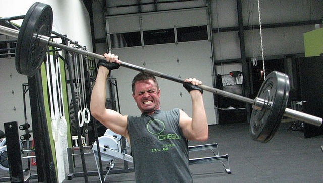

I've seen a few proponents of CrossFit try and claim because of the randomness of the daily workouts (WOD) that they are following the principles of Antifragile. For those unaware _Antifragile_ is a book written by Nassim Taleb describing a state for which we do not have a word in the English language. Fragile means something easily breakable. Not fragile means it is not easily breakable. Antifragile goes further and states that the stress will make the object better than it was before. Exercise can clearly be both. If you provide a safe stimulus and allow time for recovery, your muscles will get stronger. If safety or recoverability is compromised, then what could have been Antifragile just becomes fragile. CrossFit workouts might be random, but the body does not require randomness to gain strength. Get the weight, volume, recovery, form, or tempo wrong in CrossFit and you will be sidelined with injuries that create damage far worse than the benefits received. The losses are not limited. One bad rep of a poorly selected exercise can sideline you for weeks, months, or years. For exercise to be truly Antifragile it must be safe. It need not be random. To construct an exercise plan that is Antifragile, one should solve for safety first. The movement should have a very low skill component because the more difficult the exercise the harder it will be to perform safely under load and fatigued situations. CrossFit uses compound movements that have high skill requirements. CrossFit solves for power and strength first and then attempts to make it safer. And they aren't always successful as a lot of people get injured from either compromised form, using too much weight, or too much volume. I believe you can construct an exercise plan that is safe, effective, and antifragile with High-Intensity Training (HIT). The Big 5 Workout as described in _Body By Science_ has a machine-based plan and [Hillfit 2.0](/2013/07/hillfit-2-0-a-zero-budget-approach-to-high-intensity-training/) has a bodyweight approach. Both are designed for safety first. The skill needed to perform each movement is extremely low. By slowing down the movement and removing momentum, you not only end up using less weight, but you aren't powering through weak points in the repetition. The progression path of increasing weight or time under load on an exercise that allows one to go to failure is safe by design as long as it is performed slowly. That makes HIT Antifragile.  _[Photo](https://flic.kr/p/dvb6MK) by crossfitpaleodietfitnessclasses. A static hold or slow press with lighter dumbbells would not only be safer but just as effective for building shoulder strength._ This post is not meant to start a battle with CrossFit. Even Taleb got it wrong. In the post [What Taleb Got Wrong in Antifragile](/2013/01/what-taleb-got-wrong-in-antifragile/), I use the author's lessons to discredit his approach to exercise as not being Antifragile.

---

## Comments

### Jim
*August 15 at 2014 at 7:56 PM*

MAS,
Nice post.  I agree.  
But CF does appear to have some psychological aspects on its side.  Namely, the measurement of parameters and especially social aspects.  In general, it looks like CF is more fun than HIT.  Of course, you could argue that it is better to separate strength training and "fun" sports activities. Also, while CF injuries cause setbacks and slow progress, I think many wouldn't even get started on a typical HIT plan.  Interesting article on BB today re: Why Techies Love CF.

---

### MAS
*August 15 at 2014 at 8:06 PM*

@Jim - Excellent points. I didn't enjoy HIT for over a month when I first started. CF does appear more fun to an outside observer. This is probably why HIT doesn't have more popularity. It just doesn't look as fun as other training methods. 

Found the article you mentioned. Here is the link for others. 
http://boingboing.net/2014/08/12/nerdfit-why-techies-love-cro.html

I would add a 7th reason to the sidebar list.
#7 Techies tend to be younger. Younger bodies have faster recoverability. They can survive a poorly designed program longer than someone older.

---

### masbetter
*August 15 at 2014 at 8:23 PM*

Oh god that photo. OUCH.

---

### Alex
*August 16 at 2014 at 2:34 AM*

I'd add the appeal of "hacking" fitness, especially among the Crossfit Endurance crowd. The idea that conventional training wisdom - and published data - is wrong, that there's a secret, better way, and that you've got it, is immensely appealing to a crowd that prides itself on "disruption". (This applies to their paleo fanaticism too, I think.)

---

### Scott
*August 16 at 2014 at 4:55 PM*

MAS: well taken.  So here is my Crossfit workout:

3 rounds of: 3 pullups, 6 pushups, 9 squats (air squat or use 8kg kettlebell) 
3 rounds of: 15 rope flips, 10 wallballs (10lbs)
3 rounds of: 500m ski-erg, .5 mile stationary bike

There are many different ways to combine that workout -- 3-3-3, 3-2-1, alter the combinations, add rowing instead of bike.  Low skill, minimal risk, and it's Crossfit.  It's takes me 20-40 minutes depending on how I combine the exercises. 

Cheers,
Scott

---

### MAS
*August 16 at 2014 at 9:50 PM*

@Scott - Well done! That is the best looking CF workout I've seen.

---

### Stuart
*August 17 at 2014 at 2:51 PM*

Scott,
        I agree with MAS, a good attempt at producing a safer version of a Crossfit routine, I remember that Drew Baye wrote a couple of articles a few years ago where he did the same thing and attempted to modify a few of the more popular Crossfit workouts in order to make them safer.
       The only issue I have with your suggestion, as I would with anyone who prescribed such a workout to be honest, is how practical would it be to replicate the same workout over time in a typical gym setting? I know just how hard this can be as I used to train for, and compete in gym X-Training competitions over here in the UK. They are a safer version of Crossfit, using typical Glitter Gym equipment (no plyometrics, gymnastics, or Olympic lifts). However training for them ion a typical gym day was very problematic. You'd set up a circuit, and have started on it, only to find that someone had walked over to take a piece of equipment you were going to use. Made going for a PB a bit tricky at times. You'd have one eye on the clock and one eye on the rest of your circuit, to make sure someone wasn't taking it. I'm assuming that you have a well stocked home gym? Or attend a commercial gym that isn't very populated?
      I'd sometimes talk to the guy who was trying to promote this activity as a "sport" in this country. He couldn't understand why it wasn't growing like Crossfit was. I tried to explain to him that he wasn't marketing it in the right places. Most Glitter Gym members weren't interested, neither were the gym managers as it took up too much space, time and effort for little reward, and those that were interested couldn't train properly for it, due to the issues that I outlined above. I mentioned that from the very outset Crossfit recognized that they wouldn't be accepted by the mainstream, so they branched out on their own, starting small and cheap, doing things their way, hence the "box" was born. He didn't like what I was saying, and when I realized that this form of training also wasn't the be all and end all of fitness and  health, and stopped doing it (and to be fair was pretty vocal online in my opinions) we fell out. I still think that he hasn't progressed much since then with his promotional efforts, and that was a few years ago.
     Here is an example of the type of "racing" course I used to do. Different courses/ races had different formats of the same or similar exercises.....
http://www.youtube.com/watch?v=AzS_bMURhmE

---

### MAS
*August 17 at 2014 at 3:14 PM*

@Stuart - I love it when others use the phrase "Glitter Gym". Perhaps adding that word to the fitness lexicon will end up being my legacy. :) 

I don't want to speak for Scott, but most of his workout doesn't require a gym. Like Hillfit it appears you could do it anywhere. The rope flips and cardio being the exception, but even then if an gym had those pieces of equipment, then there would be a dedicated spot as to not get in anyone's way.

---

### Scott
*August 17 at 2014 at 3:45 PM*

MAS: in fact that workout doesn't really require a gym, although rowing machines and ski-ergs are not free.  But the place I go to has everything I mentioned.  And it's as practical as any other kind of workout.  

You used the word "cardio" -- I actually use the term "metabolic conditioning" but I think it's the same thing.  My opinion is that fitness is mobility (full range of motion) plus metabolic conditioning (strong heart/lungs.)  

My plan is to be able to do these kinds of workouts for the next 30 years -- as long a fitness tail as I can manage.

---

### Øyvind
*August 18 at 2014 at 9:13 AM*

You may already have seen this post by Skyler Tanner: http://skylertanner.com/2014/06/18/hit-movement-training-the-ultimate-health-protocol/  I think it fits nicely into the subject. Also his posts below that one about the grand unified training spectrum. I really like the idea that when the relevant line between exercsise and physical activity i general is drawn, one could combine a once-a-week full body HIT workout with some daily light, low volume movement/mobility training, resulting in a body that moves in a more adaptable (anti-fragile?) and injury-proof way.

Really looking forward to your new and improved take on hillfit by the way :D

---

### MAS
*August 18 at 2014 at 3:06 PM*

@Øyvind - I have been thinking the same way as Skyler. Do HIT, but then engage in more complex movements - just not under load. Or if you must do the exercises under load, do them post HIT with a very light weight.

I need to get around to my next Hillfit post. I hope I haven't hyped it too much, I just replaced one of the exercises with something I found more effective.

---

### Jason
*August 19 at 2014 at 10:53 PM*

Good points, safety is definitely important. There's nothing inherently wrong with moving large loads over long distances quickly, as they say.. but before you try to build antifragility you must first mitigate fragility and robustify. Moving large loads over long distances quickly isn't the way to mitigate fragility - which is where most people need to be focused.

Even top movers who are pushing limits on load, leverage, complexity, etc. spend a good amount of time going back and mitigating fragility and robustifying their joints and systems to handle the unknown that they are toying with.

---

### Mastur
*August 21 at 2014 at 12:38 AM*

MAS, given your description of antifragile in the realm of training and fitness, you might be interested to check out Scott Sonnon. All of his programs have antifragility built in.

---

### MAS
*August 21 at 2014 at 1:08 AM*

@Mastur - About a decade ago I had a clubbell. I also saw Scott at the Arnold 2004 expo, but did not get a chance to chat with him.

---

### Stuart
*August 21 at 2014 at 3:16 PM*

The importance of the antifragility issue hit me quite hard yesterday when I learnt that 8 times Mr Olympia winner, and squatter of 800lbs for 2 reps, Ronnie Coleman, was undergoing a double hip replacement. This is one of those individuals portrayed by the fitness media as being a paragon of health and fitness. Yet this is a man, younger than myself, by several years, who has had replacement joints at far too early a stage in his life. These young individuals who embark on these "heroic" fitness quests, with no thought to their future years, and who think they are indestructible (yes I was one of those, and my knees won't let me forget it), need to stop, pause and observe those who have gone before. "A wise man learns from his own mistakes, an even wiser man learns from the mistakes of others". I wish I'd been wiser, but in my defence, the internet didn't exist when I started out, and I was eating from a diet of information spoon fed me by the fitness media of the time. I didn't have access to the critical thinkers, like MAS, and I hadn't developed the ability to think for myself at that time. 
     What is it you keep saying Michael? "There are bold squatters, and old squatters, but very few old, bold squatters." Well it looks like a very notable name has been added to that growing mound of evidence that supports that quote.

---

### MAS
*August 21 at 2014 at 5:22 PM*

@Stuart - Thanks for the nice comment.

I had no idea that the great Ronnie Coleman had a double hip replacement. When I looked it up, I discovered powerlifter Dave Tate, who is a role model to many young squatters, had both hips replaced at age 45. 

Now it could be unrelated, but I would be cautious. And although both Dave and Ronnie are famous and have made money from their physiques, most bold squatters won't make a dime. Those health expenses ARE coming out of their pocket. 

The squat quote I believe was posted by Dhammy in a comment a few years ago. 

I didn't really think about exercise as I do now which is with an investor mindset that tries to "Seek Alpha" until I was exposed to HIT in early 2011. 
https://criticalmas.org/2012/02/responding-to-a-crossfit-enthusiast/

The more I think about Taleb and his exercise the more bewildered I get. All the work he did on investing and being respectful of risk was ignored when he decided 1-rep max deadlifts were an ideal fitness routine.

---

### Scott
*August 25 at 2014 at 1:22 AM*

In the spirit of HillFit, I came up with another simple workout: 15x 10lb wall ball, 20 18 inch box steps with 8lb weight in each hand.  5 rounds.  In other words 75 wall balls and 100 steps on the 18 inch box.

It took me about 12 minutes or so.  One advantage to this kind of workout is that I could do it everyday.  I'd expand it a bit, get up to 20 minutes or so.  But it seems to cover a very basic set of realistic body movements: squatting and stepping.

---

