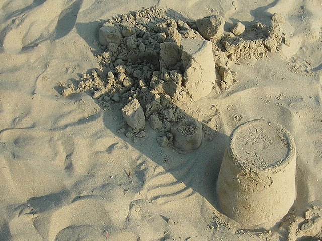

One of the things I most dislike about the health and fitness blogosphere is that certain people with some level of popularity can dismiss honest criticisms from less popular bloggers or commenters by labeling them haters or trolls. Sometimes it might be justified, but the labels are thrown around too easily. I'm not going to name names, just be aware of those at the top that are quick to dismiss any challenge to their beliefs and business model by labeling their opponent and not addressing their argument.

I can think of three popular fitness professionals on the internet that I agree with 80-90% of the time that I can't stand. They exude arrogance and condescension. If you disagree with them, you are either ignored or dismissed as a troll.

For the most part [I rarely comment](/2012/04/comments-about-comments/) on other websites. If something inspires me, I'd prefer to blog about it here and link to the original post to extend the conversation. For me blogging is about learning and I learn a lot from those who comment here. Even though I don't comment much, I am partly aware of how certain elite bloggers treat those that challenge their posts. I'll never know how many comments they removed or how many people got banned, but sometimes the word gets out.

To my knowledge, I've never been labeled a hater or a troll. There are two fitness sites where my comments have been blocked. I never go back to those sites and I refuse to link to them. In most cases I prefer to shun not shame.

On the nutrition side, nobody gets labeled a hater more than CarbSane. She is a top researcher and confronts those who spread false nutritional ideas with references. Her critics try and dismiss her with name calling, but she keeps at them on both [her blog](https://carbsanity.blogspot.com/) and on Twitter. CarbSane has become my Snopes to dismiss nutritional misinformation.

At times I wish I was more like her on the fitness side, but I'm not nearly as smart nor do I have a passion to keep fighting the same battle over and over. It is like building sand castles on the beach. Every day a new wave of nonsense will level the previous day's work.

_[Photo](https://flic.kr/p/LHvd3) by tony..._

---

## Comments

### dhammy
*August 14 at 2014 at 7:19 PM*

Those sites that are too quick to label legitimate discussion as trolling undermine their own credibility as a legitimate news sources and avenues of public discourse.  Ultimately, they'll go the way of the do-do as more credible blogs arise.  In the long term the only way to survive in the scientific world (and blogosphere)is to challenge your beliefs, re-evaluate, re-hypothesize.  Scientific method over dogma.

---

### Evelyn
*August 14 at 2014 at 8:10 PM*

Wow!  I am flattered by such high praise MAS.  Thank you, is all I can say.

---

### Stuart
*August 14 at 2014 at 9:15 PM*

MAS,
        Just a quick comment to say that I, and I'm sure many others will be quick to state how well you treat people who comment here on your blog. I have noticed that you treat everyone, even those who disagree with you, with a great deal of respect and civility. It is clear that you take the opinions of others into consideration, even if ultimately you end up not agreeing with them. That is how it should be, and your attitude and approach makes this a pleasant environment and a place where people feel comfortable sharing their opinion, whatever  it may be. In that regard you are very similar to Chris Highcock, another individual who's demeanor I have the utmost respect for. 
     In closing your post reminds me of something strength training legend Dr Ken Leistner once wrote. (Excuse me as I am paraphrasing slightly) He was commenting on the different perspectives in the strength training field, from individuals who often gathered at strength training conferences. He commented that he would rather talk to someone who's views were diametrically opposed to his, if they could express those views in a polite  manner, and were generally a nice person, rather than an individual who totally agreed with him, but who had a bad attitude.

---

### MAS
*August 14 at 2014 at 11:01 PM*

@dhammy - One of the issues I see with 3 guys I haven't named is that they are really good with nutritional science.  They dismiss risk in exercise selection and model advice from outliers. In other words, they get bro-tarded when it comes to fitness. 

@Stuart - Thanks!

---

### charles
*August 15 at 2014 at 12:31 AM*

The trouble with the world is that the stupid are cocksure and the intelligent are full of doubt.

Bertrand Russell

---

### charles
*August 15 at 2014 at 1:44 AM*

http://www.nytimes.com/2014/08/15/technology/web-trolls-winning-as-incivility-increases.html?_r=0

---

### Nigel
*August 15 at 2014 at 1:25 PM*

I second your vote of confidence for Evelyn aka CarbSane.

Science &gt; Pseudoscience. Every. Single. Time.

There's a helluva lot of pseudoscience out there!

---

### mrfreddy
*August 15 at 2014 at 2:32 PM*

Carbsane? You're joking, right?

If you can read her stuff, good for you. I can never make past the second or third paragraph (IMHO, she has be one of the worst writers on the inter-tubes - meanding, rambling, incoherent, nasty, mean-spirited, never getting to whatever her point might be...), but I gather that, according to her, her interpretation of whatever she is blabbering on about is the only true interpretation and everyone else is deliberately lying. 

Puh-leeze. 

I'm all for exposing dogma and false claims where you find them, but it can done with class and style (for example, Denise Minger) or, the other way.

---

### MAS
*August 15 at 2014 at 2:59 PM*

@mrfreddy - I don't understand a lot of the science in her writings. However, THIS post was about how elite bloggers and authors address their critics that bring forth valid criticism. She cites books, references, videos, etc in her critiques. Whether she is right or not is not my point. She is bring forward specific points of disagreement. Often she is dismissed as being a troll or a hater or mean spirited instead of having her point addressed. 

When the elite dismiss her character or intentions instead of her point, I start to think she is on to something. Either they know they are wrong and don't want to admit it or believe they are above responding to challenges. Either is unacceptable to me. Often they are defending their pocket book and not the truth. This is rampant in fitness. 

I get angry critics here, but I still try and address their point. (see my squat, bench and Naked Warrior posts for examples). I wrote it. I should either defend it or admit I'm wrong. How I interpret the mood of my critic is not relevant.

---

### Lynne
*August 16 at 2014 at 1:36 AM*

Cheers for bringing CarbSane to my attention MAS, I'm always happy to find another good source if info :)

---

### Nigel
*August 16 at 2014 at 9:29 PM*

Referring to the "Disagreement Hierarchy" at http://scienceblogs.com/startswithabang/files/2009/08/disagreement-hierarchy.jpg

I see that mrfreddy goes straight for the bottom of the barrel. Stay classy, mrfreddy!

---

### MAS
*August 16 at 2014 at 9:52 PM*

@Nigel - That is a great graphic. Thanks for sharing.

---

### Becca
*August 18 at 2014 at 12:01 AM*

@Nigel - I also love that graphic.

And thanks for sharing CarbSane MAS!

---

### mrfreddy
*August 18 at 2014 at 2:59 PM*

Nigel, thanks! You've convinced me with your classy retort and after much study and reflection and a box of bon bons, I've changed my option on CarbSane. I've re-read some of her recent blog posts, and I am stunned by the clarity and grace of her prose. Always to the point. Keeps her nasty opinions about everyone in the low carb world (and I mean EVERY ONE) to herself. Never resorts to mind reading (you know, claiming to know her "enemies" motivations, knowing when they are deliberately lying, and so on and so forth). And the science lessons, oh my! She takes complicated subjects and makes them so simple! And always ties them to her central point. I wish I had had teachers like her back when I was in school!

And, oh yes, all those pictures of a slim, fit, vivacious CS really show she not only talks the talk, she walks the walk! Yes indeedy.

---

### MAS
*August 18 at 2014 at 3:11 PM*

@All- Probably the best introduction to CarbSane is her podcast interview on Evil Sugar Radio.
http://www.evilsugarradio.com/39-evelyn-kocur-food-restriction-food-addiction/354/

It user friendly without going super deep into nutritional science like the blog does.

---

### charles
*August 18 at 2014 at 4:25 PM*

@mrfreddy
"all those pictures of a slim, fit, vivacious CS really show she not only talks the talk, she walks the walk! Yes indeedy."

Then what say you about how Jimmy Moore looked a week or so ago?
https://vid.me/XJB

---

### mrfreddy
*August 18 at 2014 at 5:28 PM*

If we were talking about Jimmy Moore I might think that was relevant.

---

### Anthony
*August 23 at 2014 at 6:22 PM*

I've been personally dismissed as a hater by both Tony Horton (I believe he used "idiot") and Mark Rippetoe. The image I created of Rippetoe may have invited that though, so, he gets a pass in my book for now.

Next of my bucket list, Crossfit folk, followed by the TV based "fitness celebrities" =D

- Anthony

---

### MAS
*August 23 at 2014 at 11:18 PM*

@Anthony - Good job! As for battling with Cross$hit, it is a never ending battle.

---

