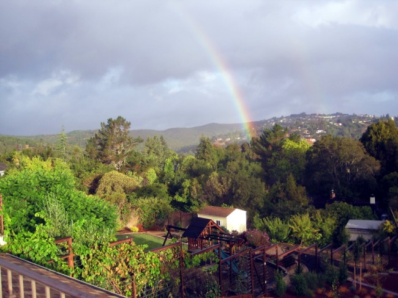

I finally got around to playing with the MailChimp application long enough to publish the 1st CriticalMAS newsletter. The theme was _Summer of Moving_. Not sure if I'll have a theme for every newsletter, but it seemed right for this one. I did not plan to put off sending the first newsletter for almost 4 months. The next one will be 1 or 2 months tops.

For those that haven't subscribed here is a direct link:

### [Summer of Moving](http://us8.campaign-archive2.com/?u=616cbc7aa428b2f7781a192cb&id=9a612164bc)

The signup form is in the right column. If you have any feedback or suggestions for Newsletter #2, please leave a comment.

_The new CriticalMAS World HQ_