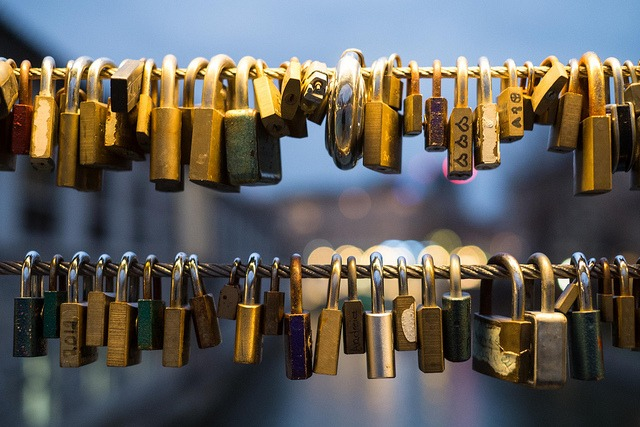

My last post [Scan, Encrypt, Store, Delete, Shred: Going Paperless!](/2014/09/scan-encrypt-store-delete-shred-paperless/) was about physically securing sensitive data in my home. The other half of a security plan is securing your online accounts. I am not an expert on security. **My strategy is to be more secure than the vast majority of people on the Internet and do it in a way that is sustainable.** We all know the problem. We either use easy-to-remember passwords or we reuse passwords across different sites or we become a ball of stress trying to recall which password we used with which site. Then we save passwords in our email folder and hope that it doesn't get compromised. Technology is always changing. What might have been considered a secure password a few years ago is now trivially easy to hack. In a few years, there may be new guidelines on passwords, but right now **longer is better**. And every password should be unique. Sites are being hacked all the time. When a site is hacked, the usernames and passwords are tested against other sites. You don't want your health insurance password to be the same as your Amazon password and vice versa. I used to have a "tough" password for important sites and an "easy" password for sites I didn't care about. In retrospect that was a dumb approach. Compromise one of the important sites and the hackers could access all the other important sites. And my "tough" password was only 8 characters long with numbers and symbols, but because it wasn't in the dictionary I felt comfortable with it. Processors are much faster now. That "tough" password is now trivially easy to break. Wikipedia has a good page on [password strength](https://en.wikipedia.org/wiki/Password_strength) and [password cracking](https://en.wikipedia.org/wiki/Password_cracking).  _[Photo](https://flic.kr/p/dB1H1Q) by Nathan Meijer_

### #1 Get a Password Manager

Passwords that are tough to crack are impossible to remember. They are also hard to type correctly. Password Managers not only help remember the passwords you use for different sites, but they are able to generate very secure passwords on your behalf. A good password manager will also be able to run a security analysis on your passwords to alert you when you are reusing a password or when a password isn't secure enough. There are several Password Managers. This [CNET article](https://www.cnet.com/news/best-password-managers/) covers a few. Which one you pick will depend upon your needs and devices. I'm not going to tell you which is best. Again I am not a security expert. I will say that whichever one you use is a step up from reusing short passwords.

### #2 Create a Passphrase

The password you use to secure your password manager should be long, memorable, and impossible for anyone else to guess. Mine is almost 30 characters long. An idea for creating a long passphrase is to use fictional characters, animals, numbers and string them together in a [Mad Libs](https://en.wikipedia.org/wiki/Mad_Libs) type sentence that is too silly to forget.

**evilSPOCK.sings2.PANDAS\_for$500**

That passphrase is 31 characters long, memorable, and impossible to guess. You should be able to create something equally secure that you will not forget.

### #3 Setup 2-Factor Authentication on Email

You can secure every password, but if someone hacks your email, they can start requesting lost passwords. Get 2-factor authentication. Read [Two-factor authentication: What you need to know (FAQ)](https://www.cnet.com/news/two-factor-authentication-what-you-need-to-know-faq/) for a primer on the topic.

### #4 Change ALL Your Passwords

You can't assume that some hacker doesn't already have one of your passwords already. Change them all. It will take time. Start with the sites that are most important to you. Use the Password Manager to generate the password. Here is an example of a 20 character password generated by my password manager.

**!v8e5hzMmCYWc9DADmy9**

Thankfully I don't need to remember that or type it in by hand because that task is now handled by the password manager. If during this process you decide to close old accounts, still change the password first. You don't want your old insecure password sitting on a database table\* forgotten.

### #5 Delete Old Emails

Even though you've changed your passwords, it is still a good idea to delete any old emails announcing you've created an account. Some have links to reset passwords in them. Delete them all and then empty the trash.

### #6 Run a Security Test

A good password manager will have a security test. Run it until you pass. Once you pass, add a recurring event to your schedule to retest your security every so often. I retest my security every 4 months.

### More Secure, But Not Perfect

If you follow the above steps, you will be far more secure than the average person on the Internet. If one of your sites is compromised, the damage is contained. Some argue that the Password Manager becomes the weak point in security. Break that password and you have all the passwords. This is true. To minimize that risk, make sure your passphrase is secure (#2) and that you monitor developments in security from time to time. The article [“Severe” password manager attacks steal digital keys and data en masse](https://web.archive.org/web/20170720081300/https://arstechnica.com/security/2014/07/severe-password-manager-attacks-steal-digital-keys-and-data-en-masse/) talks about how some password managers were recently exploited. Most of the password managers were fixed. Despite those risks the article still advises:

> On the whole, readers are likely better off using a password manager than they are using the same password for multiple sites. For that reason, Ars still recommends that people use a password manager. However, readers should remember that password managers represent a single point of failure that could lead to the complete compromise of virtually every website account they have. It's not possible to know which managers are safer than others without a trusted third-party conducting a detailed assessment on each one. That said, well-known managers that have been available for years are probably more trustworthy than a newer one that was recently introduced into the market.

I put (2014) in the title of this post because I expect security strategies will change at some point. _\* When you create an account on a site, they are supposed to store your password in a secure manner. Meaning it should be encrypted on their database and not stored as plain text. That way if they are hacked and the hackers have a copy of the database, they won't be able to make use of the passwords. Unfortunately, not every site uses best practices. OKCupid was [storing 42 million user passwords in plain text](http://krebsonsecurity.com/2013/11/cupid-media-hack-exposed-42m-passwords/). This is a big reason why every password should be unique. I wonder how many of the OKCupid customers used the same password and email to access their online banking?_  **UPDATE 2017:** Check out this [Password Strength Tool](https://www.comparitech.com/privacy-security-tools/password-strength-test/) to get a feel for how secure your password might be.

---

## Comments

### MAS
*September 16 at 2014 at 5:49 PM*

ONE MORE THING: When updating your passwords, also update the answers to your security questions. With social networks it is super easy to figure out mother's maiden name. So instead of saying "Johnson" say something like "Detroit". Change your birth city to "pizza" and your pet name to "October". That will reduce the chance that someone can call up using known data about you to access secure sites.

---

### Txomin
*September 17 at 2014 at 7:35 AM*

Good passwords managers store data in a local encrypted database. Back it up.

This database CAN be stored in your email account together with a portable version of your password manager (as attachments). I prefer USBs when on the go but the email option will also work.

---

### MAS
*September 17 at 2014 at 3:38 PM*

@Txomin - Great idea. After your post, I did just that. 

I also this page which stresses the importance on strong unique passwords.
http://www.instantcheckmate.com/crimewire/is-your-password-really-protecting-you/

---

### garymar
*September 18 at 2014 at 12:29 AM*

I keep a list of passwords written on a piece of paper stored in the safe in my office.

---

### Mike
*July 15 at 2015 at 2:04 PM*

We had to change our passwords earlier this year after my laptop and my wife's ipad were stolen in a break-in. I use 1Password on my iMac, and can access my passwords (via a password-protected HTML file) on my Chromebook via Dropbox. I cannot use 1password on my work PC, so I can't get the full benefit of using it to submit the passwords for me. 

A neat way I've found to generate long passphrases is to use the Diceware passphrase list. It's a list of 7776 short words, keyed to a 5-digit number. Throw 5 dice to generate a random 5-digit number. (I use random.org's dice-throwing web app, or its iOS app to do this.) 

Repeat that throw 5 or 6 times to get a batch of randomly generated 5-digit numbers. Look up those numbers on the Diceware passphrase list to find the words that go with them. String those words together separated by random special characters, capitalize, etc. I also end the phrase with a number. So I can end up with a 30+ character passphrase that would be pretty tough to crack, I think.

I now have very strong phrases protecting my email and bank accounts, and the neat thing is that, if you use them often enough, they are somewhat easy to remember.

---

### Mike
*July 15 at 2015 at 2:05 PM*

Sorry, forgot to post the Diceware URL: http://world.std.com/~reinhold/diceware.html

---

### MAS
*July 15 at 2015 at 2:25 PM*

@Mike - Thanks for sharing the tool.

---

