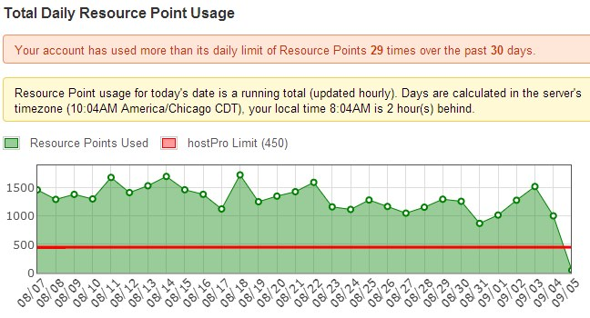

Yesterday I moved this blog off Site 5. My page draws were fast, the server was stable and with one exception the service was excellent. Why did I leave? Because my account exceeded their in house metric of Resource Points. When I signed up for the account, I didn't even see a mention of Resource Points. I saw what other customers see and that is the word Unlimited.

> Unlimited disk space. Unlimited bandwidth. Unlimited websites.

On one hand they promise Unlimited, but if you dig around you will see that isn't true. I understand why web hosts do this. You don't want someone using their account as a media server abusing the bandwidth. My issue with Site 5 is this blog never abused their resources. What they consider excessive is far from it. I'll repost my traffic here.  As I mentioned [yesterday](/2014/09/always-run/), the traffic to this site is not tremendous nor is it trivial. It is in that middle ground that makes finding decent hosting at a fair price a challenge. This is not a high traffic site. It does not deliver audio or video files. I've been hosting this blog since March 2000 using numerous hosting companies. Not a single one ever had an issue with the resources I was using.

### Reaching Out to Site 5

Back in May I was poking around on the Control Panel and I saw the Resource Usage link. When I looked at the page, I discovered I was in violation and had been everyday since joining. Not just by a hair, but by quite a bit. I read every page they had on the Resource Usage and still saw no reason why my site would even be close to being in violation. I also did not know why they hadn't contacted me. After contacting support, I was still confused. I knew I was in violation and I knew they weren't saying anything about it. The conclusion I reached is that whatever Resource Usage metric they created was done a long time ago before processing power and bandwidth costs were much higher and that it hadn't been updated.  Site 5 has known since February that I've been in violation of their Resource Limits. I learned in May. I brought it to their attention so we could resolve the issue. Other than sharing links to resources I had already read, they offered me no guidance. Then a few days ago, they decided to enforce their metric. This means getting my Resource Usage down or the site will get moved to their a $100 a month VPS server or I get suspended. My response to them:

> I need help explaining to me why my site is exceeding resource points. - I serve no audio or video. - I only get ~1,500 visitors a day, which get cached Wordpress pages. Most pages have just 1-2 images. On Backstage if I look at AWS, I can see my site is using 35 GB bandwidth a month. Is this the number that is a problem? If so, then why do you sell "unlimited", when you could just say "30" or whatever the limit really is. If it is a different metric, where can I see and monitor it? Is there something else going on? I've implemented the tips on the WP optimization page.

More than a day went by and I got no response. So I contacted them again. I finally got a response, which basically said "due to the nature of dynamic scripts" they can't tell me why the usage is high. And am I suppose to diagnose which dynamic script is draining resource limits, which is a number I can't calculate? They also said it could be bots or malicious scripts hitting my website. How is that my problem? My site is on their network. I pay them to host it. They have the power to defend their network against external threats. I don't.

### The Real Problem

Let us say hypothetically that someone can convince me that I installed rogue code on my server and that was the cause of the problem. Site 5 has known since Day 1 there was a problem. If they were incapable of hosting my site, they should have reached out to me sooner. We could have worked together to find a resolution or I could have found a new host while I was still inside the refund period. Because I am now past the refund window, I'll be eating the cost, as I had to hire a new host yesterday.

### What About Lower Traffic Sites?

Initially I thought I could still recommend Site 5 for lower traffic sites. Their servers are fast and stable enough to handle 500 daily visitors. But there are lots of web hosts that do a good job with lower traffic sites and they do it at a better price. Also, what happens when you grow your audience? You run the same risk I did and could end up having to hire a new host in the middle of a billing cycle.

### My First Date with SiteGround

My research for a new host led me to SiteGround. If you go to their hosting page, you will see that they guide you into a plan based upon monthly visitors. **Wow, an actual metric I can look up!** They have plans for 10K, 25K, and 100K monthly visitors. Before signing up for the 100K plan, I contacted their support. I shared my blog link, all my site statistics, and disk space usage both today and estimates going forward. They were super cool and said hosting my site at the GoGeek level (100K) would not be a problem. Our relationship is off to a good start. Page draws are super fast. Based on my tests, twice as fast as Site 5 or even my beloved WinHost, which hosts [INeedCoffee](https://ineedcoffee.com). In fact, they are the fastest page draws I've ever seen on a WordPress site.

---

## Comments

### The
*September 5 at 2014 at 8:03 PM*

Could your bandwidth issues be due to Google+?  When you post on this Blog Google sends me 2 notifications.  One via the Google+ tool in my Browser and another via G mail.  When I view the email on my phone it presents me with a full version of your post shrunk down very small.  I usually have to click on it to actually read it, which then pulls it up in my web browser.  Later on when I go to my PC there is still the notification from Google+ which presents me with a full copy of the post I have already read via the email notification.  I would estimate that I see a full version of each of your blog posts at least 3 times even if all i actually did was view the subject line.

Not sure what you can do about it, but thought it might be part of the answer.

Mark

---

### MAS
*September 5 at 2014 at 8:24 PM*

@Mark - No even if my pageviews were triple, the server should be able to handle it. Plus I suspect G+ makes a copy on their end. Same is true with RSS. A service intercepts all requests to my server and delivers a snapshot built on their end using their bandwidth.

---

### The
*September 5 at 2014 at 9:01 PM*

Back in the olden days of 2003 when i was hosting a website, i had a similar issue with my web host.  My bandwidth suddenly spiked to almost 10x it normal usage.   It turned out someone had linked to several of my images to populate their own site.  Grrrrrrr  I wound up swapping the images for with one that was a big red box with black type "Stealing is Bad".  When they just re-linked my images again, i swapped them out for highly NSFW images...  They got the point  :)

I know you are an old hand at this and probably regularly check for that sort of stuff, but i could not help myself and still reminisce about my old webmaster days..

Mark

---

### MAS
*September 5 at 2014 at 9:35 PM*

@Mark - Back in the day I wrote a script in Classic ASP that blocked hotlinking. 

I don't bother with that anymore for a few reasons.
1- bandwidth is suppose to be unlimited. 
2- search engines reward sites where images are valuable and being linked to. Block hotlinking and you block some of that mojo. I once estimated that 15% of the traffic to INeedCoffee started from an image search. 
3- it is now accepted behavior on social media and forums to hotlink. 
4- although you can write scripts to block hotlinking, you run the risk of not displaying the image on the actual site if the validation is off. Plus people figure out how to get what they want anyway. 
5- also I want my full posts not to have missing images if viewed from an RSS reader or some other aggregator. 

So in a scarce world (2003), I wanted to block hotlinking, but now I mind far less. Site 5 does have a tool to block hotlinking. I went through the logs to see if any images were being hammered. None were.

---

### deadsunrise
*September 6 at 2014 at 1:05 PM*

Hi MAS. If you have several websites..  shouldn't it be better to get a virtual machine on OVH or some other proved host instead of normal hosting accounts?  With OVH you can get them in US datacenters now.  They have extremely good DOS protection and it's really really unlimited, you can max the network interface without problems.

I think you have knowledge about all this so managing the server should be pretty easy for you to do. I have a high traffic site (frozen-layer.com - used to be alexa 970) on a dedicated server with OVH and have been using them for about 6 years. I set up virtual machines on that server and  host 7 or 8 more websites, monitoring infraestructure, puppet, dns and mail servers, etc, enough to run a small ISP and never had a problem.

Their small virtual machines work great, we have a couple contracted with them at work for outside monitoring (I work at a ISP) and haven't had problems either. Since 2002 I've gone through tons of hosts just as you are doing. When frozen-layer was growing I started with normal webhosts, reseller accounts, dedicated servers in 4 or 5 providers.. OVH have been the best until now. You have enough traffic/sites to step up to your own server.

---

### MAS
*September 6 at 2014 at 2:53 PM*

@deadsunrise - You are correct. The end game is Cloud Servers. I was looking at Digital Ocean and Linode, but decided to go with SiteGround, because I was under the gun for time. I had to move the site immediately, so going from one cPanel site to another cPanel site was a process I was comfortable with. 

Eventually I'll be on a Cloud server, but I'd prefer to use a low traffic site while I am figuring things out. I have a few sites than get less than 100 visitors per day. Those will be the first ones migrated. Then if all goes well, bring over this blog and/or INeedCoffee.

---

### Silas
*September 10 at 2014 at 12:21 AM*

Whoa, such a good timing for a post like this. I'm still within the refund period of Site5, but I think I'll pass. I don't mind paying a couple bucks more to get rid of headaches. 

The thing is, Site5 have servers all around the world, and that is a good thing, because fast loading pages rank higher in Google and all the stuff we already know. I do NOT want to sign with any EIG brand (HostGator, Domain.com, etc), but I need my servers located in South America.

Do you know any hosting service that has servers in South America? Or, at least how can I search for one? I always end up reading the same domains in reviews sites and forums.

---

### MAS
*September 10 at 2014 at 4:06 AM*

@Silas - What I like about Site5 is that you can pick your server location, which makes it ideal for a local business. However if your business is in South America, they probably won't be much help. 

2 ideas come to mind for your S.America needs. I'm not an expert, just some thoughts

#1 - Google App Engine https://developers.google.com/appengine/

It won't be as easy as a dedicated Wordpress host like Site5 or Siteground, but they have servers EVERYWHERE. 

#2 - Keep hosting with Site5 or similar, but use a CDN (Content Delivery Network) to serve your images, media files, style sheets and javascript. There are plugins that help. I haven't done this yet, but I am investigating. This should greatly increase page load. The page might come from Dallas, but all the byte heavy stuff from a CDN with servers in South America. 

Examples:
http://www.metacdn.com/live-streaming-coverage
https://www.cloudflare.com/features-cdn

---

### Fernando
*August 20 at 2015 at 2:12 PM*

Hi there, I am currently having exactly this same problem. I started with Site 5 in March 2014, moving out from Dreamhost who after 4 years of being a customer and having all my wordpress sites with them, contacted me saying that I was using too many resources and that I should jump to a VPS, which I did and they still pushed me to update and update and update spending every time more, more and more. The visits to every single website remain the same though.
Now Site 5 is doing a similar thing, after one year being with them, last Feb 2015 I decided to pay a year in advance to get rid of the annoying monthly bill. Now (August) I have received an email saying that my websites were using too many internal resources. I checked the plans they are offering, I have the Hosting Turbo Pro which they advertise as being able to handle around 100.000 visits per month. I have less than 10% of that on all hosted websites, still they show as if I am now consuming a lot of resources (more than before). I have only 2 websites with higher traffic and neither of them reach their own internal 600 resource limits.

I think they have a big issue with their wordpress configurations or they are considering a website which is at any point of time for any length consuming more resources they assume the website is always consuming more resources. The only thing I did different this month is to update my two main websites wordpress versions, plugins, themes. As everybody knows these specific tasks which last less than 5 minutes for each site consume for a short amount of time more resources of a server. But I think it's unfair that I have to upgrade my plan because I used for some minutes more resources. 
They cannot prove it with facts, because I used their own AWStats to show them that the traffic of my websites are even lower than in Jan 2015 where everything was supposed to be fine. 

I asked for their help, lets see what they do, clearly if they want to retain me as a customer I hope they treat me well and help me. Otherwise, the hell of searching again for another hosting provider with all the hours that this means to migrate the sites and so on, will be an endless pain I don't want to suffer anymore. I was hoping Site 5 was the last hosting I ever needed...I hope they still are..

---

### Don
*December 13 at 2015 at 5:48 PM*

Getting banned due to too many resource points is common with Site5. There are probably bots hitting your site unnecessarily and often, eating resources. Your AWS will have a list of hosts IPs hitting your site and how much they are downloading. I look these sites up and if they are not a legit search engine I add them to the ban list. I need to do this check every month. This has reduced my resource points a lot. Site5 is very unclear about what affects your resource points.

Anyway good luck with your new ISP.

---

