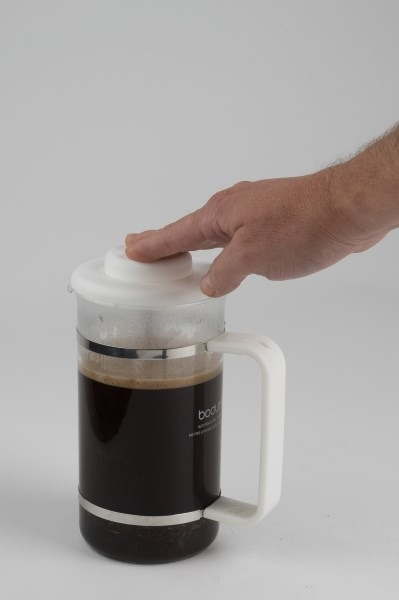

This year I have gone back and rewritten a few of the older brewing tutorials on [INeedCoffee](https://ineedcoffee.com). Unlike this site which has built a loyal audience over time, most of the people who access INeedCoffee are hit and run. They come looking for specific information, read it and leave. So what I have been doing is swapping out the old tutorials for new ones. New verbiage and new photos. Same URL. Then I change the article date to today and "re-release". I call this process the "Reverse Indy".  _Replace the lame French Press tutorial with the shiny new one. Same URL so no bookmarks break._  Until a few minutes ago, INeedCoffee has had two different tutorials for the French Press. One sucked (1999) and one was OK (2002, updated several times). The problem was they competed for audience. Search engines would deliver half the users to one and half to the other. Today I deleted the sucky one and redirected that link to the other tutorial. The other tutorial was completely rewritten.

#### [French Press Tutorial](https://ineedcoffee.com/press-pot-tutorial/)

 I actually wrote this tutorial from memory as I quit using a French Press a few years ago in favor of the Clever and [Aeropress](https://ineedcoffee.com/upside-aeropress-coffee-brewing-tutorial/).

---

## Comments

### RBiser
*October 28 at 2014 at 5:21 PM*

Thank you by the way. I found your other site from this one (which I have followed for a while) and boosted my enjoyment of coffee significantly. I have used a french press for years, but on your recommendation I got a clever about a year ago and an aeropress is on its way from amazon as I type. 

Question: I love the brightness and lack of sediment in the clever but miss the body (mainly from the oils) in the french press; do you not mind the difference or have you found a way to boost the body in the clever?

---

### MAS
*October 28 at 2014 at 5:26 PM*

@RBiser - You could experiment with a longer brewing time. Like 4 minutes. I prefer brighter, so I haven't explored going for more body.

---

### Dan
*October 28 at 2014 at 9:11 PM*

Four or five years ago I read an article about the guy who came up with the Clover, (that expensive machine that Starbucks was using and then bought the Clover company).  In it, he and others talked about how it operated. It sounded to me like a reverse French press, in that the unit pushed the coffee up and out. While the coffee was brewing, they described stirring the grounds for about a minute and also that he used more coffee, about 25% more than would normally be used. I tried this and it was great. I used more coffee, stirred for about a minute, pressed it about about 1:30. It was great. I did this until about a year ago when felt like I was spending too much on coffee. I lowered the coffee amount to what you mentioned, a tablespoon per 3 oz of water, still stirred for a minute but let steep for 3:30. It's still great this way. I recommend stirring the grounds for a minute to people and they love it this way too.

---

### MAS
*October 28 at 2014 at 11:56 PM*

@Dan - The key IMO on why the Clover works is the filter is as fine as human hair. That results in zero sediment. But it still has the richness of the F.Press or Vac-pot.

---

### RBiser
*October 29 at 2014 at 4:26 PM*

@MAS: This morning wetting time + 4 minutes steeping and stirring twice + time to drain produced a cup with a lot more body, but as you insinuated to the loss of brightness. I did enjoy the extra body and now have to decide which I want more, brightness or body. 

In your experience iss brightness vs body an unavoidable tradeoff in coffee making?

---

### MAS
*October 29 at 2014 at 4:31 PM*

@RBiser - For that decision, I would go by country of origin. 

BRIGHT: Central America, Colombia, East Africa, island, lighter blends
BODY: South America, Indonesian, darker blends

A Sumatra will might taste better if you go for body, whereas Kenya you would go for brightness.

---

