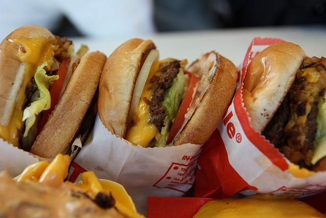

I've had this thought for a while. It is an offshoot of an idea in my post [Approaching Nutrition From An Investor's Mindset](/2013/04/approaching-nutrition-from-an-investors-mindset/).

> When you are investing the goal is to put your money into something undervalued and then get out before it becomes overvalued. In other words, buy low and sell high. The more undervalued the investment, the less risk one takes. If we think about this nutritionally, we benefit most from the nutrients and foods that we are deficient in. A fast food junkie will likely benefit from a vegetarian diet and a vegetarian will likely benefit from a Paleo diet. For a while.

My proposal addresses two different groups of people who might have compromised health. The fast food eater that consumes a lot of muscle meat and the strict vegetarian (more likely a vegan). **Each group could benefit the other by swapping roles for a day.**  An ethical vegan would be able to eat animal protein for a day and still be within their moral guidelines provided they were able to convince a fast food eater to eat vegetarian/vegan for a day. They might even prepare the meals to assure that the fast food eater stays away from animal protein. The fast food person gets a break from meat and loads up on fruits, veggies and legumes. The vegan can now consume some animal protein for a day and shore up any nutritional deficiencies they might have developed. The impact to the planet is neutral, yet both parties should be nutritionally better off. Actually, I am guessing the vegan would consume grass pastured or more humane forms of animal protein, so the ecological effect would be a net positive. Or the vegan could throw a dinner party for 6 heavy meat eaters and build up 2 days of animal protein credit at once to be spent at their leisure. You could do this once a week, once a month or once a year. Before I get vegan rage, this is just a thought experiment. Not every vegan or fast food eater will have nutritional deficiencies. But if you do, this is not a bad way to do some nutritional diplomacy with _"the enemy"_. Good idea?  _[Photo](https://flic.kr/p/4P25oA) by Derek_  _Photo by Harald Walker (no longer on Flickr)_

---

## Comments

### Jim
*October 24 at 2014 at 3:25 PM*

MAS,
Very interesting thought experiment.  
My guess is that the typical fast-food guy would have little problem switching for a day, but the typical vegan would have a huge problem with it. Also, I'm thinking it would be hard to find a vegan that would entertain the thought of even possible dietary deficiencies.
Not meant to be inflammatory. Just my thoughts.

---

### dhammy
*October 24 at 2014 at 5:15 PM*

I love the idea as a thought experiment as well.  It makes a lot of sense from a pure economics and practical perspective.  But it misses the human element...ie, the irrational human element.  People choose to become vegetarians for a lot of reasons...mostly (perceived) health or ethics related.  And they self-identify by that label, "vegetarian", in much the same way that prius-drivers identify as supporters of the environment.  Long-story-short--they aren't going to participate in this in the real-world.  Although I think you'd find plenty of PALEO or fast-food-eaters to meet the other side of the market equation.

---

### glenn
*October 24 at 2014 at 8:03 PM*

I think dhammy is correct. Let's leave aside any metaphors involving Muslims.
This is maybe like getting a practicing Hindu to go to a Born-Again Baptist church service once a month and vice versa. It might happen one month, but not 12 months in a row...

---

### Virginia
*October 24 at 2014 at 8:31 PM*

I'm not really sure that this type of approach to morality and moral behavior, in general, would resonate with most people.

---

### MAS
*October 24 at 2014 at 9:04 PM*

@All - The more I think about this, the more I think it would be for those that are questioning their decision. Maybe the benefits they got initially are gone and their health has declined. Enough to be a concern. Yet they still are concerned about the ethics of their choice. 

If a vegan made a vegan friendly meal for several meat eating friends their conscious could be alleviated enough to eat a bowl of ice cream, knowing that choice actually reduced meat consumption in totality more than they could by being vegan for one more meal. 

Again this sort of idea might only catch the attention of those questioning or on the fence, which is a small minority.

---

### glenn
*October 24 at 2014 at 10:57 PM*

It's just that "vegan" is an attractive social identity for many people whereas "omnivore" isn't...

---

### Becca
*October 25 at 2014 at 12:20 AM*

Very interesting idea!  I agree that it would probably only work with people who are "on the fence" vegans... or if you stipulated that only ethically sourced meat would be used it might attract more people too.

---

### Texbola
*October 25 at 2014 at 1:09 AM*

Me thinks you spent too much time drinking coffee in Seattle...

---

### Brock
*October 25 at 2014 at 5:04 PM*

Disney did a movie version of this only in their version mother and daughter switch brains and see what the others life is like.  Both are horrified at first, although they learn a lot in the process.  Each gains respect for the other, but wouldn't trade back for all the money in the world.  Freaky Friday: vintage starring Jodie Foster; and modern starring Lindsay Lohan and Jamie Lee Curtis.

---

### Mr.
*October 27 at 2014 at 2:42 PM*

Wouldn't it end up just makin them sick anyway?  I've known people who gave up meat just for 40 days and had pretty bad nausea the first few days when they were finished.  I'd think a vegan who hadn't had meat for years would be worse.

---

### MAS
*October 27 at 2014 at 3:01 PM*

@Mr. F - Good point. It is a topic I haven't looked into, so I don't know how much of that nausea is physical and how much is psychological. The vegan might start with some eggs or chicken broth and not steak. Then ease into dairy and go from there.

---

### April
*October 29 at 2014 at 2:39 AM*

As a vegan, I wouldn't do it. And most vegans I know wouldn't either. To many vegans, particularly ethical and/or long term vegans, the thought of eating meat is akin to what an omnivore would feel if they seriously considered butchering and eating another human being. To many vegans chicken isn't something, it's someONE. Add to that the fact that I personally have never liked the taste/smell/texture of most animal products. For instance, eggs smell more or less like sewage. Milk smells like vomit (infant formula and breastmilk also smell like vomit, incidentally). Fish smells like rotting... well, I imagine it smells (even the "just caught" super fresh fish) similar to how durian smells to most westerners. 

(I should probably note at this point that my sense of smell seems to be radically more acute than virtually anyone else I've ever met. I can't stand perfume or scented shampoos/conditioners/body washes. The smell of dryer sheets is enough to make me want to die. Gas stations induce almost instantaneous headaches. Vanilla scented products (candles, air fresheners, tea, cigarette papers, etc) make me nauseous.)

I would absolutely switch diets with someone from another country though, so long as their diet was vegan. I'm sure there would be a lot to be gained by following a plant based diet centered on another culture's staples. However, that's not really pertinent to the overall idea of some sort of ecological/ethical balance.

As a further aside, I don't really think ethics are tradable in the way you suggest. It would be like saying to a pro-lifer, "It's okay. You can have an abortion, and I won't. That way the scales will balance out."

---

### Virginia
*October 29 at 2014 at 3:11 AM*

Yeah, it is evident that almost all of the commenters here do not understand (or are indifferent to) the vegan perspective. If you care to try to understand it, you might try to apply (hypothetically of course!) this approach to moral behavior to your interactions with other humans, or perhaps to animals for whom you feel empathy, like pets.

---

### MAS
*October 29 at 2014 at 3:38 AM*

@April & @Virginia - Thank you for your perspective. 

The only thought I can add is that there are always new people both becoming vegetarians and people that become former vegetarians. They aren't static groups. The decision to become or reject vegetarianism is not a light decision. I was a strict vegetarian for <a href="https://criticalmas.org/2008/07/im-not-a-vegetarian/" rel="nofollow">~2 years</a> before adding in fish. It was a tough decision at both ends. 

My proposal would probably ONLY be considered by those either transitioning into or out of a vegetarian diet, which is a small minority.

---

### Pauline
*October 29 at 2014 at 4:14 PM*

Saw this book on recent new read shelves in Waterstones Bookstore UK, and got a copy at local library - looks like it may be an interesting read:

http://www.goodreads.com/book/show/18051510-the-plantplus-diet-solution

Though at the moment I have stepped away from most nutritional dogma and just focusing on feeling good in life, so my interest in nutrition is simmering away in the background while other stuff is more in the foreground.

---

