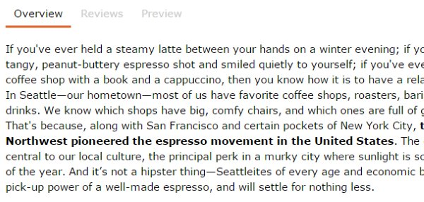

_**UPDATE March 2021:** UserStyles was a great idea, but their server has either been super slow or down so many times since this post was written that I can no longer recommend this solution._

This is a topic that I can not drop. I am so sick of websites that use small gray fonts. My theory is that all designers are under 30 years old, have perfect vision, and work on the best monitors money can buy. They design webpages primarily to make photographs look better and not to make the text more readable. And then they don't test the new design on the people who actually use the site.

When Meetup.com did their last design they chose a light thin gray font called Whitney that is painful to read. Someone asked Meetup if they A/B tested it.

https://twitter.com/Meetup/status/422830788430684160

What the jerks at Meetup were saying loud and clear is that they don't give a damn about their users. Their design is there to please their designers, who don't have to interact with the site as users do. An [A/B test](https://en.wikipedia.org/wiki/A/B_testing), which measures how users navigate and use the site with the changes and without would have clearly shown that it now takes more effort to read the site.

I created a User Style workaround called Meetup Darker: No Whitney Font. When the page loads for me, my style sheet overrides their awful typography with clean readable text. Anyone with the plugin can install my style sheet.

### Readability?

For a long time, I used the plugin Readability to clean up the small gray fonts. The problem with Readability is it doesn't work for application sites like Meetup and for blog content it strips out the comments. This weekend I was painfully reading the light gray comments on a site when the term **Typography Inflammation** came to me.

Thankfully there is a tool that you can use to fix these sites called Stylish. Here is how you use it.

### #1 Install Stylish

If you have Chrome or Firefox, install the Stylish browser add-on. If you are still using Internet Explorer, you are out of luck. It appears to be available for Safari as well, but I haven't tested it.

### #2 Visit Site You Wish Had Better Fonts

Use the Readability plugin if you don't need comments. But if you do, press the Stylish button on your browser and select "Find more styles for this site".

If a good one exists, use it. Problem solved.

For this example, I will be tackling the site _ChefSteps_. There are worse offenders. Because I am taking a multi-part class on this site, I plan to read the content thoroughly and probably more than once. If I were just skimming the text, I wouldn't have gone through the trouble.

The one I created for this example is called Chef Steps - Darker. Below you see the before and after screenshots.

_Not as bad as Meetup, but when you are reading long amounts of text for comprehension, it is nice to bump up the size and darken._ 

_Much better._

### #3 Create an Account on UserStyles.org

Pretty straightforward.

### #4  Create a New Style

Pick the _create link_ on the home page. Enter whatever name, description, and info you like. Under CSS drop this code in. I used Verdana. It is one of the best things ever to come out of Microsoft. Designers hate the font, but you already know what I think of the current crop of "designers" when it comes to font selection.

@-moz-document url-prefix("https://www.chefsteps.com") { 
html, body, p, li { 
font-family: Verdana,helvetica,arial,sans-serif !important; font-size: 15px !important; color: black !important; 
} 
}

Replace **https://www.chefsteps.com** with whatever domain you are on. If the site uses SSL, be sure to use the **https://** in this description. You can upload a screenshot or the system says it will generate one. I have yet to see the system generate one, so I create and upload my own.

### #5 Install Style

Once it is created, you can install and test it. Hopefully, it will work.

### #6 Advanced

What I did was very basic. Your typography issues might be different than mine. Use it to meet your needs.

Some people have created much more advanced styles. When GMAIL got rid of the light blue in place of the cold black fonts in 2012, I installed Old Gmail Approach, and instantly my email was back to the glory days.

---

## Comments

### mike
*October 15 at 2014 at 1:13 PM*

check out: https://addons.mozilla.org/en-US/firefox/addon/nosquint/

---

### MAS
*October 20 at 2014 at 10:29 PM*

@Mike - I like it. Works great as a fireFox solution.

---

### Wish
*May 25 at 2015 at 4:59 AM*

This is pretty cool. I just used it to fix the grey text on your blog!

---

