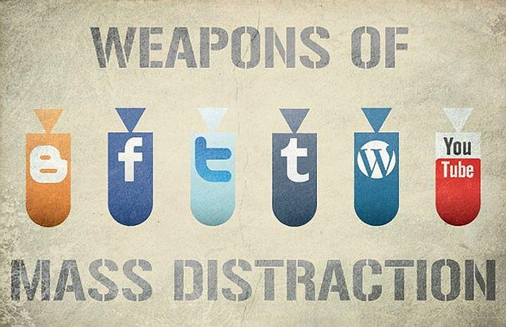

People believe I have amazing willpower. They see me giving up certain foods or habits and sticking with some form of restriction as evidence of that fact. And I believed my willpower was strong as well. Exactly two years ago, I [gave up coffee for an entire month](https://ineedcoffee.com/a-month-without-coffee/). Me! The guy who has been running the website INeedCoffee for 15 years. But something seemed off. If my willpower was so strong, why wasn't I more successful? That answer came to me in an outstanding book recently.

I love accidentally finding gems. I was looking for another title in my library's audio-book section and the system didn't have what I was searching for. But I noticed in the search results, the book _The Willpower Instinct_. I am so glad I found it. It has been 3 weeks since I listened to it and the lessons are still resonating with me.

 _The Willpower Instinct: How Self-Control Works, Why It Matters, and What You Can Do to Get More of It by Kelly McGonigal Ph.D._

### 3 Types of Willpower

I learned there are three different types of willpower.

1.  I Will  (study early, meditate, go to the gym)
2.  I Won't  (dieting, spending too much)
3.  I Want   (a complex goal you work towards)

I am very good at #2. I can give up certain foods, even those that I get tremendous enjoyment from in an instant, and not slide back. Readers of this blog will see past experiments where I gave up all sorts of foods for 30-day tests. Because of a rule, I made while still in middle school, I've never gambled\* or even bought a lottery ticket my entire life.

What I've been less good about is the _I Will_ and the _I Want._ I learned from the book that the fact my _I Want_ is not clearly defined or in my case keeps changing makes it hard to gather the willpower to practice the _I Will_. I view the _I Won't_ portion of willpower as protection against failure and the _I Will_ as actions moving toward success. But first, the _I Want_ must be defined or you won't stick to your _I Will_ and _I Won't_ goals.

### The Enemy and Ally of Willpower

The enemy of willpower is a distraction. Our primitive brains are geared towards the fight-or-flight response. That was essential for our survival in an unsafe world, but today instead of noticing movement from a potential threat in the bushes, we are being distracted by Twitter and Facebook.

The Willpower Instinct explains how to use Pause and Plan as a response to Fight or Flight. When we slow down, we are better able to exert self-control and increase our willpower. Willpower is an internal battle between impulse and impulse control. Naming them as they surface will help.

One of the best ways to slow down is meditation. Meditation strengthens the prefrontal cortex, which improves our willpower skills. Like a muscle, it gets stronger through exercise. Even as little as 5 minutes a day can help one develop greater willpower. Other ideas for improving willpower include slowing your breathing down to 4-6 breaths per minute. Slow breathing activates the parasympathetic nervous system, increases heart variability, and provides a boost in willpower.

Going outdoors for a few minutes or lying down for 10 minutes are other methods for increasing willpower. In each case, you are removing yourself from responding to distractions in a Fight or Flight manner and letting Pause and Plan work for you.

_Photo by Birger King (account no longer active on Flickr)_

### Be Excellent to Yourself

Probably the most important lesson from the book was on moralizing our willpower failures. There is a common belief that we need to get tough on ourselves when we fall short. Research has shown conclusively that this is more likely to lead to more failure. Forgiveness and empathy are the paths to greater success.

We want to show ourselves the same level of compassion that we would show a friend struggling to meet their goals. We do this by learning how to make friends with our future selves. The book makes it clear we need to stop framing willpower challenges in moral terms.

> Thinking in terms or right and wrong instead of what we really want will trigger competing impulses and self sabotaging behavior. For change to stick we need to identify with the goal itself not with the halo glow we get from being good.

It took me until a year ago to figure out that this lesson was correct. Once I rejected [Quantified Self](/tag/quantified-self/), which in many cases is just the quantification of personal failures, my life improved. It was a lesson I shared in the post [Better Sleep for the Too Early Riser](/2014/10/better-sleep-early-riser/).

> When you try to improve your sleep or anything in life, it can be easy to blame ourselves for failures. Stop that. Show yourself self compassion as if you were talking to a friend with the same problem. Don’t attach yourself to the outcome. Focus on the process. Getting great sleep takes practice. Focus on the practice and not grading yourself.

### Predicting Failure

When we create goals we imagine ourselves succeeding and what it takes to get there. That is still valuable, but the book makes a solid case that we should then try and predict our failures. If we can predict how we might get distracted or tempted, we can imagine a healthy positive response before it comes. We cannot see the future which leads us to temptation and procrastination.

At the time we fail on willpower is when we are most likely to feel bad. Feeling bad leads to giving in, which leads to feeling worse and giving in more. The downward spiral. Having thought about positive responses to these situations before they arise is an act of self-compassion.

### Great Book

These are just some of the concepts in The Willpower Instinct. I highly recommend this book.

_\* Not counting the stock market. :)_

---

## Comments

### Allison
*October 31 at 2014 at 10:58 PM*

I have never written a comment to a blog before...but this post was such a gem that I was moved to respond.  The bit about self compassion was particularly poignant to me.  How many times have I slipped in my journey to reach a goal and then berated myself so utterly that it was made even easier to continue to backslide.  When you are kind and forgiving to yourself, it is harder to keep giving in to baser impulses...maybe because self-deprecation is also a base impulse?  I'm not sure.  But, I just wanted to thank you for this.  I look forward to reading the book!

---

### MAS
*November 1 at 2014 at 4:55 PM*

@Alison - The "get tough on ourselves" method of motivation is deeply ingrained in society. I just wish I had learned earlier in life it was flawed. Glad to have your comment.

---

### Stuart
*November 2 at 2014 at 12:41 AM*

Have you seen her talk at Google? https://www.youtube.com/watch?v=V5BXuZL1HAg

---

### MAS
*November 2 at 2014 at 5:45 AM*

@Stuart - Yes. It was a good overview of some of the concepts.

---

