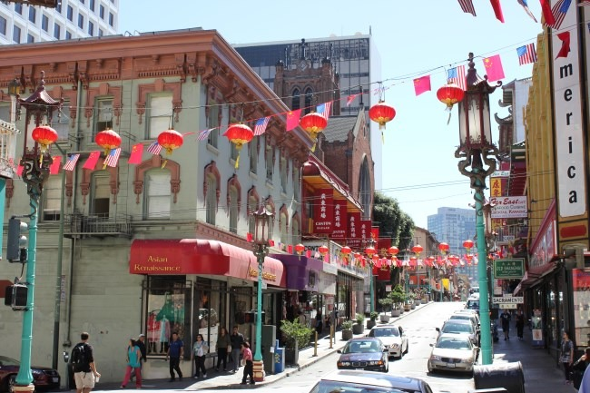

From 2008-2013 I did a few posts mapping my [urban hiking adventures](https://criticalmas.org/best-of/urban-hiking/) in Seattle. Now that I am temporarily in the San Francisco area, I thought I'd post one for this city. I've done many already. I'd say I've urban hiked over 100 miles in the city since my July arrival. Probably closer to 200 miles. Today I paid attention to the streets I was taking, so I could put together this map. Usually I don't pay attention and just move north, south, east and west, until I get to my target location. Today's espressos were Pinhole, Coffee Cultures and Contraband. All were excellent. If you are interested in the SF Bay Area coffee scene, you can follow along on my adventures via a Google Spreadsheet at [tinyurl.com/sf-espresso](http://tinyurl.com/sf-espresso).     _[11.6905 miles](http://www.gmap-pedometer.com?r=6452793)_ If you want to urban hike San Francisco, but like me don't want to pay for parking, start your adventures in Noe Valley, Castro, South Haight, Cow Hollow, Alamo Square or Bernal Heights. Monday through Friday is tougher, because even if you find free parking, you might be limited to two hours. Saturday and especially Sunday are easier, but get there in the morning. You want to be parked by 10 AM. By Noon the freeways are full of people coming into the city and parking will be much tougher. And to get around, I used to use GPS, but I ditched the battery draining technology for a good map. I'm learning the city a lot better with the Streetwise map.  _Streetwise San Francisco Map - Laminated City Center Street Map of San Francisco, California - Folding pocket size travel map with BART map, MUNI lines, bus routes by Streetwise Maps_

---

## Comments

### Big
*October 2 at 2014 at 11:21 AM*

I love the idea of Urban hiking...I wish I lived in a more scenic area but none the less, I can still do it here(Arlington, Texas)...Like hiking to my local Starbucks and back would be interesting...

---

### Anemone
*October 2 at 2014 at 1:24 PM*

I used to do park crawls when I lived in Vancouver - in the winter when the higher trails were under snow. The best ones were where they had left green corridors so I could mostly stay off the streets. But those streets look like fun to hike, too.

---

### Scott
*October 2 at 2014 at 10:39 PM*

Hi MAS,

Long time reader here. I know this is unrelated, so sorry about that. I was wondering - you mention that you enjoy ice cream a lot. Are there certain flavors that you prefer / avoid based on your dietary restrictions and gluten-freeness? If I take a trip to an ice cream shop, what should I look out for?

Thanks,
Scott

---

### MAS
*October 2 at 2014 at 11:03 PM*

@Scott - I used to stick to basic flavors with minimal ingredients and I still do mostly. However, I no longer avoid HCFS or carageenan. I wish I could have a choice of many different clean ice creams at a fair price, but I don't. So I pick the cleanest option at the best price. I tend to avoid the silly flavors, as they are most likely to have gluten and be of lower quality.

---

### Scott
*October 2 at 2014 at 11:27 PM*

Thanks MAS! I appreciate the quick response. Yeah that makes sense. You mean you don't go for the chocolate covered waffle cone with malted milk balls, caramel swirls and brownie bites? Hehe :)

---

### MAS
*October 2 at 2014 at 11:33 PM*

@Scott - Yes. Also if you have the space and are committed to ice cream, making your own is an option.

---

### Char
*October 3 at 2014 at 3:47 AM*

So an espresso every 3.666 miles.  Is that good mileage?

---

### Becca
*October 3 at 2014 at 12:16 PM*

Looks like a beautiful city... I find street maps are better to learn from than GPS too.  I recently tested this theory in Denver and it worked out pretty well.

---

### Nick
*October 6 at 2014 at 12:30 AM*

You've inspired me to do something similar in my home city - Melbourne - especially now the weather is warming up (not that it gets overly cold here, especially compared to Nova Scotia where I spent 2013).

---

### MAS
*October 6 at 2014 at 3:21 PM*

@Nick - That is great. Share a link if you do. Urban hiking is an awesome way to learn a city.

---

### Joe
*October 17 at 2014 at 9:20 PM*

MAS, I always enjoy these. Tell me, what's your pace for these? When you're doing them do you plan to stop every few miles or at specific times?

I've been walking and wandering San Diego a bit more and tend not to plan then I'm out later than I intend - till it gets dark. 

I'm sort of vaguely asking -- how planned are these urban hikes?

---

### MAS
*October 20 at 2014 at 10:38 PM*

@Joe - I use a Streetwise Map. At home I will write down (on paper) 2-3 coffee shops. I start my journey from a neighborhood where parking will be easier. In SF, that usually means to the West. 

I vary everything else. I am trying to learn both a city and its coffee culture. 

If coffee isn't your thing, I suggest bringing a camera. Just that act will make you more receptive to seeing new things, even in places you've been many times.

---

### Joe
*October 22 at 2014 at 7:38 PM*

@MAS, I appreciate it. I like the point of view. I've been walking more -- generally starting with a trolley or bus ride but with an "anchor" destination in mind. Making a *full* day of it sounds doable. And it sounds like you go at whatever pace feels right. Camera is a great idea too. Thanks!

---

### Javier
*October 25 at 2014 at 1:40 AM*

ou ice cream did you go to humphry slombe? yummmy ice cream. noble folk in healdsburg is good too!

---

