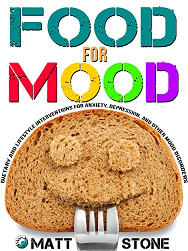

Matt Stone just released a new book titled _Food for Mood: Dietary and Lifestyle Interventions for Anxiety, Depression, and Other Mood Disorders_. Like his other books, it is an extension of the metabolism discussion. This particular book focuses on the role that our food and beverage choices and timing can have on both reducing or inducing anxiety.

 _Food for Mood: Dietary and Lifestyle Interventions for Anxiety, Depression, and Other Mood Disorders by Matt Stone_

For the most part, I enjoyed the book. Here are some ideas from the book that I found most interesting.

### #1 "Dieting lowers thyroid and raises cortisol with 100% consistency."

I knew this to be true, but when I read that sentence again, I immediately thought of the person who has struggled with fat loss for years. It is very likely that past diets have put them into a higher stressed state before they "begin again" with another attempt to lose weight. The more years of dieting, the greater the likelihood their metabolism has dropped as a result of lower thyroid and increased cortisol. Starting yet another diet is likely to fail without first addressing that stressed state.

### #2 Dieting too hard can result in anxiety and poor sleep.

My #1 tip on the post [Better Sleep for the Too Early Riser](/2014/10/better-sleep-early-riser/) is _Sleep Before Other Goals_.

> You may wish to gain muscle, lose weight or both. Maybe you have performance goals. Until you are sleeping like a champion, put them aside. Once you are sleeping better, body re-composition goals will become much easier. You do not want to stack stressors.

### #3 Shallow and Slow Breathing Reduces Anxiety and Increases Metabolism

This was the most interesting part of the book to me. I was aware that slowing the breath reduces anxiety. However, I hadn't thought much about the depth of breath. The style of breathing discussed in the book is Buteyko. This is something I'll be looking into more. The slow part makes sense to me. The shallow part doesn't.

### #4 You Can Induce Anxiety by Drinking Too Many Beverages

This is an extension of an idea that was discussed in more depth in his other books _Eat For Heat_ and _Diet Recovery 2_. Basically drinking a lot of beverages can reduce body temperature. This lowers metabolism and can result in feelings of anxiousness. When I did my ["Turn Up the Heat" experiment](/2013/03/my-plan-for-the-turn-up-the-heat-experiment/), I cut back on beverages. The result was I slept better and my body temperature went up by 1 degree. Not that I felt anxious before, but I did experience more calmness. I give part of that credit to drinking less water.

### #5 Consume Salty and Starchy Foods During an Anxiety Attack

It doesn't even have to be an anxiety attack. Anytime you are feeling stressed, salt seems to help. I use it my late-night [sleep dust](/2014/01/amazing-back-sleep-hack/). I'm also very aware of stressors and when they happen simultaneously I go for something like potato chips.

### Other Ideas

Food For Mood also had sections on mood stability, depression, and why increasing serotonin might decrease metabolism.

---

## Comments

### Anemone
*November 30 at 2014 at 9:34 PM*

Thanks for the heads up. I'm always happy to download a free ebook.

That shallow breathing doesn't make sense to me, either. I was under the impression that deep belly breathing activated the parasympathetic nervous system (calming) while chest breathing was part of the fight or flight response. Slow breathing makes sense, though.

---

### Matt
*December 1 at 2014 at 1:11 AM*

I don't know if "shallow" is the right word. Really the word should be "relaxed." The most relaxed breathing is the one where the fewest muscles are used. It's how you would breathe naturally if you weren't exerting yourself in any way, including forcibly trying to take deep breaths in either your belly or your chest. Just very gentle nasal breathing.

---

### Glenn
*January 7 at 2015 at 5:51 PM*

I love potato chips too, but I think they might be too fatty to be helpful in this context...

---

### MAS
*January 7 at 2015 at 11:05 PM*

@Glenn - A 1 oz package of potato chips is 160 calories. Nothing to worry about.
http://www.calorieking.com/foods/calories-in-potato-chips-classic-potato-chips_f-ZmlkPTc5MDUz.html

---

### Glenn
*January 8 at 2015 at 12:11 AM*

I'm not worried about the calories. It's possible that the relatively high fat content of the chips would reduce the effect of the starchiness. Anyway, is there something special about starch or is is a salty-carbohydratey combination we're aiming at? In that case, sleep dust would fit the bill, right?

---

### MAS
*January 8 at 2015 at 12:19 AM*

@Glenn - The book is about using food strategically to reduce anxiety. One should not be concerned about 10 grams of fat in a bag of chips, especially if it solves a mood issue and lowers stress hormones. Salt + Starch is a winning combination. Sleep dust might be enough or might not. I don't see a problem with chips. This isn't about body comp.

---

### Melanie
*January 19 at 2015 at 5:29 AM*

I'm pretty much that person you describe in point number 1. You mention "starting yet another diet is likely to fail without first addressing that stressed state". Is there a book (this one?) that you could recommend I read to start correcting the years of yo-yo dieting I've put my body through. Thanks :)

---

### MAS
*January 19 at 2015 at 10:50 PM*

@Melanie - I would say just focus on getting good quality sleep. Sleep is the best de-stressor. Although this post is geared towards the early riser, most of the tips are for all.
https://criticalmas.org/2014/10/better-sleep-early-riser/

---

