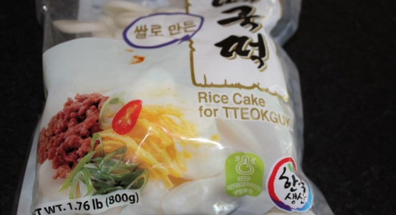
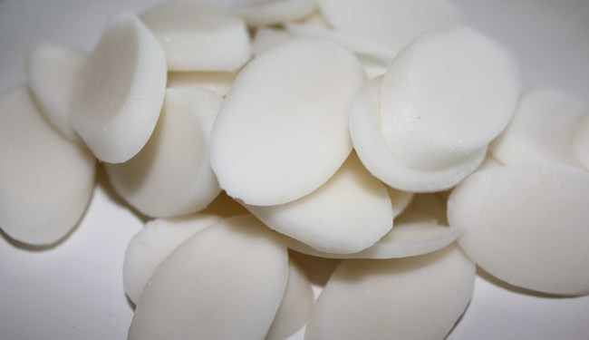
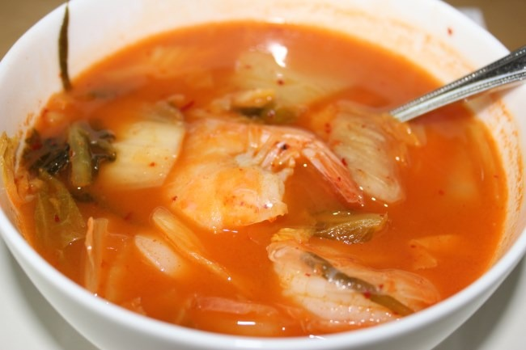

When I haven't planned for a meal or don't know what to make, I know I can always quickly make a few bowls of delicious Korean soup. All you need are some basic ingredients and then follow this guide. It should be noted that I am not Korean. I am from Ohio, yet I've had two different women both born in Korea tell me that I am more Korean than they are. Must be all that [kimchi](https://criticalmas.org/best-of/fermentation/) I've made. :) This is a soup template. It is not meant to be complete. This is a starter guide.

### #1 Warm up the Stock

The base for soup will likely be determined by two things. First is if you even have any stock on hand and second, what protein will be in the soup. Most of the time I make this soup, I just use water. However, I have used beef stock and [fish stock](/2012/10/anchovy-kelp-stock/). Beef stock is good for all meat and fish stock is good for all seafood.

-   Water
-   Beef Stock
-   Fish Stock

### #2 Add Gochujang and Chopped Kimchi to Soup

Your aspiring Korean kitchen should always have kimchi and [gochujang](/2012/10/making-gluten-free-korean-chili-paste-gochujang/) on hand. Gochujang is red chili paste. Add some paste to the soup. I add about 1 tablespoon per bowl. Sometime more. Different gochujangs have different spice levels, so you will need to dial in your ideal spice level. Chop up some kimchi and place that in the soup.

-   kimchi
-   gochujang

### #3 Add Korean Rice Cakes

If you are unfamiliar with Korean cooking, you have probably never seen Korean rice cakes. Outside of Korean grocery stores or mail order, they are hard to find. There are many different types of Korean rice cakes, but for soup I like the ones shaped like discs. They behave in many ways like a pasta and add wonderful texture to soup. If you can't source them, you have three options.

-   Korean rice cakes
-   Side dish of rice
-   More veggie. Seaweed and daikon are two ideas.
-   Make your own Korean rice cakes ahead of time. I've never done that, but here is a [recipe](http://www.maangchi.com/recipe/garaeddeok).

I cook the rice cakes for 3-5 minutes. Check the package though, as there are different cakes that will have different cooking times.   _Rice cakes are sold fresh, packaged and frozen. Whatever cakes you don't use right away can be stored in the refrigerator for a few days. A better idea is to just freeze them. This is will prevent mold._ 

### #4 Add the Protein and Finish Cooking

I've made this soup many ways. Shrimp is my favorite. You can also use sliced tofu or SPAM. I tried canned tuna once and it was awful. Don't do that.

-   Shrimp
-   Tofu
-   SPAM
-   fish ([croaker](/2012/12/korean-yellow-croaker-soup/) is a popular choice)

Each of these options will only take a few minutes to cook. Taste test if you aren't sure.

### #5 Garnish and Serve

I love adding sliced green onions (scallions) when serving. For additional saltiness, add fish sauce. For additional spiciness, sriracha or additional gochujang works. That is all there is. You now have a simple template for quickly making Korean soup.

-   Green onions
-   fish sauce
-   Sriracha or additional gochujang

 _Korean soup with Shrimp and kimchi_

---

## Comments

### Nathan
*November 15 at 2014 at 10:45 PM*

Hey, I just found this, thought you might be interested:
http://www.amazon.com/gp/product/B00O2RXEQ4/ref=oh_aui_detailpage_o00_s00?ie=UTF8&amp;psc=1

Expensive but Gluten free, and much better ingredients than most Gochujang you're going to find off the shelf.

---

### MAS
*November 16 at 2014 at 2:07 AM*

@Nathan - Making your own GF gochujang is super easy and cheap.

https://criticalmas.org/2012/10/making-gluten-free-korean-chili-paste-gochujang/

---

