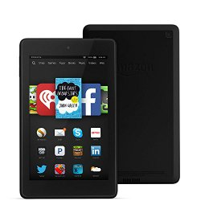

I haven't blogged since returning from my Seattle trip. The reason is I unpacked and starting playing with my new Kindle Fire 6. Earlier this year I raved about the [Chromebook](/2014/04/love-chromebook/). However, as much as I loved and still love my Chromebook, it fails on two points.

1.  Reading e-books on the Chromebook via the Kindle Cloud Reader gets tiresome real fast. You need to hold your elbow bent over the arrow keys to turn pages. After 20-30 minutes of this, you need to take a break to stretch out your arm and get the blood flowing again.
2.  The second thing is the Chromebook can't do Skype. It is not supported. Google Hangouts is fine unless the person you are trying to video chat doesn't have it installed. Also, I've noticed there are times when Skype works better.

Now that I have the Kindle Fire 6, I am blasting through books again. And I got Skype installed. Therefore less blogging.

The Kindle Fire also has a browser, so now I have been taking it with me into the kitchen to read recipes while I cook. It is much easier to move a Kindle Fire around than a laptop. And for $100 there is less financial risk should I drop it or spill anything on it. I might get a protective case for it, but I haven't decided yet.

I also installed Netflix on the Kindle Fire. Before I was using the smaller Pod Touch for my portable video player. The larger screen of the Kindle Fire is better.

