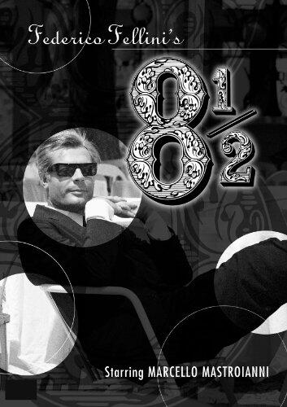

I am not in the mood to blog. I haven't been in a while. I feel like destroying. There is too much noise. There are times when I don't want to add to the discussion. I want to pull away and reassess. This is one of those times.

I am reminded of a line from the great movie 8 1/2:

> Destroying is better than creating when we're not creating those few, truly necessary things.

### INeedCoffee

When 2014 started my [coffee site](https://ineedcoffee.com) was a mess. 15 years of content. Some of it is great. Some of it is awful. Navigation was difficult and the site was spread so thin that it lacked focus. Instead of adding more content to make it better, I took the opposite approach. I deleted about 200 articles that were either low quality or didn't match what I felt the mission of the website should be, which is primarily to educate the home coffee drinker to make better coffee.

I moved the site off my hand-written Content Management System and over to WordPress, making sure every link, image and redirect displayed properly.

Then I spun off all the agricultural articles to their [own website](https://ecofriendlycoffee.org/). These long technical articles have tremendous value, but not to the core audience of INeedCoffee. They deserved their own home.

After those steps were taken, I selectively rewrote several tutorials and added new professional photos. Then a new tablet and mobile-friendly design were launched along with a link to a [Coffee Brewing Guide](https://ineedcoffee.com/coffee-brewing-guide/) anchored to the top of every page. Now the site has a focus, quality tutorials, and better navigation. I still have more work to do on the site, including more rewrites, but for the first time in more than a decade, I'm proud of INeedCoffee.

### CriticalMAS

Here on this blog, my vision is less clear. Although I once destroyed over 1,000 blog posts for an earlier version of this website (2000-2004), I don't have plans to do that again\*. Just not sure what direction this site should take. Topics that used to excite me, don't anymore. My need to share has never been weaker.

Someone asked me recently why I was interested in nutrition and I couldn't answer the question. You'd think that after the past 7 years of blogging about it that I'd be able to come up with a good response, but I couldn't. Maybe I am still reading about nutrition for the same reason I still skim financial news, which is I am hoping some new information will surface that will rekindle an interest that has faded.

I'll be taking a hiatus from this blog, while I try to figure out some of these questions. If you have any thoughts, leave a comment. I need guidance.

_**UPDATE January 2015:** I ended up removing about 750 posts._

---

## Comments

### Andrew
*December 28 at 2014 at 2:14 AM*

It can be painful to admit that you are no longer interested in something and be willing to step away from a huge investment of time. When I worked in academia where you are supposed to go deeper and deeper (more and more about less and less until you know everything about nothing) for your whole career,  it was kind of unbelievable the first time I realized I had exhausted a lot of my curiosity about physics.  It wasn't that I knew everything or that there were not questions I would have liked to have resolved, but my interest in other topics dominated more and more.  Having now gone through this with several other fields, most recently nutrition, I now can almost embrace the emotional state brought on by these transitions.   Nutrition has plenty to think about and the combination of trying to glean 'truth' from the world of studies, macro theories and biochemical minutiae while self-experimenting is certainly diverting for awhile.   For me the realization of how idiosyncratic and context dependent it all is drained me of the initial intellectual appeal so I am fairly content having some basic tools to enforce moderation in my then-current activity milieu and respond to issues as they arise.  

Anyway it makes sense to give nutrition blogging a break; there is more than enough noise and noise about the noise.  Your occasional posts on application of financial market reasoning to real world decisions are interesting so that could be a new theme at some point.

---

### Aaron
*December 28 at 2014 at 5:37 AM*

Hey MAS,

Take as much time as you need man.  When you find new stuff that excites you and that you need to share with people, we'll be here to read your unique opines!   With so many fascinating things going on in the world today and unprecedented amounts of information at our fingertips, it will be interesting to see what draws your fancy.

---

### Joep
*December 28 at 2014 at 1:15 PM*

For me, the posts you write about underlying principles are the most interesing. In those writings, the field (finance, fitness, blogging) becomes more like a metaphor. I think you have a talent for getting to the essence. Maybe when you reach that kind of clarity (like with your latest fitness post), your work is done :)

---

### Fabian
*December 28 at 2014 at 2:23 PM*

Blogging Blues! I’d say it’s absolutely okay to stop for a while. It’s not a chore, it’s not a job, so you may just do whatever you feel like. I did that over most of this year and am slowly feeling how it itches me to start writing again, so I guess a pause was just what I needed.

That said, I hope you keep going, as I have been enjoying your writing ever since I first discovered it. Your Foundation Training recommendation (to someone who isn’t interested in fitness topics at all) was great… It has become my standard workout by now, and several people have complimented my improved (though over the day far from perfect… ;) posture. 

So thanks a lot for that - and for your posts in general!

---

### MAS
*December 28 at 2014 at 5:55 PM*

@All - Thanks for the feedback. 

This morning I was thinking about my rules for having a good post.
1- must be educational, inspirational or entertaining
2- novel in some way
3- as concise as it can be 

Not only are these 3 rules good guidance for the reader, but also the writer. For me the limiting rule now is #2 novelty. Unless a topic has enough novelty, I lose interest and if I force it rule #1 or #3 may get broken. 

Many top bloggers get really good at #1. But with every post the material becomes less novel. To compensate for the lack originality, the posts get longer and longer. Crisp original writing is replaced with lengthy predictable prose. I was starting to see myself heading down that path.

---

### Sigrid
*December 28 at 2014 at 10:44 PM*

I guess one of the nice things about writing a book is that once it's written you can move on, to something else you're interested in. I've loved your site since I've discovered it a few years ago and at this point I treat it like a book, a repository of interesting articles on fermenting and fitness. And for this I find your Twitter reposts of older posts really useful. Just because you're not adding new posts to this site doesn't mean this site isn't a work of reference with enduring value.

The endpoint of your various journeys - to become and be antifragile - seems right. I've found it a useful and liberating way of thinking about everything. The beauty of that idea is that it does not lend itself to narrow prescriptions, unlike other more extreme food and fitness philosophies. 

I guess it's time to live adventurously and discover new things that excite you.

---

### marc
*December 28 at 2014 at 11:33 PM*

The post "Measuring Strength and Hating on HIT' was superb. That post made me think!

Measuring strength by a tensiometer might work well.  Arthur Jones used this measuring method along with others  at Project Total Conditioning at West Point.

Other ideas???? to measure strength increases?

---

### MAS
*December 29 at 2014 at 3:19 AM*

@Sigrid - Thanks. For those not on Twitter, every 6 hours a tweet goes out to an archived post on my @CriticalMAS handle. 

@All - Even though I do not know when or what my next post might be, I am still committed to this site. Currently I am moving a lot of images into the site from SmugMug. About 800 posts will be updated and most with larger images. 

@Marc - Not measuring is the end goal. But I am not a HIT trainer. maybe they would get some value with that tool.

---

### Pauline
*December 29 at 2014 at 3:10 PM*

I would miss your articles if you stopped blogging as I do when you take a break, its part of my daily routine, there are only about 3 sites I visit daily.  But I understand about flagging interest, my reading of stuff on health waxes and wanes.  I find if I take a break from it to read other things, I usually swing back again as that hiatus creates the impulse for further delving.  I think a lot has been written on nutrition etc over the years and there is a natural feeling of consuming too much information to wanting a complete break from it all.  I have always found your book reviews great and when I am in my own doldrums will look up whatever you have read and have a stab at reading something new.  You are a gifted writer, clear and level headed and full of much needed common sense.  It is good medicine in  a time of excess.

---

### Ty
*December 29 at 2014 at 4:10 PM*

Mas,

I've been meaning to a comment here for awhile, especially after reading your Knock Yourself Out Bro post. I'm sure there are some frustrations to blogging and life's definitely too short to spend your free time on things you're not interested in. So do what you need to do, however, I want to make sure you get credit for writing one of the few genuinely useful health/fitness blogs out there and frankly its one of a very very small number of them that I still read consistently.

I started putting on real weight in my early 20s (10 plus years ago) and like a lot of people got interested in diet and exercise to reverse this process. All the advice out there is basically terrible. I see the odds of starting from a position of knowing nothing, reading and trying things, and then successfully getting your health and physique into a shape that works for you as vanishingly small. I think a similar thing could be said about low back/muscle skeletal pain - which has also been a challenge or me the last few years.

For what its worth, your blog is responsible for my entire current fitness routine. I'm doing the Body by Science program weekly and have stuck to it for the past 6 months - pretty unusual for me to stay with anything that long fitness related. I've also been doing Foundation Training for the past few months, sometimes every morning, though lately I've been just doing a super intense weekly Foundation workout and am liking the results of that approach, and to top it off I just started doing the routine from 3 Minutes to a Pain Free Life this week. 

Its not like doing all this things has resulted in perfect health, but they've all been helpful and relatively easy to stick with and more effective than chiropractors and other body workers. I'm carrying more muscle than i ever have before, my low back pain is extremely manageable these days and I'd like to think I'm making some progress on an old shoulder injury thats my other source of muscle pain. I may even in time be willing to say these problems have been fixed, though caution is always appropriate with this stuff.

And, oddly enough, the other idea I got off your blog was to start experimenting with potato starch and other prebiotics ala free the animal. I know that's not a topic you spend much time on but I would not have investigated this without your favorable mention and that's actually been extremely helpful. I've experienced a reduction in body fat and appetite as a result of supplementing with potato starch, inulin, and a few others. 

I say all this having purchased my share of dragon door books, gone through a jogging phase, taken a few kettlebell classes etc and having spent plenty of money on chiropractors, a neuro-muscular therapist and other stuff. Good workable ideas are hard to find on the net.

Heck, I'm even thinking of giving Matt Stone another chance as a result of this blog. I'm curious if some of his ideas about mood and metabolism could be useful to me and if they are that will be another idea I've obtained here.

So anyway, thanks for all that. I'm not sure that means you should keep blogging if you aren't enjoying it, but I think its important for you to know that you are really good at it and that you are helping people.

---

### April
*December 29 at 2014 at 4:23 PM*

For what it's worth, your blog is one of the ones I most consistently enjoy, and I think a big part of that is because you don't seem to feel obligated to make X number of posts per week. I also like that you cover a wide variety of topics, because I frankly find blogs that focus only on one topic to be incredibly boring.

---

### MAS
*December 29 at 2014 at 10:08 PM*

@All - Thanks for the new comments. 

After I finish the massive image move, I will be creating a long overdo Best of Nutrition page and announce it on the newsletter, which I expect will go out in about 2 weeks. 

I've also started deleting and merging some older posts. Mostly photo ones or blogs and blogging.

---

### marc
*December 30 at 2014 at 4:11 AM*

@MAS

After pondering your reply.... I came to the conclusion that your reply is certainly the course of maturity and shrewdness. Perhaps only competition would lead to the necessity of measuring strength increases.

What the fitness world really needs is weight loss regimens that facilitate long term health.

All the best,

Marc

---

### Gokhan
*December 30 at 2014 at 10:46 PM*

I hear ya. My level of excitement for nutrition and exercise is also not what it used to be. Lately I have been more into worldly wisdom, such as the works of Charlie Munger. Maybe you can transition into becoming a applied-philosophy blogger? ;) How to master practise the art of being a stoic 101?? All kidding aside, I really enjoy your blog and hope the hiatus does you good.

---

### Anemone
*January 1 at 2015 at 2:25 PM*

I've gotten some fun ideas from here (cold acclimatization, stoicism) and learned about Matt Stone, which got me started on my eating disorder recovery (still in progress), something I'm very grateful for, but lately I've found your blog pretty boring. I guess it's because you weren't into it as much. Phew.

Go outside, have fun, live your life. Why spend all your time on the internet if you don't have to? (Here I am stuck inside in a cold Montreal winter while I recovery from semi-starvation. I envy you your location and health.) If you want to come back at some point, great. Sometimes we just need time to step back and let everything sort itself out in our minds. After a long period of acquiring information, we need time to assimilate it, make connections on a deeper level. Don't rush it. I'm interested in seeing where you go after this. I'm not interested in seeing you go around and around in circles, not getting anywhere. What is it they say - that you can't predict the emergent whole from the parts? You need to step back and watch it emerge? Something like that. You've got the parts, now let them gel.

Anyway, I have gotten a lot out of your blog, even though I often disagree, so thank you for that.

---

### Glenn
*January 2 at 2015 at 9:02 PM*

Don't know... No easy answers of course. Are there two or three blogs out there that you enjoy reading? Is it possible to fill in the gaps between those blogs? Or synthesize them in some way.

Also, how about going on a retreat for 2-3 days - preferably a silent one (i.e. no talking). I think a 10-day retreat is overkill, though. 2-3 days are usually sufficient...

---

### Justin
*January 2 at 2015 at 9:09 PM*

I feel compelled to write in to express my support for doing whatever you need to do, and to share my appreciate for your ongoing transparency. There is some value for me in your habit of sharing about how and why you do this work; a preference I have in art and life for including reference to how the thing is made, during the making or performing of it; no waving attention away from the man behind the curtain.

Joe at ArtLung turned me on to your work back when he and I were collegues in San Diego; early web development time.

I appreciate the concise reviews and opinions on material I otherwise would not have come across. I hope you'll continue to write as you come across new material, and as you're moved to.

I've taken something from your method and notes on style (points above) that I expect, if I could make a habit of sharing, or of initiating conversations as you do, rather than responding to them as I'm inclined to, would be influential and helpful. To date my site remains a skeleton with reference to my work and travels and very little meat. Perhaps that'll change in 2015.

I'll remain a devoted reader when you get the urge to share and I'll look forward to your thoughts and reflections on new experiences, particularly in the way of body work, movement re-education, Feldenkrais, etc.; things I've occasionally been an advocate for here.

Also, and I never would have anticipated this, you've been influential in turning me to finance, which I've been geeking out on since you're mention of Edwin Lefvre's entertaining memoir "Reminiscences of a Stock Operator".

Best to you and looking forward.

---

### James
*January 3 at 2015 at 1:15 PM*

Mas

I have only recently found your site. I typed "Foundation Training results" into google and it showed up. I guess I wanted some validation that I wasn't wasting my time on yet another phony program (though my instincts told me I wasn't). So far I have found tremendous value in what you have written. I ordered Hillfit via your link and will make it a habit to train that way, along with FT which I've done off and on for 6 months or so. 

Having flitted from training program to training program, spent £1000s on fitness equipment and supplements, yo-yo dieted for years and ended up the heaviest (17 stone) and unhealthiest I've ever been; the info on this site is a breath of fresh air. I still need to sort my diet out, and am looking through the related posts here, any advice is appreciated. 

I found your posts on Pavel very interesting. I dabbled with his programs, but more unfortunately went down the Tacfit/Sonnon path, which I bitterly regret. After years of being burnt and scammed, I came to the conclusion that fitness and diet need to be as simple and sustainable as possible. It's at this point in my life that I have come to your site, and I thank you for the words you have shared thus far and hope you continue to write well into the future.

All the best,
James

---

### garymar
*January 4 at 2015 at 5:13 AM*

It is entirely a compliment, and an endorsement as well, when I say that your blog has always reminded me of the old joke about the World's Most Boring Headline: "Sensible Canadian Initiative".

---

### Mundus
*January 6 at 2015 at 9:56 PM*

Hey MAS, I'm new to your blog, but already I have been reading one of your posts at least once a day, and it has proven invaluable to me. I, like most people, had never even heard of such a thing as HIT. Luckily I found your blog before I fell for the fitness propaganda that is used by our controlled media sources! It reminds me of the lies they tell us about our hair and skin products...very unsettling. What do you expect though, when we are born into a place where the masses elevate fools into rich "heroes"! I'm just glad I found this place; thank you so much for opening my eyes to High Intensity Training.

Anyways, I would be very sad if you stopped making new articles, since I have come to rely on your advice for my own health choices in life. I know you said you feel like you ran out of things to discuss, but maybe you can try something like the "ultimate" article, the final say on how to live your life. It could be a collection of everything you have taught us about HIT. I guess it would be like a training program(MAS style)? A checklist of things, like buy proper workout shoes(flat), determine body type(ectomorph!), exercise in cold environments, do the Big 5, etc. You can just copy and paste from the appropriate posts you've done, or edit as you see fit, into your last masterpiece!

Well I've gone on long enough. I hope you feel better about writing soon, because this is a fantastic website. Bye!

P.S. Have you written about green drinks? Or martial arts? I haven't found one yet, or maybe it's because I'm new...?

---

### Yaco
*January 7 at 2015 at 10:46 AM*

"We don't practice in a fixed way because we don't want to program a fixed response; we want one that is dynamically appropriate to the situation." Is better develop intent than strength, http://www.yichuankungfu.com/cheuk-fung/yi/

---

### Anthony
*January 7 at 2015 at 6:56 PM*

Hey MAS

Not sure if this will help, but perhaps it will on the nutrition front.

I've thought for some time now that nutrition is so interesting because it allows for such immense personal power over our lives. By moderating and being mindful of the quantity and quality of energy we stuff in our faces, we direct the course of our physical health over a lifetime.

This is the truth of nutrition. To the extent that we control what does and does not go into our mouth, we control a huge part of our life, the physical part that is the foundation for everything else. You really couldn't ask for a better system. And the more one successfully respects that system, the better one feels, and (usually) the better food tastes. 

IMO, food is to health what sight is to the senses. The largest and most powerful input.

- ADJ

---

### Simon
*January 8 at 2015 at 11:06 AM*

Hi MAS,

I just wanted to send a quick reply to thank you for all the blogging. Like other people have said here, your site is one of about 3 that I visit nearly every day to see if there's a new post.  Through you I found HIT etc and changed the whole way I train so thank you so much for that. 
One book you might like that may help you in finding new direction is Viktor Frankl's Man's Search for Meaning. It's a short book and pretty amazing.  Best of luck with everything.
Simon

---

### MAS
*January 8 at 2015 at 5:36 PM*

@All - Thanks for the supportive comments. 

@James - I have not followed Sonnon for a decade. He was pushing Clubbells the last I checked in with him. Bought a pair, which in retrospect was wasted money. I'm sure I could have went to a hardware store to find something cheaper to swing around. 

@Mundus - No, I have not written about green drinks or martial arts. Green drinks might be interesting, but I've never been interested in martial arts.

@Anthony - Totally agree. 

@Simon - Someday I will read that book.

---

### Michelle
*January 8 at 2015 at 11:59 PM*

Hey Man, I totally feel you! Nutrition used to be fun and exciting. Now I feel I've learned everything there is to learn I miss that passion I used to have.  It was fun in the beginning when everything was new and at one point all the changes felt overwhelming. I'm guessing the path/journey is more fulfilling then actually getting there.  However, there will always be new knowledge just at a slower pace. I've found with things of interest it's ok to leave them for a bit and come back to it later. Good luck! I've enjoyed reading your blog! Body by Science game changer!

---

