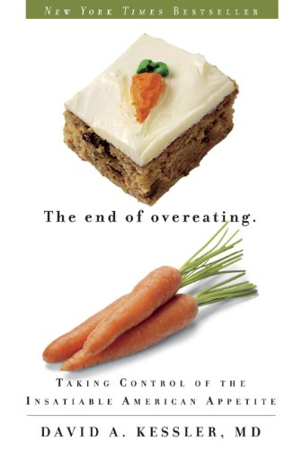

A few days ago I read a comment on _180degreehealth_ from Jason who is frustrated with figuring out how to lose weight.

> So basically what I gather is that its pretty much impossible to lose fat. Calorie restriction doesn't work. Macro restriction doesn't work. Food reward is out the window. Exercise doesn't cut it. Eating clean doesn't matter.
> 
> Ok avoid omega-6s, don’t starve yourself, don’t drink too much water, eat the food, take some glycine.
> 
> I’m doing all of these things and I feel like shit and am 270 lbs.

I really empathize with Jason. When you start going down the well of online experts on fat loss, there is so much disagreement. There not only are several different theories of obesity, but each camp is quick to discount the other theories. So what happens over time is the person seeking help becomes more knowledgeable but more paralyzed.

A few years ago I was wrestling with competing nutritional philosophies and the deeper my knowledge went the more confused I got. So I stepped back from the problem and reassessed. Nutrition was an incomplete knowledge problem. We don't know who is right and those writing the articles don't know our needs. Since we don't know, we _invest_ ourselves into the thesis that makes the most sense to us. That is when I put together the post [Approaching Nutrition From an Investor's Mindset](/2013/04/approaching-nutrition-from-an-investors-mindset/).

I encourage all to read that post now. The basic concept is that the foods we select are like investments. We get more value from the foods we are lacking and less value from those we consume on a regular basis. If we approach fat loss in the same manner, I think the picture gets more clear.

> _**Calorie restriction doesn't work.**_

Calorie restriction does work for many. The first downside is counting calories isn't fun and can be cumbersome or inaccurate. Secondly, most people gain the weight back. Metabolism drops. If you've been chronically dieting then this tool in investment terms is not undervalued. However, if you've been exceeding your calorie level, this tool is more undervalued and worthy of investment consideration.

> _**Macro restriction doesn't work.**_

Another take on calorie restriction. It provides a simple narrative to accomplish a calorie reduction. We've seen countless examples of people who use low-fat, low-carb, or Zone-like iso-caloric strategies to jump-start a diet. Although some hit and maintain their goal this way, many get the gains early and then stall. In investment terms, the strategy went from undervalued to fair value. At that point, move to another strategy. Doubling down is a bad idea in investing and with fat loss as well. Lock in your gains and move on.

> _**Food reward is out the window.**_  

I'm not so sure. The thesis here is that food scientists able to create foods using a mix of salt, fat, and sugar into something so tasty and easily digestible that we eat past satiety. Having read _The End of Overeating_, I think there is merit in food reward. How much of a role, I do not know. If one consumes very little processed food, then this would be a poor investment. If one consumes a lot, it is worth consideration.

 _The End of Overeating: Taking Control of the Insatiable American Appetite by David A. Kessler_

> _**Exercise doesn't cut it.**_

If someone isn't exercising, then exercise is an undervalued tool. If someone is exercising too much, then it is overvalued.

My personal belief is that fitness professionals prescribe too much exercise, but some exercise is necessary. Lots of walking and just enough strength training. The risks of too much exercise are injury risk and increased appetite. For me, the sweet spot is to walk every day - be it 30 minutes or 2 hours - and then lift weights 1-2 times a week for about 15 minutes. I use machines with the movement performed slowly. Anyone that says 15 minutes "isn't enough", either doesn't understand intensity or is not looking at a long enough time horizon. See the book Body By Science for a deeper understanding or if you don't have a gym [Hillfit 2.0](/2013/07/hillfit-2-0-a-zero-budget-approach-to-high-intensity-training/).

> _**Eating clean doesn't matter.**_

If someone has a slow metabolism and has already been eating clean, it probably isn't helping. But that isn't everyone, so it depends on the person. Or we could be defining "clean" inaccurately.

### Building Our Fat Loss Portfolio

A good investor doesn't just buy one stock. They diversify. They don't know which investment is going to make money and which ones won't. A good investor will limit their losses on their bad picks and periodically rebalance their portfolio. You can't beat yourself over picking bad stocks. Sell them and move on. Maybe one day you will buy it back at a better price.

Approaching fat loss with this mindset frees you from any allegiance to the different nutritional camps. You use the tool that is undervalued to you at that moment and discard the ones that aren't. And no internet expert knows you better than you know yourself. No one is getting 100% success rates. That tells you that not every fat loss strategy works for every person.

I personally see the diets that are having the most long-term success are using some form of cycling. You have time periods of reduced calories and exercise and time periods with more calories and activity. Those are paired in a manner to reduce overall calorie levels while maintaining metabolism.

---

## Comments

### Gokhan
*January 29 at 2015 at 8:20 PM*

Overeating is like compound interest. Overeating a few days a year does not matter, but do it consistently over a long time and the results will be amazing :).

---

### Jennifer
*January 30 at 2015 at 6:08 PM*

I'm no expert, but I have had some success of late after years of dieting, years of giving up...  but in the last couple of months I've lost maybe 20 lbs (more to go).  It's pretty simple (for me): eat less, walk more.  I've set a goal of walking AT LEAST 1 mile a day.  As for food, I just make sure I eat all three meals, and eat slowly and listen to my body to know when to stop.  Also cutting waaaay down on bread.  I realized dieting wasn't going to work for me, but sustainable lifestyle changes would.  And realizing that my overall health is more important than happy taste buds.  Of course we'll see how it goes, but I feel better.  Your posts always inspire me!

---

### Glenn
*January 30 at 2015 at 6:27 PM*

Very sensible. I'd also suggest checking out The 2-Day Diet, and buying/building a treadmill desk. A total game changer!

---

### MAS
*January 30 at 2015 at 6:48 PM*

@Gokhan - ...or reduced metabolism or both. 

@Jennifer - For most people a linear approach only works for so long, which is why sustainable fat loss is hard to achieve. A zig zag or cyclic approach seems to be more effective. Glad to hear my posts are inspiring. 

@Glenn - Looks like an interesting take on the cycle approach. 
<blockquote>To reach your perfect weight simply follow the low-carb plan for two days a week, then for the rest of the week eat normally but sensibly with the help of the healthy eating guidelines. </blockquote>
Since low-carb often means "higher protein", I can see how this might be effective. Are you doing this currently?

---

### Anemone
*January 31 at 2015 at 10:17 PM*

You're assuming that (1) losing fat is a good thing, and (2) it is possible to reduce weight maintenance to a set of formulas with variables we can manipulate effectively - that weight is subject to conscious control over the long term rather than the result of a set of complex mechanisms that long predate our conscious brain, evolutionarily speaking.

One of the comments on the other article is that obesity is often associated with yo-yo dieting. Another point is that obesity may correlate with illness, but is not necessarily a cause. It may actually be a response to stress in the system (dieting, early stages of an illness) rather than a cause. Fat may not be pretty, but other than that there may not be anything wrong with it per se, and it appears to be protective when people are ill.

link: http://junkfoodscience.blogspot.ca/ - check out 'obesity paradox' series
(I used to also refer people to YourEatopia, but have clashed with the site owner over bad science she insists on citing that is not related to eating disorders, so now I'm not sure.)

Set point theory (which I realize not everyone accepts) says that your body fights to maintain your weight in a narrow range, and if you over or undereat, your metabolism will speed up or slow down to compensate. And the best way to lose weight (if you need to) is to stop dieting and eat to hunger (if you have normal hunger signals) or count calories and eat what someone your age/sex/size normally eats (if you do not have normal hunger signals - i.e. are eating disordered).

links for set point: <a href="http://www.nytimes.com/2007/05/08/health/08fat.html?_r=5&amp;sq=weight%20loss%20rockefeller%20university%20&amp;st=cse&amp;scp=3&amp;pagewanted=all&amp;" rel="nofollow">NYTimes article</a>; http://www.mirror-mirror.org/set.htm

One of the links from the mirror mirror article emphasizes healthy habits: eating fruits and vegetables, getting exercise, not smoking, and drinking in moderation, rather than dieting.

I feel for Jason - since beginning recovery from chronic unintentional starvation I have put on probably 85-90 lbs (from BMI 22-23 to BMI 39), with maybe 40 lbs of that water. (Some of it is muscle, though!) It's not fun, but if I keep eating enough, eventually my metabolism will pick up and burn off the excess. I don't know when the water will go but presumably when it's good and ready.

---

### Texbola
*January 31 at 2015 at 11:28 PM*

Simple....cut carbs and eat non-man made food and be patient...

---

### MAS
*February 1 at 2015 at 1:26 AM*

@Anemone - If set point theory is real, and I have no doubt it might be, then a cycle approach address both the calorie deficit needed and the hormonal support. Using investing talk, a hedging strategy is used. 

@Texbola - You missed the entire point of this post. It is about making decisions in the absence of information. People have succeeded and failed on every type of diet. In the end, the only right diet is the one that works for the individual and works in the long run.

---

### RetailTrader
*February 1 at 2015 at 2:01 AM*

Very intrigued by the thoughts on cycling, Perhaps  the next thing then is to think about how exactly we can implement this. Thoughts on a live example would be great!

---

### MAS
*February 1 at 2015 at 2:39 AM*

@RetailTrader - Oh I think this is the early stages of this topic. The more I think about it, the more interesting it becomes. Applying risk tolerance, diversification and hedging principles to a fat loss strategy is exciting.

---

### Gokhan
*February 1 at 2015 at 7:30 AM*

MAS do you follow Nassim Taleb on FB? It's great, he posts his thoughts there every few days or so. You mentioning cycling actually reminds me a bit of the "barbell method".

Personally I have been one those guys that ate too much muscle meat to the point where a steak really doesn't appeal to me anymore. So my plan is to abstain from eating meat for most of time, but then splurge on it ever so often. Like our ancestor's did whenever there was a festival of some sort.

---

### MAS
*February 1 at 2015 at 7:53 PM*

@Gokhan - Not on FB, but I listen to his interviews on EconTalk and have read all his books. I like how he thinks about risk. I even did a post critiquing his fitness strategy based off his risk model.
https://criticalmas.org/2013/01/what-taleb-got-wrong-in-antifragile/

---

### Jonathan
*February 1 at 2015 at 10:15 PM*

Hi Michael,

I have to disagree with you on the food reward idea being thrown out the window.  I think food reward is one of the most powerful tools we can use to gain or lose weight.  You used it to gain weight when you started eating lots of ice cream.  Ice cream is a highly rewarding food.  It is very easy to eat a tremendous amount of it AND consume lots of calories at the same time.  It is also a very processed food.

On the other side of things, someone could eat a fair amount of protein and starch with little added fats/sugars.  This would drive down the palatability/reward of the food, meaning they would consume less of it AND ingest fewer calories since whole foods almost always have fewer calories to begin with.

Manipulating flavors, textures and macronutrients can have a profound effect on how much we consume in a given meal.

---

### MAS
*February 1 at 2015 at 10:24 PM*

@Jonathan  - I was quoting someone else.

---

### Becca
*February 2 at 2015 at 4:05 PM*

I'm intrigued by the idea of getting a better definition of "clean eating."  I think it means something different to everyone.

---

### Karl
*February 3 at 2015 at 12:16 PM*

As always a thoughtful and very well reasoned approach. 

I think there's a good bit of variance in what 'works' for any of us. Obviously the bottom line in calories in and out, but that's more like (to continue MAS's thought) making sure your balance sheet comes to 0 when your calculations are done, it's not necessarily causal. So if you're not losing weight, whatever you're doing isn't working and it may be time to diversify your plan a bit.

One of the bigger mistakes that I see people make is the idea that there is one way to do it and once you find it you can't change. People will lose a bunch of weight on low carb or whatever and then slow significantly or stop. They then decide that they need to go even lower carb and start looking at the amount of carbs in heavy cream or whatever. That way lies diminishing returns. Keep an open mind and remember your balance sheet to 'check your work'. If the weight is coming back or doesn't go down, then it's time to diversify.

I think food reward and how different foods affect you is also definitely something to keep in mind and as a corollary, there's a critical need to be honest with yourself. There's a lot of clear evidence that the people who swear up and down that they're eating 1,000 calories a day and never cheating, but still can't lose any weight are actually eating far more than they say- we all remember that time we switched out fries for a salad, but most forget the 15 M%Ms they went through while waiting for the copier at work. It's notable that even the people who claim a metabolic advantage to whatever way of eating, say it's really small.

Another core principal is that if you're not happy with your body in some way you need to do something different because whatever you're doing isn't working. We're all wired to keep going roughly the way we are and change, even clearly positive and desired change, is really, really hard. It's part of being human, which is generally pretty great, but can also be a real hassle sometimes. There's no need to feel bad about how hard it is, but it's important to recognize the self-imposed obstacles to changing. I have no strong idea about how to overcome that inertia, but must be part of the process.

---

### MAS
*February 3 at 2015 at 4:29 PM*

@Becca - I like your comment. It is worthy of its own post.

@Karl - Personally I think there is validity to food reward, but I want to structure my fat loss portfolio in a way that still works should food reward end up being a flawed concept. 

The book the Willpower Instinct has a part where instead of imagining we will be successful on reaching on goals, instead imagine us failing. Then ask yourself how you will respond should failure happen. 
https://criticalmas.org/2014/10/understanding-willpower/

Using your M&M example, you might have a no M&M rule, but find yourself by the copier grabbing a handful. By planning for this possibility, you could have in place a decision that you must execute next. In investing terms, a stop loss order. Having a stock drop 5% and executing a sell order might be like eating M&Ms by the copier requires going to the stairs and climbing up and down 10 floors before you leave the office.

---

### Karl
*February 4 at 2015 at 1:49 AM*

@MAS 

I really like that approach of planning around failure happening, especially since that's more likely outcome anyway. That makes sense in a lot of contexts. I'm going to have to try it with a few of my I Want plans.

I had missed that previous willpower post of yours, thanks for the link! That's all really interesting. I've tried meditation several times in the past and although I like it and found it useful, I was never able to keep it up. Maybe that's a good testing ground for the ideas in the post.

I'm pretty sold on food reward as well. I live in Asia and the most striking difference between here and the US, though this is changing, is the overall high level of their food culture. Even at the lowest price points you can get food that's hand made and fresh, and therefor completely free of those homogenous eating signals that so much of our processed food has. 

It was interesting to have a true celiac colleague come through for a visit to Seoul, Shanghai and Bangkok and find that restaurants in those cities had no problem identifying which dishes were ok for her to eat. She told me that in the US, it's pretty hopeless unless the restaurant has made gluten free a policy. The big difference I think is that so much of the Applebees (or wherever) food is pre-made so the staff have no idea exactly what's in it.

So for me it isn't a big shock that Asians are generally much thinner without any of the diet and exercise mania we often see in the states. It's much easier to be slim if all you eat is freshly made food. I'm pretty convinced that that's a big piece of the puzzle.

---

### MAS
*February 4 at 2015 at 6:58 PM*

@Karl - I noticed healthy lean people in Thailand and Cambodia during my 2009 trip. Then I went to Kuala Lumpur, Malaysia which due to more wealth had a lot more modern food. Many were overweight and their skin looked less vibrant than the Thai and Cambodian people.

---

### Arthur
*February 5 at 2015 at 3:11 AM*

Michael, what a BEAUTIFUL concept. It's so much better when people give examples on a concrete case, really, this just is brilliant. 

It never occurred to me that this is investing. Much of life is investing. You're basically trying to get the best outcome for you investment based on limited information on majority of the cases.

I'm not an investor, so your take on this would be awesome: how does this applies to other areas in life that has nothing to do with nutrition (or any other field where opinions frequently bash each other) or do you think this is a good mindset to have in all areas of life?

There will be a point where cycling won't bring any benefit, will it? Once you know more-or-less what work and what doesn't, isn't more beneficial to focus on those 20%?

---

### MAS
*February 5 at 2015 at 5:13 AM*

@Arthur - Thank you!

I think the investor mindset is a good one to have in absence of information. So your conclusion is accurate. As you learn more or less what works for you, you can "rebalance your portfolio" so most of your portfolio is what you know works. And you discard the ideas you know don't work for you.

---

### MAS
*February 10 at 2015 at 1:52 AM*

@Becca - The "eating clean" post is up.
https://criticalmas.org/2015/02/approach-eating-clean/

---

### Johan
*February 26 at 2015 at 8:01 AM*

Great post... as usual.

---

### LL
*July 14 at 2015 at 10:08 AM*

It always amuses me that people think everyone who cuts carbs will lose a stack of weight (even if just at first). Maybe it works if they are cutting some of the over processed crap that tries to pass off as food/carbs (so it is actually more like "cycling" because there is a contrast to something else) - but I can cut all carbs, feel great, go for a long run if I want, not eat at all, eat whatever the hell I want, exercise, not exercise, eat "clean", eat a bit of junk, eat protein bias, eat fat bias, eat carb bias, be vegan, vegetarian, paleo, keto, and still not lose the 10kg I need to - don't lose any more than 3kg no matter what I do, and even when out of control eating all sorts of crap, barely put on a few kg, and then settle back to the 10kg overweight point again. Nothing more than mother nature's joke on modern aesthetic tastes!

---

