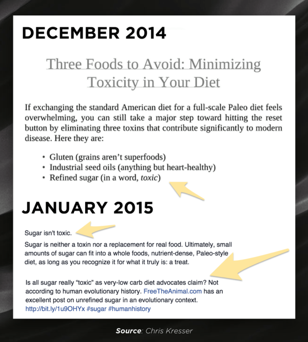
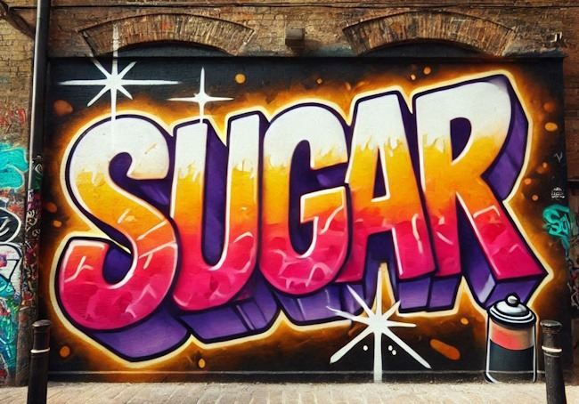

Last September I posted [5 Issues I Had With Your Personal Paleo Code](/2014/09/5-issues-personal-paleo-code/), which was my review of Chris Kresser's book. From that review:

> ### #2 Refined Sugar is “Toxic”

> 
> No, it is not. The fact there are carbohydrate sources with better nutrient profiles does not make sugar toxic. Chris likes and recommends ice cream, but says sugar is toxic. Well, check your ingredient list there pal, ice cream has sugar in it. When I became underweight, I used sugar (in ice cream) to stimulate my appetite to [regain weight](/2014/09/gaining-weight-paleo-diet/). I also used a mix of refined white sugar and salt to lower my stress levels to get [amazing sleep](/2014/01/amazing-back-sleep-hack/). Sugar is complicated at best. It is not toxic.

I got a lot of pushback in the comments, but now I have someone else that agrees with me. Chris Kresser himself.

I want to give a hat tip to Danny Roddy for alerting me to a recent post by Chris Kresser titled _Is Refined Sugar Really Toxic?_ Be warned that Kresser has an annoying newsletter pop-up window on every page, so I'm not linking to it. You don't need to read the article, because I have and took notes.

_Facebook was forcing people to log in to see this image from Roddy and showing up on my broken link checker report, so I copied it here._

__

The short version is that Kresser no longer is saying sugar is toxic. Maybe he read my post and wised up? :) HA! Let me go through the 7 points made in the article and comment on a few of them.

1\. We tend to over consume sugar calories in liquid form, which can lead to weight gain and other health issues.

**It is the calories, not the sugar.**

2\. The evidence that sugar reduces your immune system is weak.

3\. The simple narrative that cancer feeds on sugar is false. Cancer feeds "on the glucose in your blood; not necessarily the sugar you eat". Avoiding high blood glucose levels is the goal, not eliminating glucose.

4\. There is evidence that excess sugar is harmful.

**The key word in that sentence is EXCESS. Again, it is the calories, not the sugar.**

5\. Human studies have not reproduced rat studies showing binge-like addiction behavior in sugar consumption.

**Like the word "toxic" the word "addiction" gets thrown around way too easily.** 

6\. Sugar can interfere with hormones that control appetite and satiety.

**This can be a good thing! If I am underweight, have a sluggish metabolism or a hard gainer seeking more muscle, I can use this knowledge to choose sugar as a tool to increase my caloric level past satiety.**

7\. High Fructose Corn Syrup (HFCS) is not metabolically different from sugar.

**Just what I suspected.**

### Final Quote: Sugar is Not a Toxin!

Chris concludes his article by stating:

> Sugar is neither a toxin nor a replacement for real food. Ultimately, small amounts of sugar can fit into a whole foods, nutrient-dense, healthy diet, as long as you recognize it for what it truly is: a treat.

Exactly what I have been saying since 2012.

---

## Comments

### Becca
*January 27 at 2015 at 5:50 PM*

Agreed!  All the emphasis on sugar being evil is one of the things that led me away from the Paleo/Primal camp.  Glad Chris Kresser changed his mind.

---

### Marc
*January 28 at 2015 at 1:06 AM*

Extreme behavior patterns can start with self-deprivation.... which can develop from  ideas such as the complete avoidance of sugar. These behavior patterns, if left unchecked and unnoticed, may result in a withdrawal from  certain pleasures of life.

Refreshing meals, which may include "sugar," is part of a healthy and happy life. One should enjoy life and shun ascetic behavior patterns that are suggested by supposedly enlightened ones!

Don't worry, be happy

Marc

.

---

### Juan
*January 30 at 2015 at 3:46 AM*

Maybe you guys haven't realized this. But this Chris Kresser article *isn't* new, he posted it back in July. Just thought I'd make that clear since I've seen this passed around lately as though this is new.

---

### MAS
*January 30 at 2015 at 2:57 PM*

@Juan - Thanks. It was still published after his book, so my point about "coming clean" is still valid. It is a shame he is now hiding the dates on his posts.

---

### MacSmiley
*January 30 at 2015 at 8:04 PM*

"…hiding the dates on his posts"??

---

### MAS
*January 30 at 2015 at 8:18 PM*

@MacSmiley - Chris is not only using dateless URLs, but does not display when his post was written or last updated. A reader doesn't know if the content is new or out dated. With health or financial information, I don't feel that is appropriate. Chris loses credibility with me when he disguises the age of his content. 

The only way to gauge the age of his posts now is to see the date of the first comment and then you don't know if he updated the post since then. 

More of my thoughts on when it is and when it isn't appropriate to use dateless URLs here --> https://criticalmas.org/2014/06/blogging-permalinks/

---

### Ashlee
*January 30 at 2015 at 8:21 PM*

I totally agree with this, and with Marc's comments, as well.  When I first delved into reading blogs on nutrition and paleo a few years ago, there was so much fear-mongering that I was afraid to eat anything.  I'm not overweight, and I have no ailments, but I still became a perfectionist about it all.  The joke is, there is no Perfect.  I now enjoy chocolate, wine, steak, and potatoes with no guilt.  I stopped doing squats every day with no guilt.  I still read and study the health blogs/literature because it's interesting to learn, experiment, and tweak one's life process.  But there has to be balance.  A friend of mine advised that my workouts shouldn't be "work" - "run like a puppy," he said.  So now I run like a puppy and eat like a puppy.

---

### Juan
*January 31 at 2015 at 12:52 AM*

@MAS - "With health or financial information, I don’t feel that is appropriate. Chris loses credibility with me when he disguises the age of his content."

Exactly, same here. And sadly, I know a few other health sites that do that.

---

### Texbola
*January 31 at 2015 at 11:33 PM*

You people are fools...just eat all the sugar products you want.
Gosh there is study after study on the effects of glucose on insulin and health...
Yet the foolishness goes on and on and on and on and on and on....

---

### MacSmiley
*February 1 at 2015 at 4:22 PM*

No one is advocating large and excessive consumption of sugar. But we do want people to chill on the Sugar Fearmonger Express.

Is sugar detrimental in excess? Yes. Even water is toxic in excessive amounts, but that does not make water a toxic substance. Same with sugar. It is not *inherently* toxic. Consider that the Hadza H-Gs eat about 15% of their calories in honey 10 months of the year. 

As for the insulin alarmism, you can set that aside now, too. Because studies and sanity:

JAMA | Effects of High vs Low Glycemic Index of Dietary Carbohydrate on Cardiovascular Disease Risk Factors and Insulin Sensitivity /The OmniCarb Randomized Clinical TrialGlycemic Index, Cardiovascular Disease, and Insulin SensitivityGlycemic Index, Cardiovascular Disease, and Insulin Sensitivity

http://jama.jamanetwork.com/Mobile/article.aspx?articleid=2040224

Questioning the Idea of Good Carbs, Bad Carbs - NYTimes.com

http://well.blogs.nytimes.com/2014/12/16/questioning-the-idea-of-good-carbs-bad-carbs/?_r=0

Discussion:

The Carb-Sane Asylum: Thirty Years of Glycemic Index Dogma, and The American GI Man

http://carbsanity.blogspot.com/2015/01/thirty-years-of-glycemic-index-dogma.html?m=1

Use some common sense. Eat whole, real food most of the time. Whole plants are especially good for us. 

And as Marion Nestle says, "Enjoy your food". Even if it has a little sugar in it.

---

### Bryce
*February 4 at 2015 at 2:03 PM*

Michael,

Sisson has long admitted to putting enjoying his morning coffee with a teaspoon of sugar (possibly from coconut sugar or some minerally dense variant). Seems he agrees too!

Been experimenting with some daily honey, and also (to great effect) with less neurotic water consumption because of some of your posts. I have to say I feel less thirsty when drinking less water. I try to just eat wet food and drink bone broth with salt. I was about to say it feels counter-intuitive, but that's not right. Instead, it's counter to how we have trained ourselves. You'd be hard pressed to find a hunter gatherer who believed they need to drink when they weren't thirsty, eat when they weren't hungry, etc.

---

### MAS
*February 4 at 2015 at 6:55 PM*

@MacSmiley - Thanks for the detailed response. 

@Bryce - Drinking less water has been such a benefit to me. My skin used to be chronically dry. Not anymore.

---

### Mans
*February 5 at 2015 at 1:11 AM*

The more I studying dieting and health the more I realize balance is more of the answer. You sound like quite the sugar enthusiast, though, Michael :P

Overall, to say that sugar is a "toxin" is taking it too far. Sometimes what we do with something (as a hardwired species) might be more of a warning than the thing itself. Methamphetamine isn't inherently bad for you, but it typically leads to some serious issues; not comparing sugar to meth, but Kresser's warning about drinking sugar/calories is relevant given how many people overlook this.

Everything is, essentially, a tool. Even cyanide can be a tool for good if taken at minimal doses to improve your body's tolerance and response. So, in a way, I agree with you, but Kresser's warning seems to be "modern usage of this tool is way too relaxed".

---

### Yessi
*February 27 at 2015 at 3:59 PM*

Mas, I have just started to scratch the surface of the great sugar debate after years of feeling like it was "poison". 

I highly recommend everyone get a genetic test and start tweaking your diet to suit your ancestry and whatever genetic mutations you have. We usually “know” what our bodies need anyways, but there might be some great advice hidden in you genome you are unaware of.

I tried getting all my carbs from low-glycemic veges for about a year. When I added potatoes, my health remarkably improved. I think it was beneficial because my ancestors ate a lot of carbs, because I have Lyme Disease robbing me of my glucose, and because i do HIIT (anaerobic exercise uses glycogen, while endurance uses fat for fuel).

I’ve experimented with Ray Peat's pro-fuctose anti-glucose methods, as well as Kresser's 30 day diet (which became a year long diet) and what works best for me so far is Kresser + potatoes.

MAS, what is your view on Ray Peats work? I'm experimenting with added sugar and finding that after a year of having no colds I have a cold coming on. I'm keeping my sugar intake to milk, honey and fruit but considering cutting out the brown sugar again. 

Hmmmm

Anyways, great post ;)

---

### MAS
*February 27 at 2015 at 9:05 PM*

@Yessi - I did a primer post on Ray Peat here.
https://criticalmas.org/2012/11/the-peatarian-diet-for-those-of-us-with-average-iqs/

I may need to do another one. I address the fructose vs glucose question here:
https://criticalmas.org/2013/04/approaching-nutrition-from-an-investors-mindset/

thanks!

---

### Tom
*October 19 at 2015 at 12:09 PM*

One of the reasons I am a big fan of Chris Kresser is that he admits he doesn't have all the answers, and is willing to adapt his approach over time as new evidence comes to light, or he reinterprets the available evidence.  Surely he should be congratulated for this?  This article seems to be saying 'Ha ha, I told you so' in a rather undignified way.

---

### MAS
*October 19 at 2015 at 6:23 PM*

@Tom - This post was a celebration that he had changed his opinion. Sorry you felt is was undignified. I read other responses and I was much more kind. Those of us in the "sugar is not a toxin" camp have been getting attacked for years. I could have been really mean.

---

