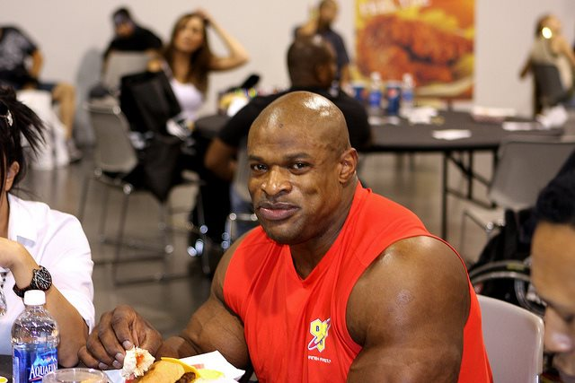

This is going to be a quick post about a story that just came out. From the article [Shielding kids from peanuts might cause peanut allergies](http://www.vox.com/2015/2/24/8103419/babies-peanut-allergies):

> Children are much less likely to develop peanut allergies if they are frequently fed peanuts, according to a new study published this week in the New England Journal of Medicine.
> 
> Researchers at King's College London looked at 640 British infants at high risk of developing peanut allergies and found that those who ate the equivalent of 4 big teaspoons of peanut butter every week were 80 percent less likely than others to develop a peanut allergy by the time they were five.

This story immediately reminded me of my own experiences with peanuts. From my 2012 post [Healthy vs Resilient](/2012/05/healthy-vs-resilient/):

> At one point in the lecture De Vany mentions how we shouldn’t eat peanuts, because they contain a carcinogenic toxin know as aflatoxin. This wasn’t a problem for me. I loved almond butter just as much as peanut butter, so I formed a new food rule and avoided peanuts for almost 2 years.
> 
> Then at a Thai restaurant I had a dish made with a peanut sauce. My mouth turned instantly numb. I had trouble speaking, almost like I had been injected with Novocaine. This had never happened to me before.

By not eating peanuts for two years, I developed a minor intolerance to peanuts. Since that incident, I purposely expose myself to peanuts every few months. The study cited today was for children, so I do not know if my experience is instructive or common.

The lesson I walked away with is eating too clean can make you less resilient. Our _Bulletproof Exec_ has created an entire diet demonizing one food after another preaching the gospel that we can become super healthy if we eat like him. The reality is the opposite. Walling yourself off from threats - perceived or real - does not make you tougher. Dave Asprey has created a diet of fragility. The way to become "bulletproof", whatever that means, is to be resilient in the face of the foods we deem to awful, even if there is no truth behind those claims.

If the words of the great Ronnie Coleman: **_Ain't nothin but a peanut!_**

_[Ronnie Coleman](https://flic.kr/p/8EPTit) by A Scott_

---

## Comments

### Cara
*February 25 at 2015 at 1:49 PM*

That's the problem with buying into the 'X is going to kill you' news stories, because when it comes to diet we're designed to take in small amounts of everything.

---

### Becca
*February 25 at 2015 at 10:52 PM*

Excellent post!  The same argument can be applied to anti-bacterial hand soaps.  Suck it up and touch some germs, it will make your immune system stronger :)

---

### MAS
*February 26 at 2015 at 1:16 AM*

@Becca - Great analogy.

---

### Rita
*February 27 at 2015 at 5:56 PM*

This is a very timely and spot-on post.  Another study has come out about children's allergies and the role of the dishwasher:

http://www.theguardian.com/society/2015/feb/23/children-allergies-dishwasher-hand-washing-study

I'm beginning to think that health is all about hormesis.

---

### Stephan
*February 27 at 2015 at 5:59 PM*

YEAHHHH BUUUUUDDDYY....!!!!

MAS just approved my excessive consumption of peanut butter :D

---

### Mike
*February 27 at 2015 at 6:13 PM*

My eyes burn if I eat peanuts, it doesn't matter the amount.   I couldn't figure it out I was eating peanuts for years and didn't know why until I avoided them.

---

### MAS
*February 27 at 2015 at 8:14 PM*

@Rita - Thanks for sharing. Hormesis indeed. 

@Stephan - If you are going to go "excessive", why not almond butter? :)

---

### Terence
*February 28 at 2015 at 1:22 PM*

Do you think that the resiliency/fragility argument can be applied to wheat products as well? I seem to be much less tolerant to gluten since I've mostly avoided it for a few years. I am not suggesting that wheat be a staple in anyone's diet, but it's not very practical for most people to avoid wheat products 100% of the time in social settings (unless you really do have celiac disease).

---

### MAS
*February 28 at 2015 at 4:43 PM*

@Terance - Great Q. I did a full post response here:
https://criticalmas.org/2015/02/wheat-resiliency/

---

### Terence
*March 1 at 2015 at 4:53 PM*

MAS - thanks so much for the response. I have been reading your blog weekly for about three years and always look forward to reading your insights about nutrition and health. Like you, I had been on a self-imposed paleo-isn diet for about three years. I didn't have a whole lot of weight to lose (I was at a normal weight and in my mid-twenties), but I wanted to challenge myself and improve my health. I honestly think that all of the clean eating and calorie counting did the exact opposite. Sure, I had a very low body fat percentage and could see my abs, but my testosterone levels sunk, I was constantly cold, and I became anxious at social gatherings because of all the non-Paleo food and drinks. About six months ago, I started to increase my carb intake from about 100g a day to around 250g (and I'm thankful to you, Paul Jaminet, and John Durant for helping me do this). I also increased my calorie intake about 25% (I am still in the process of transitioning to no calorie-counting). Unsurprisingly, my mood has improved immensely and my strength is at an all-time high. I can still see my abs and my waist size has't increased, but I am much less concerned about how I look in the mirror. Thanks again for regularly sharing your thoughts on nutrition and health; you continue to help me on my journey towards better health.

---

