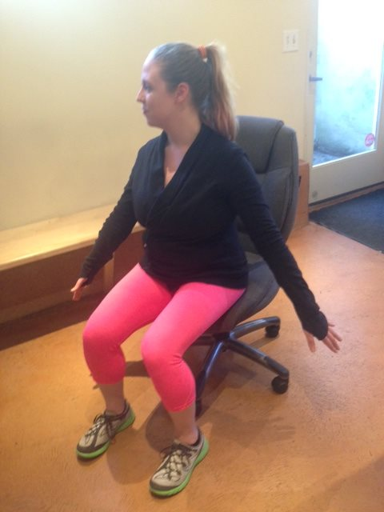

I just returned from a two-week visit to Seattle, where I met up with Nikki Naab-Levy of [Indigo Kinetics](https://naablevy.com/) and Healthy Photographers. I've known Nikki since 2008. In addition to Pilates and massage, she focuses on movement. In 2013, she helped me solve the [riddle of my tight neck](/2014/02/experiments-update-sleep-gray-hair-tight-neck/) muscles. Since most of us these days are spending more and more time at a desk staring at a monitor, I wanted to find a set of general fixes that one could benefit from and perform on their own at their desk. Nikki was happy to help with this post. Below are 5 desk stretch exercises we can do throughout the day. I'll am calling this routine the IK5.

### #1 Neck Stretch

1.  Sit tall in your chair with knees bent and feet flat on the floor.
2.  Gently drop your chin towards your chest until you feel a slight stretch in the back of your neck.
3.  Hold and breathe for 10-30 seconds. Repeat up to 3 times.

### #2 Head Turn (Arm/Shoulder Stretch)

1.  Sit tall in your chair with knees bent and feet flat on the ground. Reach your arms out long by your sides.
2.  Keeping length and energy in the right arm and right fingertips, slowly and gently turn your head to the left. Lift your chin slightly up to the left hand corner of the room. Hold for a focused breath. You should feel a tug down the right arm.
3.  Repeat on left side. You can do 2-3 sets of this stretch.

### #3 Mid Back Stretch

1.  Stand on the back side of your chair and place your hands on the chair. Walk your feet back.
2.  Sit your hips back so they are over your feet and feel length through your mid and upper back. Let your neck relax. Breathe into the stretch for 20-30 seconds.
3.  You can perform this stretch up to 3 times.

### #4 Hip Flexor Stretch

1.  Stand to the side of your chair with your right hand on the chair. Step your left leg back and reach your left arm in the air.
2.  Tuck the pelvis and bend both knees so you start to feel a tug in your left hip flexor.
3.  Gently lean to the right to increase the stretch. Hold for 20-30 seconds.
4.  Repeat second side.

### #5 Glute Stretch

1.  Sit in chair with knees bent and feet flat on the ground. Bend your right leg in and rest your right ankle across your left knee.
2.  Keeping the right foot flexed and the spine long, slowly lean over your legs. Stop when you feel a tug in the back of your right hip. Hold position for 20-30 seconds.
3.  Repeat second side.

 ******** I will be setting up a link to this post in my calendar and doing these exercises twice a day. Thank you Nikki! If you are in the Seattle area and are interested in fixing movement problems, visit her at [Indigo Kinetics](https://naablevy.com/).

---

## Comments

### Gary
*March 28 at 2015 at 8:23 PM*

The body is a motion machine.  Design motion as nature intended.

The conditions that cause pain cannot be addressed by joint surgery, therapy or other site specific treatments.  There is no artificial replacement for motion.  Motion is absolutely critical to the body's operations and overall welfare.  The danger is acute motion starvation.  Pain has one and only one function:  To alert us to danger.

The less we move the less we are capable of moving. Our systems are in a dysfunctional state.  They are not being refueled by motion.  Musculoskeletal functions are retained only through regular use.

The brain must be externally stimulated (afferential signaling/integration) if it is to move skeletal muscle. Afferent (sensory input) and efferent (motor response).  Our musculoskeletal system requires the deliberate stimulation of key posture and gait muscles. I found this out the hard way: I endured 3 weeks of excruciating cervical radiculopathy.  So severe, I thought I would require surgical decompression.  I promised myself it would never happen again.  I proceeded to learn everything I could about the kinetic chain of muscular integration, dysfunctional patterns of movement, and how to restore design motion and perfect posture.

Muscles that are not being regularly stimulated are put on hold to atrophy until they are needed again.  When the assigned muscle is out to lunch and not capable, another muscle is borrowed to get the job done. Peripheral muscles are hijacked to do the work that should be done by primary gait and postural muscles. 

Peripheral muscles lack the power and design proficiency to do their own assignments and the work of the main postural muscles. Peripheral muscles take a beating over time, and their own design functions become compromised. Major primary muscles opt out from disuse.  Compensating muscles move bones and joints out of their proper positions.

What's illogical is that we ignore the body's design as we go about our daily lives and submit to medical treatment.  Conventional pain-abatement procedures have not addressed the problems (lack of design motion) that continue to undermine health.

Every system of the body is energized by motion.

The musculoskeletal system is more than locomotion-- we have failed to appreciate its central respiratory, circulatory and metabolic roles.

This has been my personal experience.  You must find the approach that works best for you.

---

