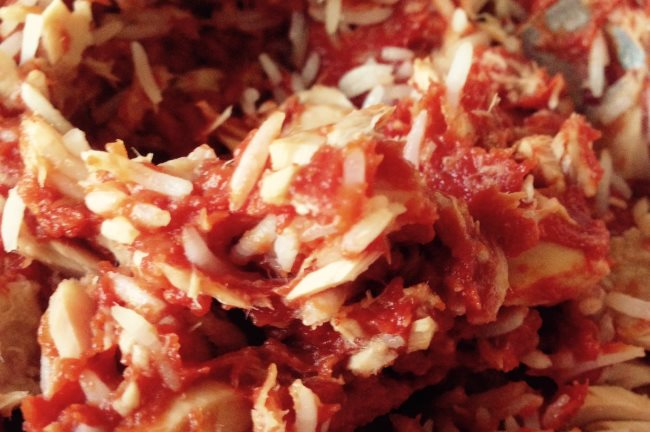

I came up with a low [food reward](/2015/02/food-reward-and-old-school-bodybuilders/) idea. Mix a can of tuna with a can of tomato paste and rice. **This is a true appetite crusher.**  _Looks more like cat food than people's food._ This would be the opposite of a hyper-palatable addictive food. It has very little taste. The tuna is neutral. The tomato paste is neutral. This meal doesn't taste good. It doesn't taste bad either. It is rather bland and boring. I've had this protein rice meal several times now and I am surprised just how full I get on this simple meal. It is now a staple of mine as I test food reward for myself. The rice is optional. If you are trying to keep the carbs lower, you can remove the rice. I've also used Korean rice cakes in place of rice. Cold leftover rice is fine as it has more of a neutral taste than fresh warm rice.

-   Tuna - The canned tuna I buy has 30 grams of protein. Protein helps suppress appetite. 140 calories.
-   Tomato Paste - Tomato paste is the espresso of tomatoes. Packed with nutrition.  138 calories.
-   Rice or Korean Rice Cakes - I have been using about 1 cup of cooked rice or the equivalent in rice cakes. 200 calories.

I've never had a meal of fewer than 500 calories suppress my appetite more than this. I'm not saying I am getting "loosen the belt buckle" full, but if I have this meal in the morning, I can go several hours without feeling hungry. Another benefit of the tuna + tomato paste combo is it requires no cooking time. Just open cans and mix. The rice is optional. Korean rice cakes cook fast, so having some around (in the freezer) is what I use when I don't have leftover rice.  _Korean rice cakes. If you live near a Korean grocery store get a few of these. They are awesome for [soup](/2014/11/fast-easy-guide-making-korean-soup/) too._  My plan is to have this meal 5-7 times a week. If you try it, let me know your thoughts.

---

## Comments

### Colin
*March 18 at 2015 at 6:14 PM*

Hey MAS, 
Long time reader, first time commenter.  Love the site and have found it to be a trove of useful and interesting info.    

This dish looks like the exact opposite of food reward, but I mean that in a good way.  Added bonus is it's cheap!  

I realized I eat a similar dish 4-5 days a week for lunch or dinner:  Boneless sardines in olive oil mashed together with half an avocado and mixed with a tablespoon of dijon mustard and a squirt of Sriracha.  On top of rice it tastes a little like a spicy tuna roll.   Might not be quite as low on the palatability scale, but it sure is filling.

Thanks again for your recipes, reviews, and curiosity.

---

### Aaron
*March 18 at 2015 at 6:54 PM*

Rice and tuna was an actual dinner meal my mom made for our family growing up.  Her family had it growing up, and she believes they 'got it' from a Japanese maid they had while living in Japan when stationed there in the 50's.  Apparently, the original recipe was with soy sauce, but my mom made it plain for us because she doesn't personally like the soy sauce.  I just talked to her and she said she still makes this meal ... but not for guests :)

---

### Steven
*March 18 at 2015 at 8:23 PM*

Good post but you gotta throw some spice in there, brother! At least oregano. 
I make the same but with fresh salsa and on occasion add  ground turkey meat with onions instead of tuna. 

Great blog , BTW.

---

### MAS
*March 19 at 2015 at 2:46 PM*

@Steven - Adding oregano would be increasing the taste without increasing calories, which isn't the goal. I suppose it one had a dislike for tomatoes and the oregano brought the taste up to neutral then OK. for me, I will keep it very plain.

---

### Gary
*March 19 at 2015 at 10:17 PM*

Tuna is processed at such high temperatures that proteins are denatured and free fatty acids are split off from the fats. This processing gives the tuna a net catabolic effect.

High temperatures-- causes the fatty acids to split—resulting in free fatty acids that are further denatured (cis-trans isomerism)—leading to free radical oxidative tissue destruction in the body.

I like raw eggs.  They are inexpensive (from foraging hens).  I can slam down four in 20 seconds, and move on to more important things.  I have probably downed 20,000 in the last 15 years. 

A supercentenarian apparently does the same thing. I saw her story recently in the NY Times.

Raw Eggs and No Husband Since '38 Keep Her Young at 115

"At 115 years and nearly three months, Ms. Morano is the oldest person in Europe, the fifth oldest in the world and one of only a handful of people whose lives have straddled three centuries."

BTW, coincidentally, I do not have a wife.  As Oscar Wilde said: "Wretched is the man who has a wife."  Maybe Wilde was a degenerate, but he had great observations.

"Ms. Morano has no doubts about how she made it this long: Her elixir for longevity consists of raw eggs, which she has been eating — three per day — since her teens when a doctor recommended them to counter anemia. Assuming she has been true to her word, Ms. Morano would have consumed around 100,000 eggs in her lifetime, give or take a thousand, cholesterol be damned."

Knucklehead Digression

Of course, I don't buy into exercise mythology.  I search the scientific literature.  You won't find the truth in Muscle Head magazine.

For those who make even a limited attempt to achieve a high protein diet, the protein intake becomes a potentially serious problem. A problem from eating too much protein, you ask? Yes, absolutely. Here are the reasons why:

An excessive protein intake is not only not necessary, it actually works against athletes. One important reason is because when the protein to carbohydrate ratio gets too high it will cause muscle breakdown for gluconeogenesis to supply sugar to the brain. This decreases lean body mass and slows the metabolism, not at all what athletes need. The consequences are:

1. Catabolism (aging) is accelerated.

2. The slow metabolism makes it easier to gain weight as soon as they even slightly decrease their amount of exercise.

3. The high protein diet programs fat cells to store fat as much as 10 times more easily than normal (and this fat cell metabolic aberration can be permanent).

4. This is perhaps the biggest consideration of all for athletes: A high protein to carbohydrate diet causes a decrease in testosterone output by as much as 15 – 20 percent (which is obviously the last thing athletes need), while simultaneously increasing cortisol output. The consequences are decreased anabolic capacity, excess catabolism of lean body mass, decreased athletic performance, decreased exercise tolerance, and increased fluid retention and fat deposition.

The most preposterous victims of the high protein diet are the competitive bodybuilders. I have known bodybuilders who, for example, eat a dozen egg whites for breakfast every morning, and throw away the yolks, the most perfectly anabolic food there is. They also frequently consume 2 or 3 cans of tuna a day (in addition to their high protein regular meals).

Now, how many knuckleheads do you know, that are cramming excess protein down their pie holes to build muscle?  I bet you know at least one or two.

---

### MAS
*March 19 at 2015 at 11:49 PM*

@Gary - Wow! Great comment. Was unaware of the issues with high temp tuna processing. Makes sense. I too am skeptical of high protein diets as they can lower metabolism and extra protein is not needed for muscle building. The great $$$ myth the supplement makers love. 

I see the higher levels of protein as a way to curb appetite to reduce weight. I see it as a tool to be used to accomplish a task, not as a lifestyle choice.

---

### Aaron
*March 20 at 2015 at 4:04 AM*

I'm not sure sure I'd attribute the eggs to her longevity.  It's possible she lived as long as she did despite her eggs.  Great post and I'd say a lot of simple meals work very similarly.  ie a meal like chicken/rice/broccoli with no real toppings.

---

### Pauline
*March 20 at 2015 at 3:46 PM*

My friend's mom is 94 this year.  She looks and eats like a bird.  Very light meals and a glass of sweet wine at night.  I have always thought her light frame and appetite has kept her brain sharp.  She also loves soft cooked scrambled eggs on buttered toast and would have that every day if she could.  She occasionally still paints art. Up until a year ago she smoked every day.  I guess there is no one secret to a long life, having family around also seems to help.

---

### Gary
*March 21 at 2015 at 1:50 PM*

"Up until a year ago she smoked every day. I guess there is no one secret to a long life, having family around also seems to help."

Supercentenarians consistently do a few things right.

1. Calorie restriction and/or intermittent fasting.
2. High (saturated and monounsaturated) fat diet
3. Some degree of CHO restriction.

So, we are back to the formula proposed by Hartroft and Porta in their 1968 edition of “Present Knowledge in Nutrition,” when they proposed that health and longevity are directly proportional to the dietary ratio of saturated fat compared to polyunsaturates. Monounsaturates (meat, poultry, fish, eggs, olive oil) are good; saturated fats (meat, poultry, fish, eggs, cheese, and coconut oil) are excellent; short and medium chain saturated fats (eggs, cheese, and coconut oil) are extraordinary. On the other hand, polyunsaturates (nuts, seeds, fish oil) are pathological --- causing accelerated tissue aging, oxidative free radical damage, and inhibition of mitochondrial respiration --- leading to cardiovascular disease, auto-immune diseases, cancer, arthritis, migraines, allergies, diabetes, dementia, etc., etc., etc.

One last note about PUFAs: You might be asking yourself -- What about the essential fatty acids that are so important to health and must be obtained from our diet? The answer is that everything you know about essential fatty acids is true -- they are absolutely critical to many biological functions. However, while these essential fatty acids are qualitatively so important, they are needed quantitatively in only very small amounts. The amounts needed on a daily basis are easily obtained from a diet containing significant quantities of vegetables and meat, fish, and poultry. The only way a person could be deficient in essential fatty acids is to be eating a diet consisting largely of processed foods -- particularly breads, cereals and pasta. There is absolutely no need to supplement your diet with vegetable oils or fish oils in an attempt to obtain your essential fatty acids.

A Dog Named Bear

I had a mentor in San Antonio.  An eccentric millionaire.  A wise old owl.  His dog was part poodle.  Dave loved that dog.  But he fed him garbage.  Chocolate covered doughnuts for breakfast (I know...dogs aren't supposed to eat chocolate).  Bear would get sick of doughnuts, and he would push them across the kitchen floor with his nose.  Then Dave would switch to tacos.  You get the idea. 

One day, Dave left Bear in the car for less than 15 minutes while he ran a quick errand.  When he returned, Bear had eaten half of the dash board.  $3000.00 worth of damage.  Dave didn't even scold him.  He said "It's Bear's way of telling me he doesn't like to be left alone in the car."

That dog lived until he was 22.  

The point of this story:  Bear was happy. He felt secure and loved.  And that is the real formula for a vibrant life.

---

### MAS
*March 21 at 2015 at 9:17 PM*

@Gary - I love your comments. I always learn something new. Glad to read your thoughts on PUFA. I feel the same way.
https://criticalmas.org/2013/11/common-enemy-nutrition/

---

### Seth
*March 22 at 2015 at 5:27 AM*

I'd be afraid to consume a lot of tuna because of the mercury and PUFA in it.

According to the book Potato: A History of the Propitious Esculent, the Irish were able to maintain very good health on a diet that was almost entirely milk and potatoes. That diet would be a lot lower in food reward than the typical American diet.

---

### MAS
*March 22 at 2015 at 4:49 PM*

@Seth - Maybe one could take Vitamin E to deal with the PUFA and selenium to deal with the mercury?

---

### Jaemin
*March 23 at 2015 at 3:39 AM*

Just curious, but any concerns of mercury poisoning with the tuna? I've read that it's advisable to have only one can of tuna every 5-7 days but wasn't sure if you had more up-to-date research on that. Thoughts?

---

### MAS
*March 23 at 2015 at 3:52 AM*

@Jaemin- The goal of this meal is first to lose weight. Being overweight is not healthy. One has to measure the risks. I see this meal as a tool to achieve a goal. Once at that goal, scale back or stop using the tool. For me I am already at a healthy weight, but I'd like to see if I can drop 10-15 pounds using food reward as the primary strategy.

So I am not concerned about mercury. Also this article:
https://chriskresser.com/5-reasons-why-concerns-about-mercury-in-fish-are-misguided/

---

### Jim
*March 23 at 2015 at 1:51 PM*

MAS:
Nice post. Let us know if you come across any other good low food reward meals.

---

### m
*March 24 at 2015 at 1:34 AM*

Miracle rice.  Best

---

### m
*March 24 at 2015 at 1:34 AM*

p.s. google it.  try. ton of recipes to make delic

---

### MAS
*March 24 at 2015 at 1:37 AM*

@m vangelis - Found it.
http://jimmyakin.com/2011/10/cooking-with-shirataki-miracle-rice.html

Interesting.

---

### Will
*April 30 at 2015 at 3:49 AM*

Gary's comment isn't quite accurate. If you really look at the data, the longest living cultures tend to eat higher fiber, high plant food diets with low amounts of animal foods, generally lower in fat than carbohydrate, and low in protein. They are also very social, participating in family and tight knit social groups, exercising gently and regularly, and finally, live with some sort of purpose. 

All the research that went into The Blue Zones isn't the "Low fat Convetional Wisdom USDA propaganda" the LCHF, Paleo community would have you believe. If you actually go to these places, these people <i>do</i> indeed live and eat this way.

---

