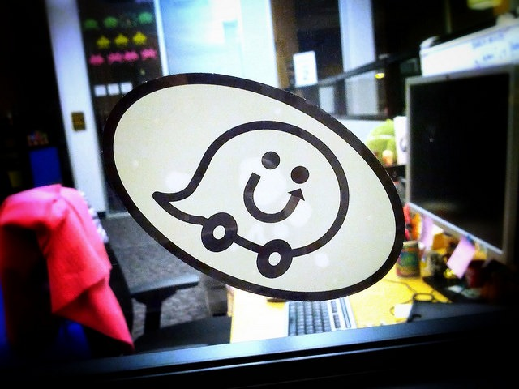

When people ask me why I like Seattle so much more than California my first response is that I drive far less in Seattle. There are other reasons, but that always comes to mind first. Recently I did I calculation where I determined that my average daily mileage in Seattle was half that of San Diego and here in the San Francisco Bay Area. I used to enjoy driving, but as I've gotten older it has become cumbersome. I'm certain that my left knee pain is from twenty plus years of driving a stick shift.

As much as I dislike driving something changed this year. I installed the application [Waze](https://www.waze.com/) three months ago. It is a traffic application that merges your data with the data of other drivers and helps you find the fastest path in real time. It alerts you to accidents and even police sightings.

_[Photo](https://flic.kr/p/qfZMmP) by Travis Wise_

For the first month, I would only turn on Waze occasionally. If I needed directions or was curious why traffic was slower than expected. Then I saw the scoreboard. There is a screen that lists the number of points I've earned and the points of 23 of my friends. When I started I was near the bottom, but as the weeks went by I saw my ranking climb. I've now passed all but seven of my friends.

In addition to points, Waze has five levels. I recently moved to the third level which is Waze Warrior. I think I'll achieve the Waze Knight level sometime in June. I went from dreading getting in my car to checking my score each morning and calculating when I would pass the next friend on my list.

Besides the rankings, I am now sharing traffic reports with other drivers who can "thank me". When I go to a business I can add a photo if one doesn't exist. This helps other drivers spot locations quicker.

It really is silly that giving me points to do something I dislike can make the task much more enjoyable, but it has. I'm wondering how else I can use point seeking to improve my life. What tasks have you tried to gamify and has it helped?

---

## Comments

### Char
*April 22 at 2015 at 8:14 PM*

I have to drive because we live out in the country- although I homeschool the kids so we don't go out everyday.  We are pretty rural, next to a smallish town so not too many traffic snarls.  I could see how this would be really helpful if we did live in a city.  
Seth Roberts used to talk about putting dots in a pattern as a motivational tool- he called them Magic Dots. 
http://blog.sethroberts.net/category/procrastination/magic-dots/
Admittedly, he was a bit strange. I haven't tried it.
And then Melisa McEwen talks of an app that motivates her here. http://huntgatherlove.com/content/skinner-box-myself-task-list-gamification.  I haven't tried that either.
I DID try sending you a Facebook friend request- and it worked!  Thanks.  
Charlyn

---

### MAS
*April 22 at 2015 at 9:01 PM*

@Char - Melissa still likes it. She sent me this on Twitter.
[link removed]

---

### Arthur
*April 23 at 2015 at 8:55 PM*

Why don't you test driving an automatic?

I also drive a stick shift and can't wait to get an auto. Couldn't imagine drive it for 20+ years. I've been driving more frequently in the past month or so and my knees have been in pain since then.

---

### MAS
*April 23 at 2015 at 9:15 PM*

@Arthur - My plan is to sell my car later this year after I return to Seattle. Depending upon where I live in the city, I may not need a car at all.

---

### Rita
*April 24 at 2015 at 1:57 PM*

Have you checked out the Nerd Fitness blog?  Their whole shtick is about making a game out of fitness to "level up" in life.  Very fun approach.

---

### MAS
*April 24 at 2015 at 2:26 PM*

@Rita - No I haven't. Fitness is one area where I don't need any help. I will take a look at the site for ideas. Thanks.

---

### Brian
*May 1 at 2015 at 9:25 PM*

I'm late to the party here, but I couldn't agree more, MAS. I found Waze about a month or two ago and I'm now a Warrior. ha! I feel the same way how it makes driving more palatable. The other day I swerved to avoid a LADDER that was on the highway. I reported it hoping it helped someone. It's really a game-changer. My have a newish car (1 year old) and I insisted on getting in-dash nav. Waste of money. It takes almost 60 seconds to re-route and isn't updated dynamically, only my DISC. I never use it anymore now that I have Waze.

---

