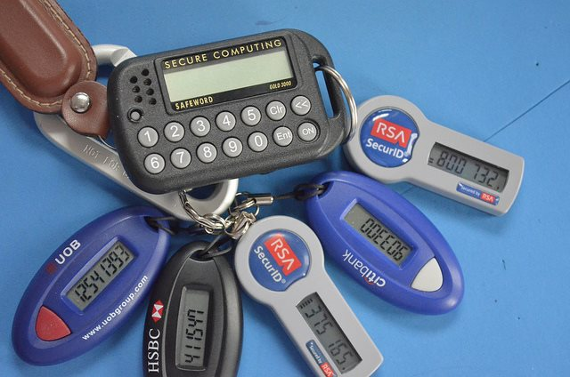

In my [last post](/2015/04/securing-my-email-inbox/) I used the Dashlane "Inbox Scan" tool to find any emails that I have archived that point to online accounts. Many of these emails also included the saved passwords. This means if someone had gotten access to my email account, they would then be able to run similar code and gain access to accounts of mine. The tool found 99 accounts. Although most were accounts with no personal information, one was a travel site that had my credit card information on file. So I spent a few hours going to those sites and adding unique hard passwords. With a password manager this is easily done. If I didn't use the site and there was a way to close the account, I did. Before closing an account, I updated my profile and filled it with junk info, because I don't trust that their data might become compromised. So instead of seeing my name, the account now says "Elvis Presley, 1/8/1935, Memphis, TN". :) I'm grateful for the free Dashlane tool, but it missed over 200 emails that had clues pointing to other online accounts. Another five hours later and I had these emails taken care of in the same manner. All those emails were deleted and the trash emptied. Now my Inbox was secure. But it wasn't. It was better, but there was still a problem. I imagined a hacker with access to my email and what he could do even if he didn't know what accounts I had online. He could guess. He could run a script that pings a list of sites requesting a Lost Password. Those accounts that respond would be a match and he would be in. This is where 2-factor authentication comes in handy as Dan mentioned in [his comment](/2015/04/securing-my-email-inbox/#comment-24520). But not every site has this option. Thankfully this is common with the financial sites, which is where hackers could do the most damage. This morning I discovered I didn't have 2-factor turned on for PayPal. Now I do. If you have the option to secure a sensitive account with 2-factor authentication, do so.  _[RSA Tokens](https://flic.kr/p/avUznU) are a form of 2-factor authentication. Photo by Edwin Sarmiento._

### Email, User ID and Password

To gain access to an account, the hacker often needs your email address, user ID and password. Email addresses are not private, so there is nothing you can do there, except maybe use a unique email address. People who own their own domain (EX: criticalmas.org) can do this pretty easy, but managing it can become cumbersome when you move web hosts. This domain was on four different hosts last year. Passwords can be unique and difficult using password manager. I cover this in the post [My Online Password Strategy (2014)](/2014/09/online-password-strategy-2014/). This leaves the user ID. For over a decade, I have been using _digitalcolony_ as my user ID for many sites. Seeing _digitalcolony_ across several forums is not a problem. The fact that until this morning I was using that same ID for two banks and an investment account might have been. It is just one more piece of the puzzle. So I have now secured my sensitive accounts with their own unique user ID. And because I am using a password manager, it remembers those user IDs. Some sites also have a forgot User ID option, which I suppose makes getting the new User ID possible, but anything that can slow down a hacker that doesn't cost me any extra time is worth the effort.

### Security Questions

If you want to gain access to one of my financial accounts you need to know my email, user ID, password and be able to answer security questions about me. Years ago those security questions probably worked better than they do now. Today there are massive databases storing every tidbit of information about you and your social network. Where I went to high school or the first car I drove is probably sitting on some database somewhere. And whoever has that data can sell it to good people or bad people. The way to secure yourself on the security questions is to not be truthful and answer with a nonsense answer.

> Q: What is your mother's maiden name? A: Brussel Sprouts W: Where did you go to middle school? A: December

Remembering these crazy answers can be done in the notes field in your password manager.

### My Inbox is Now Secure?

My inbox is way more secure than it was on Friday. I'm sure that could change over time. Security is an ongoing battle between the good guys and the bad guys. If I learn a new trick, I'll be sure to share it. In the meantime, if you follow the ideas in this post and the previous three security posts, you'll be a much harder target for the hackers.

---

## Comments

### John
*April 13 at 2015 at 8:08 PM*

Thanks, good tips.

---

### Johan
*April 13 at 2015 at 9:33 PM*

"Before closing an account, I updated my profile and filled it with junk info, because I don’t trust that their data might become compromised."

Hehe! I always did the same one closing an account on a site I didn't trust (which is most sites).

Now I understand what Critical in CriticalMAS comes from. Have a good one!
J

---

