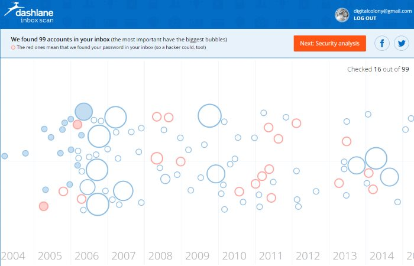

I thought I was done posting about security, but I realized today after using a brand new service that I have a security leak. Before I go into what I found, I want to link to my other three posts related to security. Start there.

1.  [My Online Password Strategy (2014)](/2014/09/online-password-strategy-2014/)
2.  [Scan, Encrypt, Store, Delete, Shred: Going Paperless!](/2014/09/scan-encrypt-store-delete-shred-paperless/)
3.  [Even More Security](/2015/02/even-security/)

As much as I thought I had locked down my security, I discovered a problem today. Techcrunch just posted the article [Dashlane’s “Inbox Scan” Tool Uncovers The Passwords You’ve Saved In Your Email](http://techcrunch.com/2015/04/09/dashlanes-inbox-scan-tool-uncovers-the-passwords-youve-saved-in-your-email/)

> Even if you create and use secure passwords with your various online sites, there are still a number of ways they can leak out. One area that’s often overlooked, according to password manager and digital wallet provider Dashlane, is email. That is, people often share their login credentials and plain-text passwords along with other sensitive data via email messages. That means if hackers get into your inbox, they can quickly gain the keys to a wide range of your accounts. And if you tend to re-use passwords, the damage could be even worse.

Before I got a password manager, I would store passwords in an email. I think a lot of us have. When I first set up the password manager I removed a lot of those emails, but I've had a Gmail account since 2004. There are thousands and thousands of emails. Going through all of them would take months.

So I used the free Dashlane tool and in seconds all my email was scanned. 99 accounts were found, some with passwords. Even if the passwords aren't there, all it takes is knowing which email account was used to sign up for an account and clicking a reset password button to take over an account.

_I'm almost done with 2005. This is going to take a while._

As I go through each account, I reset the password and then delete the emails. If I don't use the account anymore, I will close it. When I complete the project, I will empty the Trash.

This will provide greater peace of mind, but it still isn't perfect. If a hacker gains access to your email and you have an email from your bank, they could initiate a password reset, because at that point they know who you bank with and with what email. I'm not sure how to defend against that attack, but for now, getting a decade worth of potentially sensitive emails deleted is a good start to securing my inbox.

**UPDATE 4/11/2015:** Oh boy! After finishing the cleanup from the Dashlane tool, I found over 200 more emails connected to online accounts that were not detected. I'm cleaning up all these right now. Once finished, I think I have an idea to lock down sensitive accounts even if your inbox is compromised.

[Securing My Email Inbox Part 2](/2015/04/securing-my-email-inbox-part-2/)

---

## Comments

### Dan
*April 11 at 2015 at 2:52 AM*

(Sorry, I always chime in on security-related posts. :-P)

I think I'd be more anxious about giving a random third party like Dashlane access to my inbox, even if it's only temporary. If you use it, make sure that you go to https://myaccount.google.com/, click "Account permissions" (it's pretty far down the list), and then revoke their access afterward. (On the bright side, they're using OAuth2 instead of asking for the password to your email account, so that's good.)

It's a sad fact of life that if an attacker gets access to your primary email account, they also have access to pretty much every online service you use. Your best defense here is to make sure you're using two-factor authentication (e.g. being asked to enter a code that's sent to you via SMS the first time you log in with an unknown computer) everywhere that you can. That way, even if someone manages to reset your password, they probably won't be able to log in unless they somehow also managed to steal your phone (or tricked your mobile carrier into forwarding your number somewhere else -- make sure you've set a PIN for billing changes!). Luckily, more and more financial institutions seem to be adopting two-factor authentication. If you haven't already enabled it for your Google account, you can (and should!) via the "2-Step Verification" link on the page I linked to above.

---

### MAS
*April 11 at 2015 at 3:03 AM*

@Dan - I just revoked Dashlane. 

I considered they might be bad, but I weighed the risks. Techcrunch had more to lose than me. Their reputation would be toast if this turned out to be bad guys. Then I thought it is just a matter of time before a sinister party has access to that level of code. So go with the one that TechCrunch has vetted. 

I'm closing several accounts and those I am keeping now have a serious unique password.

And yes I have 2 factor authentication for Google. 

Thanks for your security comments. Great stuff!

---

### Brian
*April 11 at 2015 at 8:25 PM*

What do you mean by 'you stored most of your passwords in your email?' I must be overthinking this.

---

### Brian
*April 11 at 2015 at 8:38 PM*

First one I'm working on is Skype. I'm going to be an old man before this process is completed.

---

### MAS
*April 11 at 2015 at 9:19 PM*

@Brian - Meaning if a site forced me to create a new account with a password, I would save my login credentials in an email. Then if I forgot my password, I would search my email. I think a lot of people either do this or reuse the password across multiple sites.

---

### Brian
*April 11 at 2015 at 9:23 PM*

Oh ok. You'd create an email to allow searching.

---

### Brian
*April 12 at 2015 at 7:20 PM*

You'll also get results when you needed a password reset and the site sent you a temporary password. How are you handing those?

---

### MAS
*April 13 at 2015 at 4:09 AM*

@Brian - Those emails are deleted upon reset.

---

