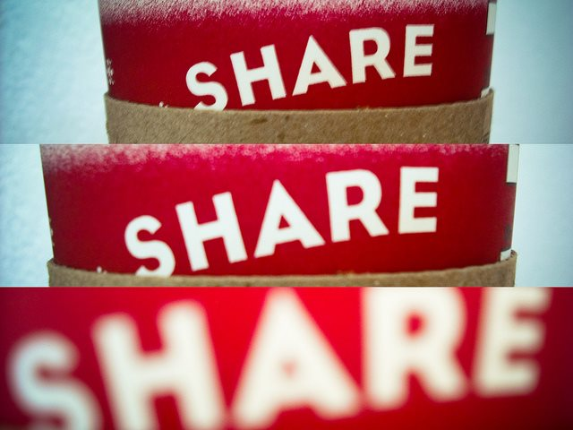

I haven't been blogging as much this year and I wasn't sure why until recently. I wrapped up last year by stating that I was likely done posting on some topics. One was [getting stronger](/2014/12/won-fitness/) in the gym and [responding to the fitards](/2014/11/knock-bro/) that dismiss injury risk. I also said goodbye to [financial forecasting](/2014/12/last-financial-forecasting-post/) and [disposable content](/2014/12/disposable-content/). I noticed a pattern on this blog. Learn, Share, Convince. First I would find a topic that was of interest to me and dive head first into learning more about it. During this learning phase, I would share my views on those ideas. Comments would pour in helping me learn more. After a while when my knowledge reached a deeper understanding, I'd take a more definitive position and write to convince the readers of what I knew. Convincing was an important driving force motivating me to blog more. This year I got tired of convincing others or even myself that my view is correct. Health debates are tiresome. I just don't care anymore. We get buried in simple narratives to explain our health history and how something is or isn't healthy. We aren't machines, but we speak of our bodies as if they were. My understanding of economics has made me rethink almost everything about nutrition and fitness. Actions and behavior have both intended and unintended consequences. Some of which you can measure. Some you can't. What looks great in the short run can be harmful on a longer timeline (extreme diets, extreme exercise). Without the desire to Convince, I'm finding myself less motivated to Share and therefore have been blogging less. The downside to spending too much time convincing is it takes away from time one can spend learning. I noticed that as this site grew, I was spending a fair amount of time responding to comments on posts clarifying or defending a position of mine. Instead of thinking about something new, I was thinking about an older post. And with the exception of a few posts, I am hesitant to turn off comments on older content.  _[Photo](https://flic.kr/p/8SrUTz) by Carlos Maya_ I will continue blogging, but if I do it with less frequency, you now know why.

---

## Comments

### Aaron
*May 1 at 2015 at 2:07 AM*

I always find your posts interesting, so hopefully you'll continue to find things to post on even if you're not attempting to convince people. If you think on how Russ Roberts interviews people, he only occasionally offers his own take. Perhaps it's possible to do something similar with future posts?

---

### MAS
*May 1 at 2015 at 2:39 AM*

@Aaron - I think that is a great idea. Russ is the best.

---

### Rita
*May 1 at 2015 at 2:16 PM*

Hey MAS - I really wish you wouldn't slow down the blogging.  Even the best teachers find that most the pupils in the classroom aren't listening, or find it more entertaining to be combative than to learn.  That being said, your process and your words are getting to the people who DO care to share this journey with you.  I find squats and ice cream equally fascinating, and the debates will never cease about fitness and nutrition, but (and I've said this before!) yours is a unique voice, and I enjoy listening.

---

### Becca
*May 1 at 2015 at 5:42 PM*

I love reading your posts - so I hope you don't stop completely!  I do, however, completely relate to the different seasons of blogging enthusiasm.  Sometimes I love blogging and can't wait to make another post... and other times I just don't feel interested in it.  It is probably tied to my own stages of "learn, share, convince."

---

### Pauline
*May 2 at 2015 at 11:32 AM*

If I think of how my own interest in nutrition has waxed and waned over the years, this must reflect in our reading habits and writing if you are a blogger.  I find I don't read or comment as much because my interest has moved on to other things.  I still like to dip into a few online sites but even the email links I get from other writers on health, I ignore because I am no longer delving into these things with the same obsessive interest I had before.  You got to do what you love and whatever makes you happy attracts more of whatever that is.  Happy hunting for whatever makes you feel good and what inspires you.  Yours is still one of the few blogs I click on to see what ideas you are sharing.  I love the variety and those blogs I read with more interest than others who have a very narrow focus.

---

### Glenn
*May 2 at 2015 at 2:05 PM*

You write about nutrition in a very clear and compelling way - that's rare and precious. 
IMHO, about three-quarters of all people haven't optimized their nutrition. They haven't really figured out what works best for them. They need help.
They also need help developing a fitness lifestyle that is effective and sustainable - you write excellent articles about that too!

---

### MAS
*May 2 at 2015 at 3:40 PM*

@All - Seems a paragraph got lost in the original version. I've added it to the post. "The downside..."

And thanks for all the positive feedback. The site will continue. I've been at this since 1996. It may change. Onward.

---

### MAS
*May 2 at 2015 at 3:41 PM*

@Pauline - Amen to seeking variety. I couldn't do this site if I stayed focused on a few topics. It would bore me to tears.

---

### Gary
*May 2 at 2015 at 8:07 PM*

When a man gets new information, sometimes he takes a new position.  

I remember years ago, I did a year of Pritikin.  How absurd is that?  Sometimes I realize that everything I thought I knew isn't worth a knob of goat shit.  And that's after 7000 hours of research.

You are a good study with a nose for truth.  And you provide value.  Nuff said.

I just noticed that you have spent time in SE Asia.  I have enjoyed three trips to the region.  My most recent trip was an archival adventure in many ways.  Enjoyed a beautiful private estate in Si Racha, Thailand for 6 months.  Reflexed out to a few islands; Koh Chang, Koh Samet, Koh Si Chang, Koh Larn and Vientiane, Laos.

I penned about 20,000 words on the adventure/fiasco.  The writing was cathartic and allowed for documentation. If you are ever bored on a Sunday afternoon, send me an email, and I will send you the link.  Disclaimer: I'm not selling anything.

---

### thomas
*May 5 at 2015 at 7:57 PM*

Yeah, I quit talking to some of my friends and acquaintances for exactly this reason.  So much of the conversation would be of me providing evidence of some point that was then disputed.  The catch-all rebuttal most often given to me is the "exception".  No kidding.  I am well aware of exceptions but many pin any lifestyle choice they make whether it be health, politics, etc. on the exception rather than the more helpful &amp; evidentiary rule.

---

### Johan
*May 6 at 2015 at 3:04 AM*

Great post! You should definitely post as much or little as you want. We want quality, not quantity. And quality is always pouring out of this site into our computers. 

Thanks!

---

### Mike
*May 12 at 2015 at 2:55 PM*

I'm a recent reader of your backlog and have been enjoying it very much. Enjoy your rest from blogging but please do continue to learn and share. People will convince themselves.

Isaac Asimov recounted an anecdote in one of his memoirs about being in the army and hearing a soldier in his barracks talking about the atomic bomb and getting all the facts wrong. Asimov said he wearily stood up to correct the soldier (probably the thousandth time he'd corrected someone) when it suddenly struck him that he didn't need to do that. I can't remember Asimov's wording, but he basically saw that correcting someone who didn't ask for or want to be corrected was a fool's errand and a waste of his time. So he sat back down and minded his own business and was probably a little happier.

---

### MAS
*May 12 at 2015 at 3:09 PM*

@Mike - Thanks for the story.

---

