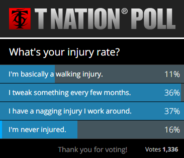

Normally I don't read T-Nation, but an article being shared on Twitter caught my eye. I knew it was going to be lacking, but I had to look. The article is titled _6 Reasons Why You're Always Hurt_ (JUNE 2024: article is no longer online).

Can you guess what reason didn't made the list? Exercise selection.

Never in the article does the idea that some exercises are more prone to injury risk than others make it to print. Another article that begins with the assumption that one must squat and deadlift. Because you know, you have to. Uggh. The article is answering the wrong fitness question.

The problem with weight training is something that took me a long time to learn myself. Built into almost every discussion on how to gain strength and size in the gym is the assumption that one should use the protocol that gets the most results. Risk is not even factored in. I've said it before, but I favor an approach that yields the highest percentage of success, not necessarily the most results for a handful of outliers. Classic free weight training protocols often dismiss injury risk as failures of the individual. See my post [Fitness Professionals Fail to Understand Survivorship Bias](/2013/09/fitness-blogging-disclosures/) for a deeper discussion.

There is a poll on the site asking readers to vote on their level of injury.

So in the quest for more muscle, 84% of T-Nation readers are having some form of injury. This is all unnecessary. I'm not going to go through the case for High-Intensity Training again. Been there, done that. If you are interested, read _Body By Science_ (machines) or [Hillfit](/2013/07/hillfit-2-0-a-zero-budget-approach-to-high-intensity-training/) (bodyweight).

**Even if traditional weight lifting is twice as effective as HIT, which I don't believe, the math is not in your favor on a long enough timeline, because it has a much higher rate of injury.** Because HIT uses very low skill movements done slowly that allow the exercise to be taken to failure safely, the risk of injury is almost 0%. So even if you never hit your true potential, which I don't believe, you also avoid the risks that cause the pain and sideline one with an injury.

Let us for the sake of argument say that compound weight lifting is twice as effective as HIT. I don't believe that, but let us start with that assumption because I don't feel like arguing the point anymore. But the injury rate for the "twice as effective" is 84%. The bro-tards don't see it, but as their training timeline extends they are running headfirst into math. They are getting older, the weights are getting heavier and the stakes are getting higher.

Why spend thousands of hours training to be brawny at 30 only to be broken at 40?

### Think Like an Investor

Common advice in investing is that young people can take greater risks. They have a long time horizon and can start over should they lose money. As the investor gets older, the portfolio gets moved to more conservative investments. This protects the downside and locks in the gains made when they were younger. This is common wisdom and most people understand it. Yet this same lesson applies to weight training as well.

Why subject yourself to excessive injury risk when you are older and have already made significant gains? Why not lock in those gains by reducing risk? Step out of the squat rack and head over to the leg press. It isn't as glamorous, but neither are injuries.

---

## Comments

### Glenn
*May 8 at 2015 at 5:28 PM*

Yes - makes sense. But several key words above aren't defined: "strength" and "results" and "success".

Lifting weights slowly - whether free weights or machine weights - will only yield slow strength.  It will also probably help many people grow their muscles larger, which is important for some. Not for me.

I'm only interested in explosive strength. I don't think slow strength is useful unless you're an ox pulling a cart or perhaps if you're a professional furniture mover.

---

### Norlee
*May 8 at 2015 at 10:52 PM*

hi Glenn, your comments on this blog about explosive strength always remind me of Viktor Frankl's book " Man's Search for Meaning". He notes that when he was  imprisoned at Auschwitz and other concentration camps for three years physical strength of any kind was completely useless because those with the guns simply starved it out of you in a very short time. Those that survived did so because of emotional/psychological strength - that's the kind of strength I am most interested in. 
I suspect that the majority of the readers of this blog are mostly interested in general health and vitality and of course physical esthetics, all of which can be enhanced by HIT.
have a good day :-)

---

### garymar
*May 8 at 2015 at 11:34 PM*

Is "slow strength" an actual scientific term? 

Does weight training "explosively" actually transfer to explosive movements in a sports performance situation? I'm sure many coaches believe this, but I thought the jury was still out on whether weight training at fast speeds does anything except enable you to <i>explosively lift weights in those particular moves</i>. As opposed to improving sport performance through increased strength due to weight training, whether done fast or slow.

Not that it makes much difference to me. The reason I can't sprint any more is not my age but the fact that <i>I don't sprint any more</i>. Besides HIT I like to take long bicycle road trips at a medium pace.

---

### rob
*May 8 at 2015 at 11:40 PM*

The safest way to weight train is to do it the way that you do it.  The least safe way to weight train is to do it the way that other people do it.

---

### garymar
*May 8 at 2015 at 11:56 PM*

Rob -- as a general principle, I firmly disagree. 

If "your way" is to bench press free weights at the limit of your strength without a spotter or safety rack, then your way is the most dangerous. If other people tell you to get a spotter or a Smith machine, you should listen to them. Their way is safer.

However, if you're just talking about fast versus slow, I suppose safety would not be as much of an issue if you're taking sensible precautions.

---

### MAS
*May 9 at 2015 at 1:01 AM*

@Glenn - I completely disagree with you, but you already know that. I'm not going to convince you and you aren't going to convince me. 

@GaryMar - I side with Drew Baye on explosive training. If I engaged in speed work, it would not be under load. 
http://baye.com/explosive-training/

@All - The purpose of this post was not to rehash HIT vs traditional vs explosive, it was about locking in gains and moving down the risk curve as one approaches their muscular potential. Guess I failed.

---

### garymar
*May 9 at 2015 at 2:00 AM*

Sorry, MAS, I got off on a tangent. Even looked up some old Clarence Bass articles on the subject and was getting ready to quote them!

<blockquote>Why subject yourself to excessive injury risk when you are older and have already made significant gains? Why not lock in those gains by reducing risk?</blockquote>

At my age (62) this is so obvious it barely merits mentioning. "Sensible" for me is a word of high praise, but you've got readers of all ages, conditions, and attitudes. When I was a young man, nothing turned me off quicker than some parent or old person telling me to be sensible. At that age, I <i>wanted to explode</i>, and damn the costs!

Your financial interest taught you about risk. For me, it was getting an engineering degree. Never did design, just sales, but even as a sales engineer, made endless decisions as we slid up and down the Pareto Curve. Cost/Benefit, time-to-market, budget constraints, make-or-buy, bang-for-buck, all day long.

---

### Glenn
*May 9 at 2015 at 1:48 PM*

I agree that there are numerous ways to feel fit and strong and to increase the size of muscles.

I'm talking about building strength to become a better athlete.

I think the burden of proof is on those who think doing something slowly would increase speed and explosive power. That's pretty counter-intuitive and the proposed mechanism of effectiveness isn't obvious.

There are about 12 interviews with professional strength and conditioning coaches on sportscoachradio.com whose livelihood depends on them making professional athletes functionally stronger. None of them advocate lifting weights slowly. They are also passionately keen to prevent injuries and develop safe ways of training - it's what they get paid to do.

"I never got strong lifting light weights. Never got fast running slow. Never got smarter learning from dumb people." -- John Welbourn, former NFL player, now S&amp;C coach

---

### MAS
*May 9 at 2015 at 2:10 PM*

@Glenn - Professional strength and conditioning coaches deal with outliers their entire career.  These athletes tend to be young. When they get older, they get discarded and replaced with another young athlete. The point of this post was about injuries and taking excessive risks in the quest for strength. Not about what is the ideal training protocol for a professional athlete. You are aware how destroyed the bodies are of aging athletes that use high force training? 

These coaches may be paid to keep injuries low, but only during the career span of their athletes. Again, there are no shortage of replacements. 

I've heard Welbourn before. Not a fan. John would have been successful in sports following a number of different exercise protocols, including HIT. 

And this straw man argument that all HIT people do is move weights slowly and then do nothing else is getting old. They still train for their sport. And if their sport requires speed, they do speed work. The difference is they don't try and replicate their sports skill inside the gym under load. 

Last point, I am not a pro athlete, Never have been and never will. I do not have the recoverability skills. I suspect 99% of my readers are in the same camp. I want to be in great shape now and when I'm 90. Bad things happen when we model after outliers.

---

### Skyler
*May 11 at 2015 at 12:26 PM*

@Glenn,

I'm staring at a study performed recently that will blow your mind: as long as the load is similar, muscular adaptations are similar regardless of lifting speed.

Simply: if you lift 80% 1rm slowly or quickly, it results in the same amount of change in the fast twitch fiber types and myosin heavy chains. The load is what matters, not the speed of contraction. 

Of course, you should spend the rest of your time doing your sport FAST, which is going to make up 95%+ of your training time. Which do you think is going to have the largest effect on your potential outcome for a sport activity?

---

### MAS
*May 11 at 2015 at 5:38 PM*

@Glenn - I think Skyler would make for a good guest on your podcast.

---

### Arthur
*May 11 at 2015 at 7:34 PM*

@Skyler

But lifting 80% of my 1RM is tremendously harder. I'd guess that it would make my muscles contract harder to lift the weight?

@MAS

HIT sounds very appealing to me. But I'm 21 and traditional weightlifting seems more easy to progress. Meaning, if I'm doing 165 lb squat today and a month from I do 180, it is somewhat  safe to assume that I got stronger. I feel that HIT isn't that easy to measure.

Anyway, I'll probably move to body weight/HIT stuff to "lock my gains" once I hit 1.5x BW squat. I think I can endure a few more months of traditional weightlifting, eh?

---

### Arthur
*May 11 at 2015 at 7:38 PM*

@MAS

I forgot to add - at the end of the article that you linked, it reads (emphasis mine):

<blockquote>Strength training programs should be comprehensive in nature with the emphasis placed on exercising the major muscle complexes throughout their fullest range of functional motion. The selected movements should include a variety of multi-joint and single-joint exercises, utilizing a good mix of machines and <b>free weights</b> whenever possible, and be safe and relatively easy to perform in terms of technique.</blockquote>

Doesn't adding a mix of free weights on your routine help you broaden you portfolio? 

(I don't wanna come as confrontational - I'm sincerely curious as to how this applies to weightlifting)

---

### MAS
*May 11 at 2015 at 7:40 PM*

@Arthur - Quantification of strength is a problem. I don't have answer. For me safety became more important that traditional metrics. 

As for your question does increasing your squat from 165 to 180 mean you;ve gained strength? It is likely, but not certain. A squat is a skill move. You can increase the skill (better form, timing, food placement) without increasing strength and see your numbers go up. I give an example in this post.
https://criticalmas.org/2013/03/more-bench-press-nonsense/

---

### MAS
*May 11 at 2015 at 7:52 PM*

@Arthur - When Drew Baye is mentions using free weights his intention is to do so in a way that honors the principles of HIT. He qualifies by saying "...easy to perform in terms of technique." That would exclude all Oly lifts and the barbell back squat. 

I still use free weights for low skill movements such as bicep curls, shoulder press and the occasional stiff leg deadlift.

---

### Glenn
*May 11 at 2015 at 9:37 PM*

MAS - I think you're underestimating what a heartbreaker for an S&amp;C coach (and really all coaches) to have an 'outlier' athlete get injured at the peak of their career at around age 27. The S&amp;C coaches I know about all live and breathe to enable great athletes to play into their 30s - Kobe Bryant being a good example. Accordingly they tend to design their exercises with safety first.

Yes - Sports Coach Radio focuses on outliers - people who win Olympic Gold Medals and national and world championships. That's an absolute and objective measure of success. It's not about "general" fitness for people aged about 20 to 70, men and women. I think that's too broad a category about which so say anything meaningful. Then it really is a case of "everyone's different" and you need to do your own experiments. 

I should have mentioned that I tried the slow lifting protocols in good faith for about 12 months. It did help me build up strength endurance, but not velocity. I stagnated or in some cases lost explosive power. And it did help my endurance cycling though.

I just spent the weekend cleaning out a flooded basement. I think much of the physical challenges in life are not lifting heavy weights slowly, but rather quickly. Sometimes moving medium weights slowly is part of the challenge too.

@Skyler - Show me the data please

---

### Glenn
*May 11 at 2015 at 10:05 PM*

I would also like to highlight this problematic binary thinking, i.e. you are either an elite athlete 'outlier' or you are an ordinary person. Life is not like that. We're all along a continuum.

One good example is Greg Rutherford - the reigning Olympic Gold Medallist in the long jump. The SCR interview with his coach Dan Pfaff highlights how Greg has a relatively low tolerance for training and limited ability for recovery. He succeeded in part because they figure out how to avoid over-traning him; they wound up doing only two or three intense sessions per week.

---

### MAS
*May 12 at 2015 at 12:42 AM*

@Glenn - The way the comments have been hijacked away from the post topic is exactly why I've grown to hate writing about fitness. It was fun for several years, but not anymore. This post was me speaking to the 84% of T-Nation readers that are already experiencing injuries. 

My idea was simply to trade certain exercises for those with lower risk of injuries as they get closer to their muscular potential. Treating an exercise portfolio like an investment portfolio. Not an extreme position. It was me reaching out to the traditional weight lifters with an idea to reduce their injury rate. Something that has worked for me and many others. Yet in the comments it became yet another HIT vs whatever, which is exactly what I said I was tired of debating. 

The fact that most S&C coaches don't destroy their clients during their active career years is not proof that their methods are superior to others -  not just for average folks - but even their own clients. They are trying to solve a different problem than me. Keeping 36 year old Kobe Bryant healthy for a few more seasons has zero relevance to my life. 

As for all the other HIT related debates, I'm done. I encourage you to invite Skyler, Drew Baye, Doug McGuff, John Little or Dr. Darden onto your show. They can do a much better job than me explaining HIT topics and addressing your concerns.

---

### Bob
*May 12 at 2015 at 12:58 AM*

“Moderate Resistance,
Great Form, Effort,
Longer TUT’s, and
Focus on Muscle Groups
Are Keys to Effective
Intrinsic Training.”

Richard A. Winnett, pH.D.

"For example, if you perform a set with a moderate resistance and complete your last repetition with a very
good effort while maintaining excellent form in 60 seconds to 90 TUT, you will optimize motor unit recruitment. It’s effort that counts. You’re not required to lift huge weights and incur all the risks of injury.  This is an extremely important finding from Dr. Ralph Carpinelli that has been detailed in a number of issues of the Master Trainer. It is contrary to most of the ‘conventional wisdom’ and principles about training and protocols that are recommended by the National Strength and Conditioning Association, to some extent, the American College of Sports Medicine, and, of course, the muscle magazines. Again, think about what this means. An exercise set with very heavy resistance and rapidly performed, ‘explosive’ repetitions may take about 20 seconds TUT.  A great deal of momentum is used so that with free weight and machine exercises the resistance is actually ‘thrown’. Despite a good risk of injury given the degree of force and repetition form, such training is performed because it’s believed that it is necessary to assure strength gains and muscular hypertrophy.  This is not true.  For most long-term trainees nd virtually all middle-aged to older trainees, this is a disastrous prescription.  Research and a proper interpretation of the size principle as noted by Dr. Carpinelli point to a safer and more effective intrinsic training prescription.

This involves:
1. more moderate resistance
2. controlled repetitions
3. a longer TUT
4. maintaining excellent form for every repetition
5. a maximal or near-maximal effort on the last
repetition in a set
6. focus on feedback from muscle groups and make
any needed adjustments.
This is a blueprint for more ‘optimal training’."

As a 62 year old weight trainer, I follow the advice of Dr. Winnett to make training both effective and enjoyable for the long haul.  My intention is to stay fit and in good health for as long as possible.  It just isn't worth it for me to risk injury that could potentially set me back physically for the remainder of my life.

---

### Arthur
*May 12 at 2015 at 2:08 AM*

@MAS

The thing with these metrics is that it's easier to know if you're progressing if you keep an eye on them. I gave a bad example; 15 lb is a very small increment and may happen for a variety of reasons, as you said. But when I first stepped in the gym, I could only squat 65 lbs. I'm now squatting 165. My thighs grew 4 inches. You can't really deny that they got stronger.

If I keep adding 5 lbs to the bar, soon I'll be squatting over 200 lbs and while you can argue that I didn't <i>actually</i> got "50 lbs stronger", you'd have to say that I got somewhat stronger. I think that the HIT idea is great to maintain you physique, because it's hard to make progress in such abstract metrics.

In fact, I think that's a great way to do weightlifting: work up to a decent number in your compound lifts and then switch to HIT, especially if you're young. I reckon I can squat without hurting myself up to 1.5-1,75x BW at 5'11. Those numbers are probably gonna be lower if you're taller and older than me.

---

### Arthur
*May 12 at 2015 at 2:16 AM*

@MAS

I'm sorry, I just read you reply to Glenn. I didn't mean to hijack your post. It just seemed an interesting thing to talk about.

---

### Arthur
*May 12 at 2015 at 2:20 AM*

@Glenn

But did you do sport drill aside from doing HIT? I never read as much as these guys to discuss anything with you, but I think the point of doing HIT is taking the high injury risk of doing highly technical moves under load and then doing your sport drill under no load at all, so you can be strong <i>and</i> fast.

---

### Marc
*May 12 at 2015 at 4:22 AM*

Bruce Lee was one of the fastest, quickest, and certainly strongest athlete "pound-for pound" athlete/actor ever. His choice of strength training was primarily isometrics....statics.....little or no movement at all.

---

### Simon
*May 12 at 2015 at 1:12 PM*

@Skyler
Would you have any link to that study or not? Would be interested to read it.
Am I right in presuming the following: if lifting 80% 1RM (let's say 80kg), and it doesn't matter if fast or slow, as will result in same changes in fast twitch fibres, so therefore the "better" one to pick is the one that gives you more TUL?
I.e. 60 second slow lift at 80kg is better than 3 sets x 5 reps (3x5 x say 2 seconds?) 30 seconds TUL?  So, 3 sets of 10 would give you more like 60 seconds (assuming you can lift 3 sets of 10 of your 80RM) and be "equal" to the 1 set of 60 seconds slow lift?  Therefore, you're talking multiple sets to "equal" 60 seconds of 1 slow set, so HIT is much more efficient time wise? Which is why I like it so much, plus the reduction in injury (I switched to HIT over a year ago now and have had no gym related injury in that time, which is a big plus!)

Could you confirm if my above logic is correct re the findings in the study?
Thanks
Simon

---

### MAS
*May 12 at 2015 at 2:03 PM*

@Arthur - I'm not saying you wouldn't be 50 pounds stronger. Pounds are easy metric to use, which is why they are popular to use. If pounds are motivating then go for it. This post wasn't about the quantification of strength. That is a problem, but it not the topic of this post.

---

### Marc
*May 12 at 2015 at 5:38 PM*

http://www.ncbi.nlm.nih.gov/pubmed/25853914

---

### Simon
*May 13 at 2015 at 9:34 AM*

Hi, I saw that link before, but it's to do with load (high vs low) and no. reps, not to do with slow vs fast etc.
Thanks
Simon

---

### Rita
*May 14 at 2015 at 6:43 PM*

Keep the faith, MAS, I totally get the point of the post.  It was something I was thinking about just this morning, in fact.  The analogy for the body's joints is often a mechanical device - the more you bend and manipulate a hinge, the quicker it will break down.  Thus, the goal is to maximize muscle stress while minimizing joint stress.  The best way to do that, as your investment portfolio analogy attests to, is HIT.  Slow movement.  Static hold a la Bruce Lee (as Marc pointed out).  Drew Baye differentiates between "exercise" and "practice", whereby HIT is exercise and anything else is "practice".  It sounds like Glenn wants to be great at practice - great at velocity.  Practice is sport-specific, while exercise is health/fitness in general, and therefore must be done in the most efficient, effective and protective manner.  Sound about right?

---

### MAS
*May 14 at 2015 at 10:07 PM*

@Rita - Perfectly said. 

@All - Rita's conclusion was spot on.

---

