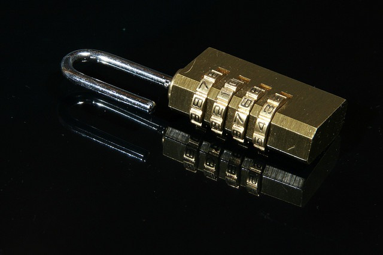

I mentioned this briefly in [another post](/2015/04/securing-my-email-inbox-part-2/), but I thought it was important enough to cover again. The sensitive financial accounts you have often will use security questions to prevent unauthorized people from accessing your account. This may have been an effective level of security at one time, but not anymore. There are databases that do nothing but collect data about you. Every point of data they can. Some of these entities are good people and some are bad people. And just like you, they can be hacked as well.

I can change my password in minutes, but the answers to the security questions these institutions ask are the type that aren't suppose to change. Some examples:

-   What street did you grow up on?
-   What was your high school mascot?
-   What was your first car?
-   Where does your nearest sibling live?
-   What is the name of your oldest nephew?
-   What is the birthday of your youngest sibling?

Even an amatuer sleuth could discover the answers to every one of those questions about me. A professional hacker probably already has them. Someone with malicious intent could call my bank claiming to be me stating he lost "his" password. The bank would then ask the security questions, which are easily discoverable on the Internet. And with major hacks such as the [Premera Blue Cross Cyberattack](http://www.npr.org/sections/alltechconsidered/2015/03/18/393868160/premera-blue-cross-cyberattack-exposed-millions-of-customer-records) where millions of health records got exposed, I must assume at some point even my Social Security Number will fall into malicious hands.

Not to be too paranoid as banks have other forms of security such as 2-factor authentication plus text and email alerts. But not everyone signs up for them and they may not be offered where you bank or invest. And for that layer of security, you need to trust your financial institution. There is nothing you can do should they mess that up.

_[Photo](https://flic.kr/p/62VvYh) by Angel Arcones_ 

However, you can control your answers to the security questions. **The answers you use to bank security questions can not be truthful.** Here is an example of how I might answer these questions. These are not my answers, just an example on how to think about answering the questions.

-   What street did you grown up on?  celery mustache
-   What was your high school mascot? boxes of paint
-   What is the birthday of your youngest sibling? shampoo day

You can store your answers to these questions inside your password manager. If you don't use a password manager, come up with a single answer that you can remember, such as "_SlipperySamSofa_".

One last tip is **do not use any words that are tied to your likes**. This especially applies to password choices. If you LIKE Star Wars on Facebook, you can bet there is a dictionary of Star Wars terms hackers will use when they try and crack your password. Hackers have software that can scan for interests across blogs and social media and then use that information to build hacking lists. Before I started this project, I used "kimchi" as part of one of my passwords. Not anymore. The words I use in passwords, passphrases and security answers have zero connection to my interests.

_I've also assembled a Best Of page for accessing the [Online Security](/tag/security/) posts._

---

## Comments

### Cathy
*July 22 at 2015 at 2:13 PM*

Wow, i have never really thought about stuff like this in this way. I find it very informative. Thanks for pulling this together.

---

### Anemone
*July 22 at 2015 at 8:52 PM*

I've been wondering what to do with these questions. I was thinking other questions, not nonsense answers, but nonsense answers look way better.

---

