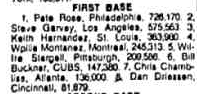

I was passing by a television at my gym a few days ago when I saw the Major League Baseball All-Star game was getting ready to start. Whenever I think of the MLB All-Star Game, I immediately think back to the spring of 1981. I was just a little kid growing up in Columbus, Ohio. We didn't have a major league baseball team, we had the AAA Columbus Clippers. That spring I can remember going to at least two games. I don't remember a single thing about the games. What I remember was the [punch card All-Star ballots](https://flic.kr/p/6yuoM8). This is back in the day when fans would go to the ballpark, grab a punch card and vote on the All-Star lineup. My sister and I didn't grab just one ballot, we grabbed stacks. And we spent most of the games voting repeatedly on the All-Star lineup. I would estimate that we voted well over 100 times. The only player I remember voting for was Pete Rose. Even though he no longer played for the Cincinnati Reds, he was still a sports legend in Ohio. My sister and I punched every single card for Pete Rose.  _Me from May 1981_ This is about the same time that I got interested in the numerical aspect of baseball. I started reading the sports page daily. I poured through statistics. I kept a baseball standings board in my room, which I updated daily. One of the things that our Columbus newspaper reported was the current tally of votes by position for the MLB All-Star game. Up until two days ago, the last tally I saw in the newspaper showed that Pete Rose beat out Steve Garvey for First Base by less than 100 votes. For over 30 years, I have believed that my sister and I were responsible for throwing the election for Pete Rose. But I just discovered this week that I hadn't seen the actual final vote count.  _From the August 4, 1981, Chicago Tribune._ Pete Rose had 726,170 votes. Steve Garvey had 575,563. Rose won by 150,607 votes. My sister and I had nothing to do with Pete Rose being the starting first baseman in the 1981 MLB All-Star Game. I started to wonder how I could have been so off on the numbers, so I actually invested another hour going day by day into newspaper archives, not just for the 1981 game, but other years around that time. What I noticed was there was a big dump of ballots counted at the very end. Unlike in today's digital world, the vote counts I was seeing when I read the paper weren't real-time. Oh well. My cool story turned out to be false. Maybe someday I'll get another opportunity to rig an election. Ha! :)

---

## Comments

### Diana
*July 16 at 2015 at 9:56 PM*

Still a great story!

---

### Rita
*July 17 at 2015 at 5:10 PM*

I love that you felt that sense of significance for so long!  It must have been a feather in your cap!

---

### MikeTO
*July 18 at 2015 at 9:44 AM*

I wonder how many other kids voted for Pete Rose more than once.  :P

---

