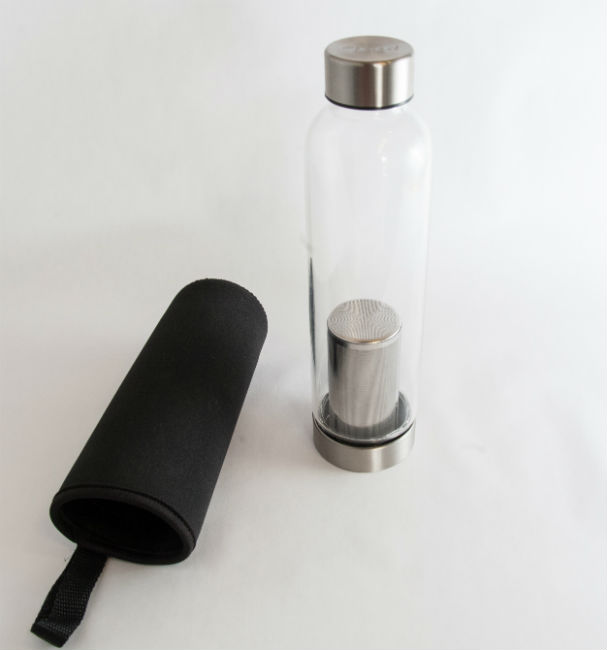

Things have been slow on this site this summer. I spent July finishing up my commitments in California and then returned to Seattle a month ago. My Seattle room is still under construction, which is making it hard to settle in. As a result, my main computer is unplugged. I'm hoping to have electrical outlets for it this week. Until then I will keep using [my Chromebook](/2014/04/love-chromebook/).

It really is amazing all the things you can do on a Chromebook if you are forced to. FTP, photo editing, [Shell](https://chrome.google.com/webstore/detail/secure-shell/pnhechapfaindjhompbnflcldabbghjo?hl=en), [coding](https://c9.io/), and even Torrent. Not that I torrent, but when a friend out of the country needed help, I was able to assist. :)

Since back in Seattle I've been catching up on new content for my coffee site [INeedCoffee](https://ineedcoffee.com/). There are also a lot more articles coming this fall. I've been advised that I should post more frequently to build a larger audience. But I prefer to post quality over quantity. There are too many sites creating disposable content. They tend to be hot for a while and then they burn out. INeedCoffee has been online since April 1999. I'm playing the long game.

_[The Perfect Solution For Cold Brew Coffee on the Go](https://ineedcoffee.com/the-perfect-solution-for-cold-brew-coffee-on-the-go/) was one of the two cold brew tutorials I wrote this month for INeedCoffee._ 

My Duolingo [streak](/2015/06/30-dias/) is now at 107 days. I slowed down my Spanish learning a lot during and just after the move. Now that I'm caught up on coffee content, I plan to increase my language study time. I have no specific goal other than to keep improving. If one day I am fluent, great. If I can only read a newspaper, that is fine as well.

And an update on Waze, which is the app I discussed in the post [Learning to Hate Driving Less](/2015/04/learning-to-hate-driving-less/). I ended up passing all my friends that connected to the Scoreboard via Facebook, except [Nikki](/2015/03/5-desk-stretch-ideas-from-indigo-kinetics/). There is no way I'll catch her, especially now that I'm away from the SF Bay Area and back in Seattle where I drive far less.

Now my only motivation has been moving up the ranks. Several months ago I achieved the level of Knight, which for the top 4% of users. I was two days away from becoming Royalty, which is the highest rank given to the top 1% when I got denied. The rankings are based upon the state. When I informed Waze I was in Washington and no longer in California, the number of points needed to achieve Royalty was 7,000 points higher. So now I am looking at another month or two before I become Royalty.

_In California, this would be enough points to be Waze Royalty._

I renewed my web hosting with SiteGround. After firing three hosts last year, I may have finally found a place that can keep the servers running, keep them running fast and respond quickly to support tickets.

I have several ideas for health and fitness blog posts, but I have more questions than answers. I was going to shelf all those posts, but I realized that many of the commenters on this blog are more knowledgeable than me and those other readers might have the same questions. So look for some discussion posts soon.

---

## Comments

### Jim
*September 1 at 2015 at 5:00 PM*

MAS:
Nice update.  Just go at your own pace. Even once a month would be fine.
RE: coldbrew--I've never tried it.  Can I pour the brewed coffee into a mug and heat briefly in a microwave?  (Note, I'm not a purest!).  Or is it just for iced coffee?  For context, I've never cold brewed, and typically use an AeroPress.

---

### MAS
*September 1 at 2015 at 5:03 PM*

@Jim - That would be iced coffee. I prefer iced coffee to cold brew, but I use an Aeropress to brew directly onto the ice.

---

### thomas
*September 5 at 2015 at 1:04 AM*

I remember reading your comment that the housing crisis would resolve itself.  Have you noticed any of that since being  back?  It seems to have gotten worse to me.

---

### MAS
*September 5 at 2015 at 2:00 AM*

@thomas - If by crisis you mean high prices for homes and rents, I revised my outlook last August.
https://criticalmas.org/2014/08/revising-seattle-rent-outlook/

---

### Rita
*September 11 at 2015 at 5:01 PM*

This article scared me about coffee: http://www.everywomanover29.com/blog/12-ways-coffee-impacts-your-hormones/
I want to be healthy, and I want to get pregnant, but this article talks as though coffee will screw up both endeavors.  And I LOVE coffee.  Thoughts?

---

### MAS
*September 11 at 2015 at 6:02 PM*

@Rita - My coffee site published an article on pregnancy and coffee.
https://ineedcoffee.com/can-pregnant-and-nursing-mothers-drink-coffee/

There are many stories that say coffee is bad and just as many that say it is good. I can't advise you, but two ideas comes to mind:

1- There have been billions of successful healthy pregnancies where the mom has consumed coffee before and during her pregnancy.
2- Less is probably the safest approach. What "less" is will be open for interpretation. I'd probably seek out the lowest level that didn't send me into a depressive funk.

---

### Rita
*September 11 at 2015 at 6:59 PM*

Perfect - thank you!  You are always a voice of reason, which is why I checked with you before buying into a fear-mongering article!

---

