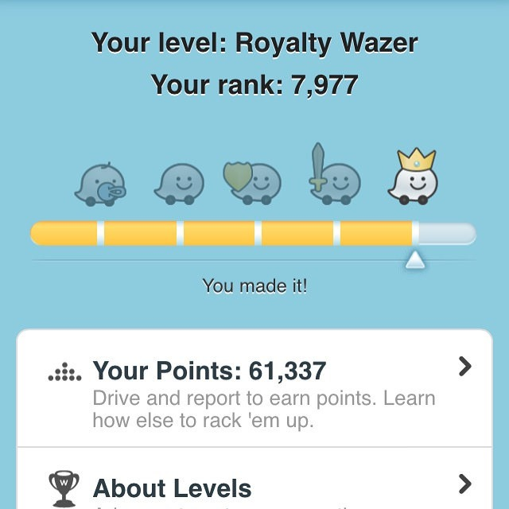
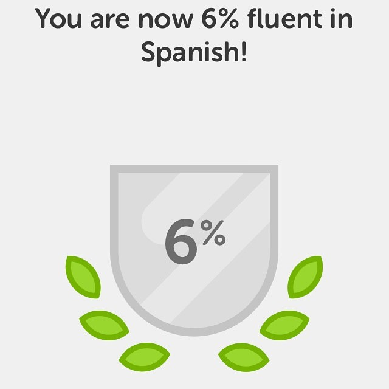

Today I am Waze Royalty!

Driving sucks. I know. But if you need to drive, why not get some points and a rank? I explained all this in the post [Learning to Hate Driving Less](/2015/04/learning-to-hate-driving-less/). Waze may seem silly to many, but it not only makes driving more pleasant (less painful) but gave me the idea to use gamification for something more beneficial.

That turned out to be the language learning application Duolingo, which I covered in the post [30 Días](/2015/06/30-dias/). Well, 30 days is now 132 days. I'm on [Level 14](https://www.duolingo.com/digitalcolony) and just hit the 6% Fluency level. Several of my friends have now joined me on Duolingo. My group the [Coffee Club of Seattle](https://www.meetup.com/seattle-coffee-club/) now has eight members actively learning Spanish. A few are learning French and one is Portuguese. It all started with the Waze scoreboard.

We live in great times. A year ago I hated driving and was too unmotivated even to start the process of learning a foreign language. Today I drive around with Waze turned on while listening to Spanish lessons (Pimsleur). I feel like a King.

Are you using any educational applications that take advantage of points, ranking, streaks, or competition with friends?

UPDATE January 2016: Having fun with the new Language Zen program.

---

## Comments

### Johan
*September 26 at 2015 at 11:31 PM*

Nice inspiring post, as usual!

There's one app called Fitocracy. Could be the king of all gamification apps, but never tried it so wouldn't be able to say for sure.

---

### Marc
*September 27 at 2015 at 2:07 AM*

Coffee Break Spanish

---

### Sean
*September 27 at 2015 at 8:26 PM*

I learned Spanish 10 years ago with massive study aids: I was a high school foreign exchange student, which often entails the motivation/feedback, human relationships, resources, and time to gain fluency quickly. 

By contrast,  I have been learning Korean more gradually over the last 8 years, and continue making steady progress. 

The most helpful app is Flashcards Deluxe, available for both Android and iOS. It has streaks, statistics of minutes studied and cards correct, and a "due cards"  formula that motivates me to try to get down to zero cards due. The formula of which cards to show is also quite intelligent, factoring in your past accuracy, staleness, whether you pressed "confident correct" or just "correct," etc. 

I briefly tried Duolinguo, as well as Memrise; I prefer Flashcards Deluxe because I can do 3-sided flashcards, with my own example sentences and the definitions also written in Korean. This is important as I make the Side 2 examples highly relevant to myself - usually draw one from where I first encountered the word (book, podcast, TV, conversation). 

In addition, if the Side 1 definition were in English, I would likely associate a specific English word with the Korean analog in the future, and I don't want to have "translator's brain" where I think in English then try to speak in Korean. This was my biggest problem with Memrise. 

As far as DuoLinguo, for Korean the site itself warns that "the Korean used is not very natural" and explicitly says it's not a good learning tool due to this. I prefer reading with Crema (Korean e-reader brand) and trying to get though 10 pages a day, then using Flashcards Deluxe to review unknown vocab from the book. 

I try to do 15 minutes of review/day on Flashcards Deluxe, and reward myself by checking it off on my daily TickTick checklist (another great app that is on all platforms and keeps history of whether you followed through). 

Unfortunately, my current Korean study methods don't use gamification to motivate, but at least have motivational components such as TickTick daily checklist, page counters, and streaks (while doing Flashcards I try to end on a streak if 2+). I really like the feeling of completing my TickTick checklist for the day.

---

### Mark
*September 27 at 2015 at 10:51 PM*

My wife thinks she has plateaued somewhat with Duolingo. She is successfully completing the lessons and reviews, but doesn't feel confident she is really absorbing the material.  

I will tell her about Flahcards Deluxe. She's been looking for additional study aids.

---

