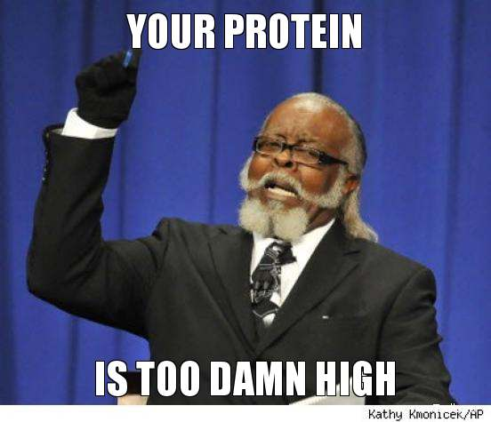
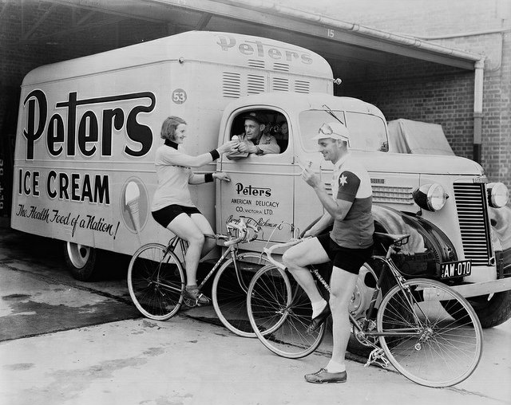

I recently saw a thread on a Paleo forum that was discussing my 2012 post [Why Ice Cream is Better Than Protein Powder](/2012/07/why-ice-cream-is-better-than-protein-powder/). I won't link to it, because the parent site uses pop-up newsletter forms on every page. I'm getting real tired of sites that are hell-bent on building their email lists and could care less about annoying their readers, many of which probably have already signed up for their damn newsletter.

Back to the ice cream discussion. My case for ice cream was convincing to the Primal forum. Good! But the thread was less convinced that protein powder could thwart their goal of gaining muscle. The consensus was to have both ice cream and protein powder. I disagree with their conclusion.

In almost every discussion regarding nutrition and building muscle, there is this blind assumption that one must eat high levels of protein to gain muscle. This is not true. Read [Matt Stone](https://web.archive.org/web/20210128091453/https://180degreehealth.com/how-much-protein-do-you-need-to-build-muscle/). Read Brad Pilon. This is the message the sports supplement sellers have been hammering away for decades telling us. You are being punked.

Protein lowers appetite. This is great for dieting, but if you are trying to gain muscle weight, what you want more than anything is calories. The reason for ice cream is it is a high-calorie nutritious food that you can easily eat past satiety. All the protein powder is going to do is reduce appetite. The last thing you want is for the ice cream to displace other sources of nutrition. You want to eat your normal healthy diet plus ice cream for the needed calories to be caloric surplus.

### Wasted Money

In the original post I said that I have:

> ...wasted over a thousand dollars on protein powders and bars since the mid 1990s.

With that kind of money, I could have bought a lot of cool kitchen gear, which would in turn go to making more healthy meals at home. I would have saved more time and money. Hell, I didn't even get a [pressure cooker](/2014/09/pressure-cooker-game-changer/) until last year. Three tubs of protein powder or a pressure cooker, which is going to help you gain more muscle? No contest, it is the pressure cooker.

### Dirty Ice Cream

The other angle people get hung up on is the cleanliness of ice cream. Those eating a squeaky clean diet that breaks into a cold sweat reading the ingredient list for many ice creams have two choices. Buy a basic vanilla as they tend to have the fewest ingredients.

Your second choice is to make your ice cream and source your own ingredients. This summer I made some coffee ice cream with a $50 Cuisinart and shared that tutorial on INeedCoffee. See [Homemade Coffee Ice Cream – A Delicious and Healthy Alternative to the Store](https://ineedcoffee.com/homemade-coffee-ice-cream-recipe/).

_[Photo](https://flic.kr/p/cw4UiE) by State Library of Victoria. Look at the side of the truck. Ice Cream is "The Health food of a Nation!"_ 

### Not For Everyone

Finally, the critics that say they would get fat eating ice cream must not have read this part of the article:

> I want to define the audience for this post. It is for male ectomorphs that are already lean wishing to gain additional muscle. Younger males and those with less training experience will benefit even more. It is also not for ectomorphs with a gut.

Even if we aren't this person, we all know someone like this person. Super lean, exercising all the time, and can't make gains. My advice is to put down the protein powder and pick up the ice cream. Give it a try. If it doesn't work, at least you know.

I know this post will be misread by many. So let me summarize. Calories are more important than grams of protein when it comes to building muscle. Many lanky men have trouble eating enough calories to gain muscle. Protein powders are not helping them. Ice cream is a better tool.

---

## Comments

### charles
*September 6 at 2015 at 12:04 AM*

What about the effects of ice cream on you HbA1C?  Any thoughts

---

### MAS
*September 6 at 2015 at 12:50 AM*

@charles - Not a clue. This post and the previous one were strictly about protein powder vs ice cream and which one is better for hard gainers.

---

### Gary
*September 6 at 2015 at 11:13 AM*

I want to pack on 10 pounds!

The important point that you understand is that athletes in training do not need an increase in protein as a percentage of the overall dietary intake.  However, neither do athletes need a higher percentage of fat in their diet.  Athletes in training simply need to maintain the same balanced diet with a proper proportion of protein to carbohydrate, but because of their increased caloric expenditure, they will need to eat more food, but with all the foods in the same proportion as if they did not exercise.

Some athletes in high volume (as opposed to high intensity) training find it difficult to meet their caloric needs by simply increasing the size of their meals each day.  For those athletes, adding extra concentrated fats such as butter, olive oil, and coconut oil will serve their caloric needs.  But again, we are only talking here about high volume athletes such as long distance runners and triathletes.

Individuals who are in high intensity, short duration exercise (the physiologically and metabolically efficient way to gain the benefits of exercise), should consume an adequate portion of protein, and the ratio of protein to carbohydrate remains unchanged ­­--only the overall quantity of food increases.

There are only 2 ways to gain 10 pounds--you can gain 10 pounds of muscle, or you can gain 10 pounds of fat.  Increasing your calories, whether those calories be from ice cream or coconut oil or candy bars or steak are going to build to build 10 pounds of fat.

If you have been doing HIIT strength training and sprint intervals, and still weight 175 pounds, then you have reached the limit of your physiological anabolic capacity.  You may or may not have the anabolic capacity to gain another 10 pounds of muscle, but if you do, you will have to do it with super physiological exercise-- ­the kind that involves paying a health cost to gain the desired 10 pounds.  You will need to do higher volume lower intensity strength training to build vascularity.  You will also probably need to stop doing sprints.

To clarify ­­--there is a difference between exercising for health benefits and exercising to satisfy a “need” for 10 pounds.  If you think the benefits of the extra 10 pounds are worth the cost of sacrificing part of your health, then that is your choice, and go for it.

Ice cream

Sugars deplete anti-­inflammatory bacteria, thin the mucus layer of the gut, and foster systemic inflammation.  Potentially dangerous opportunists bloom in the gut.  Short-circuiting the expansion of commensal bacteria.

Starches

Particularly amylose, has an extremely high glycemic load because the amylose so quickly degrades in the gut to sugar (minimize the sugars that lead to intestinal “blooms” of deleterious bacteria) wreaking havoc with your glycemic control and doing virtually nothing to feed your gut flora.

---

### MAS
*September 6 at 2015 at 3:02 PM*

@Gary - Interesting ideas there. You are saying the type of training one does should dictate how one gets their caloric surplus? Do you have any links to share for follow up reading? 

I don't think ice cream neatly falls into either an added fat category and most people are surprised to learn ice cream is not high sugar. I picked it because of the dairy base and low satiety angle. There are some in the bodybuilding community that rejected protein powder for chocolate milk and have achieved great results. Ice cream falls is a close relative. 

I began with ice cream to correct being underweight. I gained both muscle and fat. For me that was a fair compromise.

---

### MAS
*September 6 at 2015 at 3:06 PM*

@Gary - One more question: what are your thoughts on natural sugars such as real honey?
http://freetheanimal.com/2015/01/hormesis-afraid-unrefined.html

Would using a real honey to make ice cream get around your objections?

---

### Gary
*September 6 at 2015 at 6:13 PM*

Honey is about 40% fructose and 30% glucose.

Fructose causes a far more severe stimulation of excess insulin response.

What the clever promoters in Agri-­Business did was to pay their stooges to do research showing that if you drink a fructose solution instead of a glucose solution...the insulin and glucose reactions are not as extreme. The implication: fructose is natural sugar; fructose is fruit sugar; fructose is the good sugar because it doesn't affect glycemic control as adversely as glucose does. Well of course not--fructose has to wrestle with the liver for a while before it gets released as an energy substrate.  So naturally the reaction to fructose would not be as quick.

Fructose (fruit sugar) causes 10X as much glycation damage as glucose. The oxidative damage of glycation is particularly evident as the non-­enzymatic cross ­linking of collagen. Collagen?  Where is collagen found in the body?  Only everywhere.

A blend of Really Raw Honey, raw milk, and raw cream is better than any ice cream. But for me, it is just an occasional treat.

I could eat Häagen-Dazs vanilla bean until hell freezes over.  That is...in a perfect world.

---

### thomas
*September 7 at 2015 at 4:15 AM*

I am an ectomorph with a gut.  I've tried 500cal a day, ice cream diet, vegetarian, paleo, int fasting.  Nothing seems to be working.  Any advice?

---

### Steve
*October 8 at 2015 at 6:12 PM*

I agree that protein powder can be a waste of money. I think collagen/gelatin might be a better option. Creapure creatine monohydrate is another good option. Make sure to dissolve creatine in a hot liquid before drinking. Brad Pilon likes creatine.  This is helpful:

http://www.brinkzone.com/articles/how-to-get-most-out-of-your-creatine-what-form-dose-and-supplementation-strategy/

http://www.swansonvitamins.com/swanson-premium-creatine-powder-2-lb-3-oz-1-kg-pwdr

---

### MAS
*October 8 at 2015 at 6:14 PM*

@Steve - Thanks for the warm water tip. Did not know that.

---

### Steve
*October 8 at 2015 at 6:41 PM*

No problem. I think in most of the studies they dissolved it in hot tea. I'll dissolve it in my morning coffee. The downside to that is it adds a mild bitterness to the coffee- I add cream and sugar to mask the bitterness. In hot liquid it dissolves almost immediately.  A lot of guys mix creatine in cold protein/post workout shakes. They probably only absorb 1-2 grams out of the 5g because most of it isn't dissolved.

---

### Jo-Anne
*October 15 at 2015 at 9:27 AM*

@Steve

Adding a pinch of salt may mask the bitterness of the creatine in your coffee. It works on the odd occasion when I use too hot water to make my coffee.

---

