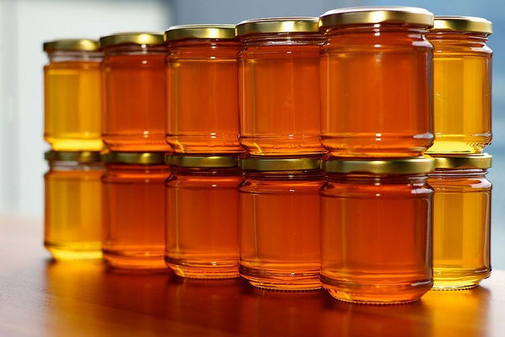

Last week I went back and revisited all my old posts on Intermittent Fasting. Because of the concerns, I discussed in [Irresponsible Health Blogging](/2015/09/irresponsible-health-blogging/), a few posts were edited and a few were deleted. I also completely rewrote my [Best Of Intermittent Fasting](/tag/intermittent-fasting/) page. My goal was to do two things. First I did not want to be seen as giving a blanket recommendation to IF. Second, I did not want to regurgitate the scientific explanations that I got from other sites, some of which I now have less confidence in.

Last month when I put out the post [Intermittent Fasting - Context is Likely Important](/2015/09/intermittent-fasting-context-is-likely-important/), I honestly thought it was a good way to end the series. I felt it was balanced and addressed both the fans and the critics of IF. But you can't please everyone. Some of the fans discounted my concerns and a few people on a Ray Peat forum felt even with all my caveats and experience that I'd be making a big mistake to resume even a little IF.

It got me thinking if there might be a way to reconcile the two sides.

### The Benefits and Criticisms of IF

I have an idea for a different approach to fasting that might work, but before I explain my plan I want to first go over the benefits and criticisms of IF first. I see three major cited benefits for IF. They are:

1.  **Learning How to Deal with Hunger** - In a [2012 post](/2012/06/my-experience-with-the-zone-diet/), I talked about how following The Zone Diet trained my body to be hungry almost all the time. I was always thinking about food and meal planning. For me to resume a normal 3 meals a day habit, I first had to learn to be OK with hunger. IF was that teacher. Being OK with hunger made me calmer. It allowed me to spend more time preparing meals. I learned to cook. I no longer had to reach for a protein bar to immediately kill my hunger.
2.  **Fat Loss** - Fat loss is about creating a caloric deficit. You can try and manage this on a day-by-day, meal-by-meal basis, but that can be costly in both time and willpower. Creating a larger deficit once or twice a week and then eating normally the rest of the week both work and can be liberating. This is the basis for the [Eat Stop Eat](/2011/01/eat-stop-eat-a-guide-book-for-intermittent-fasting/) guide by Brad Pilon. I don't believe there is anything magical about fasting, but for me, it was a simple compelling strategy that worked far better than other diets.
3.  **Autophagy / Life Extension** - I'm not going to go into much on this topic, so I'll direct you to the excellent post [Death Will Eat Itself](http://jdmoyer.com/2012/02/01/death-will-eat-itself/) by J.D. Moyer. The short version is when you deprive the cell of nutrients, it begins to self-clean. Many people believe this can result in many health benefits including life extension.

Now for the criticisms.

1.  **Reduced Metabolism** - The body is smart and if one engages in too much fasting, it can reduce metabolism. How much is too much? This is highly debatable and will vary from person to person. I cover the case against triggering autophagy in the post [Intermittent Fasting - What Paleo Didn't Teach Me](/2014/02/intermittent-fasting-paleo-didnt-teach/). The simple explanation is that by forcing autophagy and reducing metabolism, you are decreasing cell protection and slowing down repair because now the cell is under stress.
2.  **You Don't Need to Become a "Fat Burner" to Burn Fat** - Paleo has been big on pushing the message that one needs to access stored body fat directly via low carb or ketosis to lose weight. This is false, as the body is always burning fat. Thankfully this myth is going away. There are still people pushing ketosis as a magical way to lose fat. Although it may be easier, it is a stressful path and can lead to lower metabolism.

### What Diana Schwarzbein Said That Resonated With Me

After the Context post, I watched Diana Schwarzbein's _Survival of the Smartest_ lecture twice. Took [notes too](/2015/09/notes-for-the-survival-of-the-smartest-lecture-by-diana-schwarzbein/). She discusses how on a hormonal level we are either using or building. When we fast, we are using. When we eat we are building. And our ability to rebuild hormones is greatly reduced as we age. For women age 35 and for men age 40.

So our ability to handle fasting can be diminished as we age. If we already have poor sleep, over-exercise, or abuse chemicals (caffeine, nicotine) then fasting would be even worse.

What I learned from Schwarzbein was the cascade of stress hormones can cause the metabolism to tank. This lines up with the Ray Peat people and their criticisms regarding forcefully triggering autophagy. She also talked about how hormonally breaking down can feel good. It is a survival technique for the species. However, repeatedly running on stress hormones is not good and can gradually lead to chronic health problems.

### Seeking an Alternative Approach to Fasting

I first learned about autophagy from Art De Vany. He mentioned in his lecture how during the fasted state the cell consumes the damaged proteins first. Diana Schwarzbein said something similar in her lecture, stating that in the absence of glucose, amino acids are broken down to make sugar. The problem is the accompanying stress hormonal response.

All this made me ask the question: **Can one get the benefits of fasting without the stress hormone response?** Maybe you can. If carbs and salt can suppress stress hormones and protein suppresses autophagy, what would happen if one consumed just enough sugar/salt to shut down the stress hormones?

I did some searching and discovered the online book [The Protein Cycling Diet](https://proteincyclingdiet.wordpress.com/article/protein-cycling-diet-2s3nmvrwklbxs-1/). This book is very pro-autophagy and goes into great detail on science. To trigger autophagy it recommends following a very low protein diet. How low? 5% or fewer of total calories.

The problem with this diet is that capping protein at 5% is going to be tough as most foods exceed 5% protein. Even foods you wouldn't think had much protein are often greater than 5%. White rice is 8% protein. A potato is 7%. Once you start digging through the nutritional content of food, it looks almost impossible to construct a meal with 5% or less protein.

Unless instead of constructing a very low protein diet one greatly reduces the number of calories.

The Ray Peat people love salted orange juice as it shuts down stress hormones. Orange juice has a protein content of 5%. Good. Raw honey, which was discussed in the post [In Defense of Sugar](/2015/01/defense-sugar/), has only trace amounts of protein.

_[Photo](https://flic.kr/p/fCADiP) by mbeo_

### The Low-Stress Intermittent Fast

Here is how I envision the plan working. Once or twice a week on days when I wake up with great sleep and I have no plans to exercise, I will begin the day with a small amount of either honey or salted OJ. Then if I feel anxious or stressed during that day, consume a little more until the 22-hour fast is complete. I'll also have a small amount of honey or salted OJ before every caffeinated drink to blunt the stress response. At the end of the day, I will end the low-stress IF and have a normal meal.

Will this method meet my goals? I think so. First, it will teach me to deal with hunger. Not as powerful as a zero-calorie fast, but I suspect it will still be effective. Second, it will create a caloric deficit for fat loss. Third, I think but have no way of knowing that will trigger autophagy, but do it in a way that lowers stress hormones and doesn't compromise metabolism.

One criticism might be the very act of doing this could reduce metabolism via the reduction in calories. To reduce the chance of that happening, I would not do this fast on consecutive days. When I do eat, it will be a carbohydrate-friendly diet.

Am I on the right path here? One question I do not know is just how many grams of sugar (OJ or honey) will be needed to address stress hormones. I'll guess for now. If I feel cold or anxious then I'll up the sugar/salt, otherwise I'll lower it until that sweet spot is found.

---

## Comments

### Charles
*October 13 at 2015 at 5:49 PM*

http://roguehealthandfitness.com/protein-cycling-diet-for-life-extension/
When I come to the end of a 16-hour fasting window, I’ll eat fat. So far about the only thing suitable I’ve found is cream cheese, 3 ounces of which have only 5 grams of protein and zero carbohydrates, and about 300 calories. (The small amount of protein in it will be metabolized and out of the system quickly.) I can’t even eat that much and it holds me all afternoon. But I do need to explore some other food options, as plain cream cheese is pretty bland tasting. If I’m hungry and want to continue my fast this way, I’ll sometimes make a cup of chocolate: one heaping teaspoon of baking chocolate, add about 5 ounces of water, microwave one minute; then add several ounces of heavy cream. Made this way, it both stimulates the nervous system and keeps you fed, besides allowing autophagy to continue. There’s no protein in it, and chocolate itself activates AMPK and autophagy.

Then at dinner that evening I’ll eat a normal, protein-rich meal. The next day is workout day, and I’ll eat relatively high protein that day to build muscle. You wouldn’t want to keep protein low all the time as this would lead to muscle loss, a big scourge of aging.

http://roguehealthandfitness.com/activating-ampk-lifespan-extension/

https://blog.bulletproof.com/what-is-protein-fasting-bulletproof-diet/

---

### MAS
*October 13 at 2015 at 6:27 PM*

@Charles - Those links are different. They restrict carbs and therefore ignore the stress hormone response.

---

### Brock
*October 14 at 2015 at 3:03 AM*

I think what you're looking for is a "protein fast", which is something I learned about from Dave Asprey.  He describes it  in his latest book, and on his website.

The basic premise is to not eat any protein on a given day, but to feel free to eat foods with carbs and fats as desired.  You can't avoid protein entirely with natural foods, but by starting with that as a premise, a daily intake of protein can get down to 10 -20 grams, which is not that much and gives the benefit.

Here's what that looks like for me: a morning bulletproof coffee derivative (coffee or tea, some fat, blend, enjoy), Lunch and dinner turn out to be veggie curry, lunch with potatoes usually and dinner with rice.  Lunch could also be a veggie burrito bowl with sour cream and guacamole.  Snacks are 85% dark chocolate or almonds to tide me over between meals if needed.  It's hard to eat too many calories on just veggies, as long as you watch the fat intake, so I think slight calorie restriction becomes part of the experience as well, but without putting too much stress on the body.  The day turns into a bit of a carb refeed if you aren't doing a lot of carbs during the rest of the week.  

So you fast from protein from the end of dinner prior to the protein fast day to your first meal after the protein fast day, or 30-40 hours, depending on timing of the last meal prior and first meal afterwards.  This approach would probably allow you to get a light to medium recovery-focused workout in without too much stress as well - a walk or an easy hike, rather than having to take a total rest day.

Hope that helps!

---

### MAS
*October 14 at 2015 at 3:50 AM*

@Brock - One or two rest days is not a problem, since I usually only exercise 2-3 days. 

Since my 2 primary goals are learning to deal with hunger and fat loss, I think my way will be better for me. Also it is 1-2 days of not having to plan meals. Planning an entire menu of low protein foods is actually going to be much more work. At least that is the impression I got from reading the 2011 Protein Cycling Diet.

---

### Gtex
*October 14 at 2015 at 6:27 PM*

Need to share this experiment I did in the mid '70's when I was doing competitive powerlifting....
I wanted to drop from the 198 lb class to the 165 lb class just to see what it would be like and if I could do it.
I lost essentially 30 lbs in 30 days by:   eating very small meals, only when I was hungry and just enough to satisfy my hunger.
Don't remember the content of the meals, but probably just normal meals, just greatly reduced in
volume.  I remember how great I felt by the 4th week and remember that my hunger was almost
non existent(fat adapted?).  I also did not loose all that much strength either.
I have never repeated the experiment, but think about it often.  In fact I am thinking of trying it again right now.

---

### Rita
*October 20 at 2015 at 5:07 PM*

Since I'm more concerned about fertility than life extension, but I still want to keep my weight down, IF and &gt;5% protein a few days probably isn't the best thing for me right now is it?  I'm very curious about the 2-day honey bio-hack, but like I said - I'm 38 and trying for my first pregnancy so, maybe not a good idea for me right now?

---

### MAS
*October 20 at 2015 at 5:27 PM*

@Rita - I'm unqualified to give advice, but if it were my wife, I'd say absolutely to avoid IF while preparing for pregnancy.

---

### Chris
*December 5 at 2023 at 2:54 PM*

Anthony Colpo is back criticising IF 

https://open.substack.com/pub/anthonycolpo/p/intermittent-fasting-myths-expertly?r=tqz8c&amp;utm_medium=ios&amp;utm_campaign=post

---

### MAS
*December 5 at 2023 at 3:09 PM*

@Chris - Sometimes it feels like we just keep recycling the same topics to debate. It all depends on the audience. 

IF was a great tool for me after the Zone Diet left me feeling hungry all day long. Now that I'm at ideal weight (and it is winter), I can put the tool aside. It did it's job.

---

