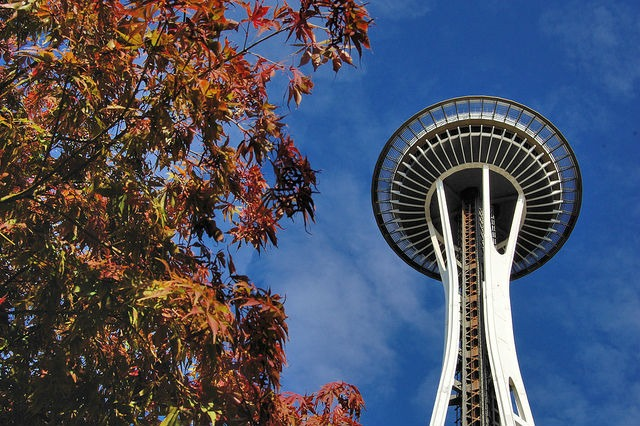

Today I learned a wonderful word. From [10 Spanish Words That Have No English Translation](https://www.huffpost.com/entry/spanish-words-no-translation_n_5399000):

>  7. Friolento/Friolero
> 
> Someone who is very sensitive to cold.
> 
> Él es muy friolento y siempre pide que apaguen el ventilador. Since the cold affects him so much, he always asks them to turn off the fan.

I used to be _friolento_. I decided eight years ago I was tired of being cold all the time whenever the temperature dipped below 65 F (18 C). Inspired by [Art De Vany](/2008/12/no-jacket-required/), I proceeded to widen my temperature comfort range.

_[Photo](https://flic.kr/p/aEWGX7) by jpellgen_

Probably the most helpful trick I used to increase my temperature resiliency was the simple act of wearing one less layer. If it is a coat day, wear a sweater. A sweater day, wear a thin jacket. A jacket day, wear a long sleeve shirt. A long sleeve day, wear a short sleeve shirt. Be a little bit uncomfortable.

The first few minutes of cold exposure is your body telling you it doesn't want to do the work of warming you up. It wants you to do its job. Ignore that call for a 10-20 minutes every day and soon your body will be throwing heat.

You can take cold exposure too far. [I have.](/2013/06/cold-thermogenesis-5-years-later/) But there is no need to. You don't need to go too cold or too long.

The key to widening your temperature range is to first trigger cold exposure and then warm up quickly. Kind of like going to the gym. Get your workout done, then hit the showers and have some post workout nutrition. Don't spend too much time on the stressor and don't ignore the recovery.

I understand why old people are cold all the time. Besides muscle loss they have pampered themselves for decades by always being in a perfectly temperature controlled environment. In a modern society it is easy to always be warm. Heated homes, heated cars, heated seats, blankets, jackets and sweaters all there to keep us from even a minute of discomfort. But just like lack of lifting weights can lead to muscle atrophy, lack of a colder stimulus deconditions the body from being warm on its own.

The problem I see now is more than just old people that have become [temperature wimps](/2014/09/temperature-wimps-san-francisco/). It appears to be almost everyone. We live soft lives inside offices and cars. Even our gyms are temperature controlled. _Close that window there might be a slight breeze!_

In the post [You Broke Your Own Metabolism](/2011/06/you-broke-your-own-metabolism/), I go further. People aren't just wearing jackets because they are cold. They are cold, because they are always wearing jackets.

Fall is here. Winter is coming. Leave your jacket behind. You'll be fine. In fact, you'll be better. Last year I sold my nice leather coat. I realized that since I had greatly widened by temperature comfort zone, it never got cold enough in Seattle to wear a coat. At 30F (-1 C), a sweater was enough.

**I used to be _friolento_. ¡No más!**

---

## Comments

### MAS
*October 15 at 2015 at 6:28 PM*

@All - More cold exposure posts here: 
/tag/cold/

---

### Thomas
*October 16 at 2015 at 8:01 AM*

Thanks for the summary of your experience on cold exposure.
One thing I have been wondering about is whether this would work for heat as well.
Have you ever tried heat exposure to become more tolerant of high temperature?

---

### MAS
*October 16 at 2015 at 12:59 PM*

@Thomas - Great question. Yes, I have done heat exposure on a regular basis starting last year via saunas and steam rooms. 

When I first went to a sauna I could only handle being in the room for 5 minutes. Now I can stay 20 minutes. Sometimes I will even split the 20 minutes into two 10 minutes sessions where I leave and take an ice cold shower in between.

---

### Thomas
*October 16 at 2015 at 1:24 PM*

@MAS:
Good to know it works for heat as well. Thanks for the explanation.

Taking an ice cold shower in between two sauna sessions looks like you're really applying the principles of high intensity training to your temperature training.

---

### Allen
*October 26 at 2015 at 5:00 AM*

Hi MAS,

Just want to know whether widening your temperature range has any side effects. For example I remember you mentioned that you could not train HIT in glitter gyms anymore because the temperature was to high. Is this because you are possibly always very warm now.

---

### MAS
*October 26 at 2015 at 5:54 PM*

@Allen - Temperatures issues are well known in HIT. Dr. McGuff keeps his gym at 61 degrees. So does Ideal Exercise in Seattle.

---

### MikeTO
*November 3 at 2015 at 5:06 AM*

I used to shovel snow in my shorts and t shirt.  I don't do it anymore since I live in an apartment.  I regularly take cold showers.  brrrrrrrrrrrrrrrr

I also live in Toronto, Canada, it's very cold here.

---

### Øyvind
*November 3 at 2015 at 3:28 PM*

Good post!

In Norwegian, someone sensitive to cold is often called a "frysepinn", literally a cold/freezing stick.

---

