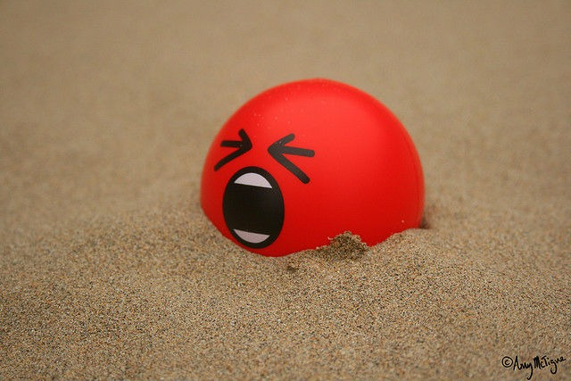

I just finished reading an interesting book on stress. I jotted down some of the key ideas. _The Myth of Stress: Where Stress Really Comes From and How to Live a Happier and Healthier Life by Andrew Bernstein_ The author states that stress is not a physical process with a psychological component, but a psychological process with a physical component. Stress doesn’t come from what’s going on in your life - it comes from your thoughts about what’s going on in your life.

> ...in reality, there is no such thing as a stressor. Nothing has the inherent power to cause stress in you. Things happen (divorce, layoffs, disease, etc.) and you experience stress - or you don’t - depending on what you think about of those things. Stress is a function of beliefs, not circumstances.

The book explains how stress originates from our thoughts, but the effects on our body, feelings, and behaviors are real. This reminded me of my experience with overcoming back pain and understanding how the [roots were psychological](/2011/02/the-psychology-of-back-pain/), but the pain was real. When I changed my thinking, the pain went away. The Myth of Stress says that insight is the key to reducing or eliminating the effect of stress. And the author defines insight as _the realization that what you had believed to be true is actually false so that the real truth emerges_. The book disagrees with the wisdom that "time heals all wounds", by stating that it is actually insight and not time. The problem is this insight can take a long time to arrive. People can spend days, months or years stuck on a problem. The key is to seek greater insight. This is done via worksheets. Here is how the worksheet process works.

1.  Describe the stressful feeling in a should or shouldn’t sentence.
2.  Rank feeling from 0-10.
3.  (a) How do you feel when you believe this? (b) How do you act when you feel this way?
4.  Write a negation of step 1 by adding “in reality at the beginning or “at this time” or “at that time” to the end.
5.  Write proof that supports the negation. Be thorough.
6.  (a) How do you feel when you see the truth of the negation? (b) What actions might come from this?
7.  Read your original statement again. How strongly do you feel this belief to be true now?

This process can lower the initial stress ranking several points.  _Photo by Amy McTigue_ The book goes through many real examples on a variety of topics including:

-   Traffic
-   Anger
-   Conflict Resolution
-   Weight Loss
-   Success
-   Financial Happiness
-   Uncertainty
-   Broken Heart
-   Having Too Much To Do
-   Regret
-   Discrimination
-   Dying Too Soon

On being calm:

> A stress-free life isn’t about trying to stay calm. Calm is your baseline state, and you contract away from it through false beliefs. From this perspective, the opposite of stress is not relaxation. The opposite of stress is education, releasing the contractions by having insights.

On culturally related stress:

> The number of counterfactual beliefs in your head, not the number of figures in your bank account, determines how happy or unhappy you are with your life. Some cultures may circulate fewer of these beliefs, and as a result they more enjoy life more. But you don’t have to know what your fellow citizens are struggling with in order to increase your own happiness. Simply find the beliefs you have about how life should be different, and challenge them one by one. The more you do this, the more you’ll enjoy life.

If you are interested in digging into the specifics, The Myth of Stress is worth a read.

---

## Comments

### Diana
*October 14 at 2015 at 11:30 PM*

This sounds like a very useful book.  Thanks for writing and sharing notes!  I hadn't heard of it before.

---

### Geoff
*October 14 at 2015 at 11:42 PM*

Does the author limit this approach only to mental/emotional stressors? That's what the list you provided covered. So I presume that's the case.

Personally, I have a hard time buying into the idea that "there is no such thing as a stressor".  Physical stress (sleep deprivation, excess exercise) and chemical stress (abuse of caffeine or alcohol, exposure to environmental toxins) seems to be very real and driven primarily from physical factors.

---

### MAS
*October 15 at 2015 at 1:12 AM*

@Geoff - Yes the author is just speaking about emotional stress. I should have mentioned that in the post, especially since this blog discusses other forms of stress.

---

### Anemone
*October 15 at 2015 at 2:43 AM*

That's a good point about physical and chemical stressors. He doesn't seem to consider trauma either - overwhelming emotional stress. There is after all a limit to what we can, and should, stay calm about.

Also, I'm wondering about discrimination. Would it not depend on how serious the discrimination is?

---

### Mike
*October 15 at 2015 at 1:41 PM*

What he's writing about reminds me of David Burns' classic "The Feeling Good Handbook," which was one of the foundation books for cognitive behavioral therapy (CBT). He also uses very simple scoring and worksheet exercises to help surface these beliefs to consciousness; when you KNOW you're doing it, you're less likely to continue doing it.  

For example, score from 1 to 10 your feelings of resistance to a task and also the difficulty of accomplishing it. After you're done, rescore yourself --  you'll likely find that the task was much less difficult than you thought.

This wikipedia page on cognitive distortions from Burns' book is a good guide to helping one identify beliefs that cause stress: https://en.wikipedia.org/wiki/Cognitive_distortion#Main_types

---

### MAS
*October 15 at 2015 at 2:03 PM*

@Anemone - How you perceive the discrimination initially and how it affects your stress level from 0-10 would be your starting point on a worksheet. Then you would perform qualifiers and come up with a negation. The goal of doing this is to get the number lower. 

@Mike - thanks for sharing. I'm adding that book to my queue.

---

### Mama
*November 6 at 2015 at 1:11 AM*

Also The Work of Byron Katie and her four questions.  Same process, but deceptively simple.

---

