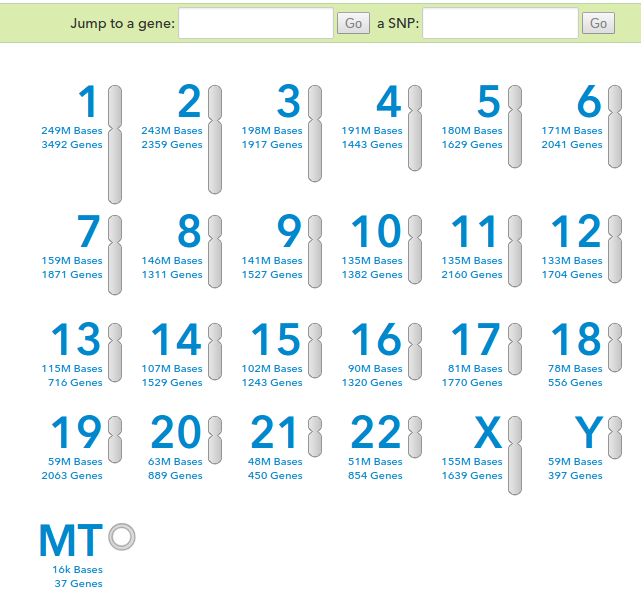

It has been a while since I thought about my 23andMe account. Back in April 2013, I shared my [23andMe health results](/2013/04/23andme-results/) and did a post on [my ancestry](/2013/10/finding-relatives-23andme/). Yesterday I was tipped off to the post [These 5 Genes Predict What Kind of Diet and Exercise is Best For Your Body](https://web.archive.org/web/20190321024623/https://rockstarresearch.com/these-5-genes-predict-what-kind-of-diet-and-exercise-is-best-for-your-body-2/) over on _Rockstar Research_. The premise of the post is that researchers have discovered that different people respond to different forms of diets and exercises at the gene level. And instead of digging through hundreds if not thousands of pages of research and references, the _Rockstar_ post simplifies all that info into a simple flowchart. For this post, I will use my data to see which exercise and diet are best for my fat loss.  _Browse Raw Data - 23andMe_ **My Data**

-   rs4994 = AA
-   rs1042713 = GG

**Result #1 = Only High Intensity Exercise Will Help You Lose Weight**

-   rs1799883 = not found
-   rs1801282 = CG

**Result #2 = You Will Lose 2.5X as Much Weight on a Low Carb Diet** Interesting. My personal story is that when I did a lot of [endurance running](/2008/03/the-runner-1989-1995/), I never got any leaner. Also, the time I did lose the most weight was when I cut the carbs. Was it reduced carbs? Or was it the increased protein in the diet? How much of a role does genetics play here? I don't know, but this has my attention now. It is one more piece of the puzzle. **UPDATE** After the comment by Anemone, which states that not having the rs1799883 marker in your test results means you need to test both paths. So here are more results:

-   rs1801282 = CG

**Result #3 = You Will Lose 2.5X as Much Weight on a Low Fat Diet** Going down this path contradicts the previous result. The exercise recommendation remains unchanged. So unless I can figure out what my rs1799883 is, I don't know if I am genetically more likely to lose fat following a low-carb or low-fat diet.

---

## Comments

### Anemone
*October 19 at 2015 at 7:37 PM*

They're saying in the comments that if you're missing rs1799883, which newer subscribers are, to take both paths. Which puts you (and me) potentially in either the low carb or low fat group. Personally I find losing weight the easiest when I lose my appetite, but I don't recommend that route.

It's fun to check, though. And I found a 4th cousin recently through 23andme. (Or rather, he found me.)

---

### MAS
*October 19 at 2015 at 9:32 PM*

@Anemone - Thanks for the info. I've updated the post.

---

### Brian
*October 20 at 2015 at 1:44 PM*

I have the same results, MAS. Is there a way to find out our rs1799883 like you alluded to? My experience tells me I lose more on low-carb but the results here aren't confirmed that, at least without rs1799883.

---

### MAS
*October 20 at 2015 at 2:24 PM*

@Brian - Don't know. I checked my raw download file from 2013 and it wasn't there either.

---

### Pauline
*October 21 at 2015 at 11:37 AM*

Something I read a while back has always stayed with me.  You either cut the fat or you cut the carbs.  Either you will lose the weight. There was a book written about metabolic differences in how some people process foods.  The writer found he did well on a vegetarian diet and when his wife took ill he gave her vegetarian meals but her condition weakened.  When he reverted to given her a higher protein/fat diet she made an amazing recovery.  So there is definitely something there.  Whenever I have tried to eat mostly vegetarian meals I feel weak and out of sorts, when I revert to a higher protein lower carb diet my energy returns.  Maybe its all in the genes.  My ancestors were Scottish, German and Dutch and for them maybe a higher fat diet works best.

---

### Jim
*October 22 at 2015 at 12:05 AM*

@MAS
They posted today at the 23andme blog that they have now met the FDA requirements, so they can offer the health info again.  I didn't think they would be able to wind their way through all of the red tape, but I guess they were able to do it.

---

### Brian
*October 22 at 2015 at 12:56 PM*

@Jim. I read that too. It's a great achievement for the site and makes me feel good about their dedication to their service. I was worried when this story broke a year or so ago and I'm glad they took it seriously.

---

### Jim
*October 24 at 2015 at 6:23 PM*

@Brian
For those interested in how they met the FDA requirements, there's an interesting story at Fast Company.  Just search 23andme fast company turn around.

---

### Ragan
*November 9 at 2015 at 5:30 PM*

answer = do both!

---

### seanorama
*November 21 at 2015 at 10:11 PM*

@MAS - Will you be getting an updated test in order to see the rs1799883 SNP?

Asking as I have the exact same results as you.

---

### MAS
*November 21 at 2015 at 11:01 PM*

@seanorama - No. There is no guarantee they will pick it up it I purchased another test.

---

### Brian
*November 21 at 2015 at 11:03 PM*

Same reason I'm not retesting. If it picked it up, I would.

---

