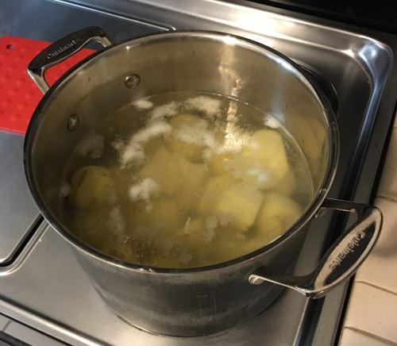

Be sure to check out my [Potato Hack Diet](/tag/potato/) Best of Page.

Earlier this month I posted [No Hunger Games - A Day of Just Boiled Potatoes](/2015/11/no-hunger-games-a-day-of-just-boiled-potatoes/). It was a trial run of two days of eating just cold boiled potatoes. That post goes into why it is easy to go into a calorie deficit without feeling hungry if one just eats potatoes. [The Potato Diet](https://vegetablepharm.blogspot.com/p/the-potato-diet_14.html) guide on _Vegetable Pharm_ is the comprehensive guide. If you have any questions, they are likely answered there.

The two-day test showed me a few things:

1.  That I could eat to satiety in a caloric deficit. No hunger.
2.  That I could sleep throughout the night and not wake up hungry.
3.  With my current coffee consumption, I found I felt much better throughout the day than I currently do when I intermittent fast. If I were not a coffee drinker, I might prefer IF, but ditching coffee as we head into a Seattle winter is not an option.

Shortly after the two-day experiment, I planned to start The Potato Diet, but I caught a minor cold and then had to travel out of state for a week. Well, now I am back and feeling great. I'm ready to do my first major food experiment in a very long time. Here is my plan.

-   GOAL: Lose 15-20 pounds
-   POTATO DIET: Monday, Tuesday, Wednesday every week.
-   EXERCISE: Sunday, Thursday

Continue with 3x a week until your goal is met and then scale to a maintenance plan. Discontinue or scale back if I experience excessive lethargy or coldness. If after a month I fail to see at least a 5# lose, I will reassess.

I will be boiling white potatoes and be consuming them cold. No salt, spices, or anything. If the diet is successful and I use the Potato Diet as a maintenance tool, I might add salt or spices at that time.

Today is Day 1. I don't plan on doing weekly updates. Maybe 1-2 updates a month. Some of you will want to know why I have picked this diet over other strategies. The short answer is I do better on simple rule diets that require minimal planning. The long answer will be the topic of a future post.

_The best resource for the potato hack is the Tim Steele book Potato Hack: Weight Loss Simplified_

---

## Comments

### Johan
*November 24 at 2015 at 2:44 AM*

Good luck man! I'll follow you soon. Don't wanna be worse.

---

### Dan
*November 24 at 2015 at 3:31 AM*

The 3 day a week idea is intriguing. The 5 days I did it were surprisingly easy to stick with, so your idea
of doing it weekly but less days is interesting.

I've also been adding potato starch and banana flour to my morning smoothie
and potato side dish at dinner. I'm in this for the gut health as well as weight loss.

The weight loss has continued since last week's potatoes by limiting added fat.  
Part of my problem was all the studies and stories the last 5 or so years about coconut, butter
and olive oil being healthy so I've been using them like supplements, adding them to smoothies, salads and
vegetables.  Perhaps it was too much of a good thing? 

Looking forward to your continued reports.

---

### charles
*November 24 at 2015 at 11:47 AM*

Why do you feel the need to lose 15-20 pounds?  What are you currently eating that caused the weight gain?

---

### Nigel
*November 24 at 2015 at 1:26 PM*

I have no doubt that you will lose the weight and be healthy. However....

You may end up with a new irrational food phobia!

---

### MAS
*November 24 at 2015 at 2:29 PM*

@Johan - Thanks!

@Dan - I considered doing x number of days per month, but due to my schedule, I figured I could commit to MON-TUE-WED weekly easier. 

@Charles - My diet from early 2014 failed. A year in California with all that driving wasn't good for me. These two posts cover what I believe to be the cause of carrying around 20 more pounds than I would like. 
https://criticalmas.org/2014/02/regained-weight-lost/
https://criticalmas.org/2015/09/a-sitting-is-the-new-smoking-skeptic-spends-a-year-in-california/

@Nigel - Ha!

---

### Becca
*November 24 at 2015 at 7:53 PM*

I'm very interested in seeing how this works out!  Mostly if you lose weight AND if you find you need to start adding flavor to the potatoes (butter, hot sauce, mustard, etc).  Good luck!

---

### Texdot
*November 24 at 2015 at 10:53 PM*

Do you have to peel the potatoes?

---

### Texdot
*November 24 at 2015 at 10:55 PM*

Wonder what would be the results of eating potatoes just at night?
That is when I have the tendency to overeat.....

---

### Dan
*November 24 at 2015 at 11:02 PM*

Textdot,  no, you don't need to peel them. There is quite a bit of nutrition in the peel.
Make sure there are no eyes and no green areas though.

Eating only potatoes for dinner should work great for weight loss I would think.
You will fill up fast, at least I did during my dinner.  I used mexican seasoning, 
BBQ sauce and my favorite was Braggs Liquid Aminos.  Simply boil them the night before 
and put in the fridge to cool. This creates the Resistant starch you want. You can reheat 
to eat them with no loss of RS.

Let us know how it works for you with only one meal a day. I might try that too.

Dan

---

### Steve
*November 26 at 2015 at 1:49 AM*

Will eating all of those potatoes cause bathroom urgency?

---

### Dan
*November 26 at 2015 at 2:06 AM*

Steve,  it wasn't a problem for me but I've read others had some issues. I think it has to do with what your diet was like before adding all the extra resistant starch and fiber.

---

### Johan
*November 26 at 2015 at 9:17 AM*

Sweden seems to be the only country where you make a differ between firm and starchy potatoes.  I would guess these two major different types of potatoes will have a very different effect on satiation and resistant starch. 

Strange that nobody mention this anyway. This may also be the reason why some people are successful why others ain't on this diet.

---

### Johan
*November 26 at 2015 at 4:38 PM*

I started the diet or the fast today. My third time. 

I will go at least three days on a strict fast with only herbal teas added. Then break. Eat normal. Then start again after a week. 

Later I will probably start experimenting with other starch diets. Sweet Potato diet, banana diet or some mix that will make it more tasty. I may also add more fats, and spices. But not this time. 

God help me! (Damn I'm atheist)

---

### MAS
*November 26 at 2015 at 5:58 PM*

@All - Made it through 3 days of Potatoes fine. However, this morning I reintroduced regular food: OJ, eggs, apple, coffee and now my stomach is making odd noises. Not painful, but unpleasant. Not sure why.

---

### Steve
*November 26 at 2015 at 7:49 PM*

I just did 2lbs of cooked and cooled potatoes for lunch and ate other stuff for breakfast and dinner. On day three I couldn't stop going to the bathroom

---

### Alex
*November 28 at 2015 at 11:51 AM*

Hi Michael, good luck with achieving your goal!

I'm sure you already know about this thread at MDA (latest so far about potato diet) http://www.marksdailyapple.com/forum/thread109763.html Potato Hack Fall/Winter 2014-2015 but just in case...

Not sure why Johan thinks only Sweden makes a difference between starchy and waxy potatoes though, we even have some that are called semi-starchy... and I've seen plenty of references in several blogs as well, including Tim's, about all kinds of potatoes all over the world.

There are lots of variations to do this and they all seem to work but not for everyone.

---

### Johan
*November 28 at 2015 at 3:47 PM*

More than 48 hours have passed. 

I cooked to potatoes in just a little bit salt. Cooled them in the fridge and then either ate them cold, nuked them, or grilled them in the oven. I added very little salt on top of the potatoes before eating them. And added some white pepper. Today I had just a pinch of dill on them.

Yesterday I ate only 1280 Kcal! I think of food pretty often, but are not so tempted to eat the potatoes because of the blend taste. Something I feel strange is that my body temperature feels very warm. I haven't measured it though. I don't know if others has felt the same thing?

Maybe it's just the stress hormones getting me ready to fight for food. So I don't know if it's a good thing (burning calories) or a bad thing (stress hormones eating my muscles).

Regarding starchy. non-starchy potatoes. I have read some hundred comments on this diet and NO ONE has mentioned or made a difference between starchy and non-starchy potatoes from what I can remember.

---

### MAS
*November 28 at 2015 at 4:36 PM*

@Johan - If you don't mind me asking, what is your base metabolism using online calculators.
http://www.bodybuilding.com/fun/bmr_calculator.htm

I feel warmer when I am calm, so I do not interpret a higher body temp with stress hormones. In fact I view signs of coldness in the hands, feet and nose as possible signs of increased stress hormones. 

As for the starchy vs waxy, I'll look into it and post if I learn anything.

---

### Johan
*November 29 at 2015 at 6:13 AM*

According to that site it is 2096 calories/day. But I am sure you shouldn't take a one solution fits all when it comes to these things.

The good thing about low calorie restriction is that you never get an after meal tiredness. I would guess, however, that I do have a lot of stress hormones from this diet. It feels like my pulse is high. Higher temperature (it feels) and higher pulse (it feels) makes me feel like I am on caffeine. But in a good way. 

On another interesting note. The last year I have had some skin issues. Looks like eczema on my facial skin. Usually comes when the bears has grown out a bit. But when on fasting or sun tanning I never had a problem with my skin.

---

### Matt
*November 30 at 2015 at 5:15 AM*

Hey, cool post! I am going to try this. It seems like a great alternative to intermittent fasting, which really hasn't worked for me (I will lose some weight, then get *ravenously* hungry).

Question: Why no salt, spices, etc.? They don't add calories. They may make the potatoes more appealing and thus increase one's caloric intake, but that's a matter of degree, isn't it?

---

### Dan
*November 30 at 2015 at 5:51 AM*

Matt, you are correct, it's only to make them taste better.  The reason many people say to not add spices is so you can use the potato days as an opportunity to change your taste buds from the typical american diet. So when you start back on regular food you really notice how good a banana tastes, etc.  I added various kinds of seasonings and still lost a bunch of weight for the 5 days.

---

### Alex
*November 30 at 2015 at 6:20 AM*

Here's the gist of the potato diet: As a quick way to lose fat, eat nothing but potatoes for a week or two. As seen above, you can gain weight if you eat too many, so don't overeat. Try to eat 2-3 pounds per day as plainly as possible. No butter, sour cream, no milk, no eggs--just potatoes. Nearly everyone who tried this last year in the numerous threads and on many different website forums found they could effortlessly lose 1/2 to 1 pound per day and keep the weight off afterwards. It's not water-weight, it's fat!

1. Plan on eating mostly potatoes for 5-7 days (90%+ of calories)
2. Eat between 2 and 4lbs of potatoes daily, include cooked and cooled daily!
3. Unlimited coffee, tea, and water.
4. Spices, salt, pepper, and vinegar OK.
5. Lifting of Heavy Things discouraged, think ‘de-load week’ Lifting light things/walking OK.
6. All normal supplements OK to continue
7. IF’ing, especially by skipping breakfast encouraged.
8. If you need to lose more weight, alternate the “Potato Reset” diet with healthy Primal Blueprint in 5-7 day increments.
9. Not recommended for people who eat every 2-3 hours, have glucose issues, or have eating disorders.
10. Highly recommended for people who have their hunger under control, have been eating PB style for 6 months or more, and are having trouble losing weight with the normal approaches.

Some suggested reasons this works so well:
- Food Reward/Satiety
- Calories Restriction
- Resistant Starch/Butyrate/Gut Flora Connection
- Insulin Sensitivity Regained
- Ketosis from calorie restriction/butyrate forming short chain fatty acids

1. Eat 2 meals of potatoes a day. Lunch &amp; dinner (fasting &amp; coffee until lunch) works for most.
2. Eating plain potatoes for lunch and fancier potatoes for most (otzi suggested this). Example: boiled potato for lunch, baked French fries for dinner.
3. No more than 1tbsp oil or fat per 2 lb potatoes.
4. No more than 10g of added protein per meal. If you need protein in your diet, it is suggested to just have a separate meal of protein &amp; then a potato meal. 5 hr separation.
5. Keep boiled or baked potatoes on hand in fridge for snacking and hunger.
6. Eat to satiety, not stuffed full. Should be about 800-1800 cals* depending on your caloric requirements.
7. Drink tons of water. (Epicurie mentioned this).
8. For your first potato hack, it might be better to do 3 days, reassess, then repeat rather than the full 5-7 days for various reasons.
9. If you have been LC/VLC for a while, it might be helpful to start taking more RS and incorporating more paleo carbs (tubers+fruits) into your diet for at least a week or two before starting the potato hack. Otherwise you might have more blood sugar crashes or constipation problems.

Ways to eat your potatoes:
-Mashed potatoes.
-Potato soup (with a bit of broth).
-Boiled potatoes.
-Waffle iron hashbrowns.
-Oven-baked french fries (my personal favorite).
-Cold "potato salad": vinegar, seasoning, boiled potatoes, VERY small amount of olive oil.

---

### Matt
*November 30 at 2015 at 6:26 AM*

Well, I have an incredibly spicy diet, guzzling chilis and eating Indian and Thai all the time. I don't think any kind of adjustment would work for me!

---

### Norlee
*November 30 at 2015 at 6:00 PM*

why is this diet not recommended for those who eat every several hours?

---

### MAS
*November 30 at 2015 at 6:02 PM*

@All - I am working on a Week 1 post now. I hope to address some of the comments and questions in these comments.

---

### MAS
*November 30 at 2015 at 7:22 PM*

@All - Week 1 update here --> https://criticalmas.org/2015/11/potato-diet-week-1-results-and-observations/

---

