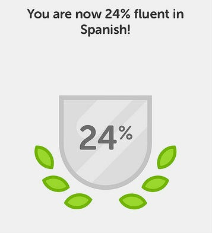

I wanted to give an update on my progress learning Spanish followed by my thoughts on the advice being peddled in the blogosphere on language learning.

The last language update I found on this blog was on September 26, 2015. In the post [King of the Road](/2015/09/king-of-the-road/), I mentioned that my _Duolingo_ streak was at 132 days and I was at 6% fluency. I had just finished _Pimsleur Spanish 1_ and was starting _Pimsleur Spanish 2_.

Today I have a _Duolingo_ streak of 346 days and a fluency score of 24%. I should have a streak of 550 days, but that is a long boring story. Now I am halfway through _Pimsleur Spanish 4_. I listen to educational podcasts in Spanish and spend 30-45 minutes a day on a vocabulary app called _Memrise_. Two hours a week I have _Skype_ lessons with a teacher in Venezuela. Yet I am not close to being fluent. And that is OK.

In August 2015, I posted:

> I have no specific goal other than to keep improving. If one day I am fluent, great. If I can only read a newspaper, that is fine as well.

Well, today I can read a good chunk of the news stories on BBC Mundo. Not quickly and I do need to look up words, but I've made a lot of progress.

Now I want to share my thoughts on a lot of the language advice I see online.

### #1 Every Tool Has Successes and Failures

There are many tools to learn a foreign language. Not every tool will work for every person. I think that people are too quick to state their way is right the way because it worked for them. But almost every tool works for at least some people or it wouldn't be around anymore.

This summer I spent 8 weeks taking _Accelerated Spanish 1_ at a local Community College. It was mostly wasted money. I was already beyond the level of the class. Most of the students didn't take it seriously and stopped attending. Even though I got little value from the class, I knew at least two of the students benefited a lot. For me, the apps and YouTube videos were better. They likely signed up for _Accelerated Spanish 2_, whereas I hired a teacher via Skype for one-on-one instruction. Community College is probably a better choice for them, whereas the Skype way is working better for me.

There is far too much debate on which language program is best. Pick something and get started. If you don't like it, grab a different tool, and proceed. And if someone leaves a comment on which tool is best in the comments, then I'll know this blog post failed.

### #2 Enough With the Polyglots

Maybe I'm alone here, but I don't find it encouraging to get advice from someone that speaks multiple languages and can learn additional languages super fast. I find it discouraging. Because even though my goal is to just make progress every day it does get frustrating to see some 25-year old that likely grew up in a bilingual household tackling his 5th or 10th language.

I'm reminded of the old muscle magazine ads where some steroid monster is selling a program on how to get HUGE. I might get huge or I may discover that our monster had an advantage that I didn't have.

### #3 The Keys to Learning a Language SUPER FAST

I've seen the videos and read the books on rapid language learning. There seems to be two keys for rapid learning. Key 1 is it really helps if you've already learned at least one language in addition to your birth language. Tackling your 3rd or greater language is going to be much easier than tackling your 2nd.

The second key as far as I can tell is have no other interests. I've read Fluent in 3 Months. Total immersion is the message of this book. Great. I believe it. But, I have other interests and those interests are unrelated to language. And those interests take time. So indirectly a key to learning quicker is to lose interest in other things.

### Yo soy la tortuga (I am the turtle)

When I approach fitness I often think of Survivorship Bias. Not what is the strategy that will get me the optimal results, but what is the strategy that has the highest success rate. They are two different things. The strategies peddled by the polyglots will absolutely work for some, but most will fail for a variety of reasons. Frustration, time commitment, whatever. They will burn out and quit.

I've added over 30 Friends on the various language apps in the past 18 months. Of those, only about 5 are consistently putting in the effort daily. Instead of being the hare, I decided to be the tortoise. I spend an average of 60-90 minutes a day on Spanish. When I started it was closer to 15 minutes.

Even though the polyglots can achieve fluency in 90 days or less, I haven't. But my confidence grows a little each month that I will someday. The most important thing is I am having fun. I am enjoying the journey. Had I tried to be the hare with a target of becoming fluent in a few months I would have absolutely quit a long time ago.

_If you are learning a foreign language and looking for a Skype teacher, I use italki. Here is my [referral link](https://www.italki.com/i/BaFdbA).  We both get 100 ITC (credits= $10 USD) if you join after you take your first lesson. I use PayPal as I've had issues with their credit card processing._

---

## Comments

### Peter
*November 21 at 2016 at 9:01 AM*

After 10+ years of learning Thai, while living in Thailand, I certainly agree with all of MAS' comments above:

Learning a foreign language is not easy (for most people).
There are no shortcuts.
Most "common sense advice" doesn't work.

The best way is to just keep going, keep trying, keep on keeping on.

I hope MAS will write more about his language learning experiences.

[email removed]

---

### DHammy
*November 21 at 2016 at 2:15 PM*

Thanks for turning me onto DuoLingo, MAS.  It's the best tool I've ever used for improving language development and retention.

For the vast majority of people you will never be fluent without a significant immersion experience.  It's simply a fact.  But a full immersion is not always feasible or desirable and that's fine.

---

### Adrian
*November 22 at 2016 at 1:24 AM*

No for spanish (wich is a language I speak) I was following a similar approach like you with more or less same results.

Rosetta Stone: I learned a lot of constructions, vocabulary and pronunciation but at the at the moment of truth I was not able to connect the dots.

Pimsleur Spanish 1: Nice, I never forgot the expressions I learn using this course and I can recognize them when I listen a conversation. But is slooow, very slow and at some point boring because of this. I mean, lot of repetition.

But then I started with Michael Thomas.I think that my most impressive progress was achieved using this course, although I must admit that it is not the best to develop a good pronunciation.

My current mix is to spend a couple of hours (all in a single weekly session) with Michael Thomas. And Pimsleur to improve my pronunciation while I drive. I think it's working pretty well.

---

### Domingo
*November 22 at 2016 at 7:14 AM*

Yo soy la tortuga.

---

### MAS
*November 22 at 2016 at 2:47 PM*

@Domingo - Thanks. You taught me something. 
http://www.spanishdict.com/answers/191927/tortuga...-what-about-the-male

---

### Chris
*November 22 at 2016 at 5:14 PM*

Hi MAS

You turned me on to Duolingo. I've been doing it for a a couple of years now and my attitude is a bit like yours. I enjoy it, I'm in no rush and plod away with about 15mins a day. 

I need to get into some conversation but find I can cope well enough when we are in Spain for holidays. 

Thanks for getting me started

---

### Arthur
*November 23 at 2016 at 9:58 PM*

Comparing  the meetings on iTalki and Pimsleur, how would you grade each in terms of effectiveness? 

Would you say that Pimsleur helped you "get the base" faster in which point talking with someone on iTalki proved to be more beneficial?

---

### MAS
*November 23 at 2016 at 11:43 PM*

@Arthur - For me I felt I needed more time with Pimsleur before starting with italki, however each person will be different. When I did start with italki, I started at a higher level. I could have started italki sooner at a lower level. 

Pimsleur worked best for me early because I was driving so much in the SF Bay area. 

And although there is only 1 Pimsluer course, there are hundred of different teachers on italki. My experience is just with one teacher so far. 

And Adrian's comment reminded me about Michel Thomas. I found his 8 hour course super helpful for pronunciation. If I were starting over, I would do that either before Pimsleur 1 or Pimsleur 2.

---

