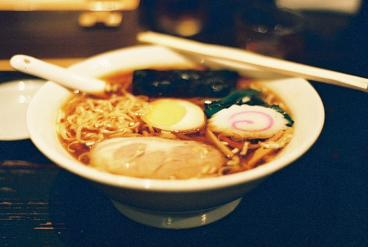

About a year ago I began eating wheat on a regular basis. Not daily. Maybe 1-3 times a week. Fortunately for me I didn't experience any issues. This is great because if we go back to 2009, I was experiencing headaches and skin flareups with wheat consumption. Now I seem to be fine.

Instead of repeating my beliefs, I invite you to read my detailed July 2015 post [Bread Defenders to the Left of Me, Alarmists to the Right](/2015/07/bread-defenders-to-the-left-of-me-alarmists-to-the-right/).

### I Got Tired of Being "That Guy"

In 2013 I started consuming trace amounts of wheat / gluten and I had no issues. But I kept the consumption at the trace level. My goal was to build wheat resiliency and to not retrigger the old headaches and skin flareups. I was taking the position that the dose was the poison.

Everything was fine. I had great health and could easily avoid wheat. Yet the people around me were aware of my needs and it began to bother me that I was causing others to make special accommodations for me, even if it was only a few times a year. I didn't want to be the guy keeping the group from getting pizza or whatever.

I needed to know what would happen to me if I had a full on wheat based meal. So since November 2015, I've been having 1-3 meals a week with some form of wheat. Empanadas, ramen noodles, even submarine sandwiches. When I get asked for an explanation on how I can handle gluten from people that knew me during the 2010-2015 era, I just respond that I cured myself of wheat intolerance.

Do I know if I cured myself? Nope. But I like the word. Maybe it opens a dialog? Maybe others that avoided wheat for years to improve their health might rethink their situation? Perhaps it applies to them or maybe it doesn't. That will be for them to decide.

_[Ramen Noodles](https://flic.kr/p/oXyy) by Taku_

### Last Words

Resiliency both physically and culturally is important to me. I don't plan on eating wheat daily, because I still have some uncertainty, which I've discussed in other posts. But I would like to have ramen noodles or a gyro sandwich every now and then.

In the end, bread is a processed food. The more processed foods one eats the less likely they will achieve a high health outcome. If you want to devote the time and effort to chasing down heirloom grains, soaking, sprouting, grinding and making your own bread - go for it. I'll just have a lot less of the readily available stuff.

I really do think this is my last post on wheat / gluten. I think I've said everything I need to on this topic. I'm no longer trying to convince others that wheat is evil or fine. You'll need to figure that out for yourself.

---

## Comments

### Diana
*December 9 at 2016 at 9:03 PM*

I had the same discovery this year.  I spent some time in Japan this fall and wasn't going to miss out on my favorite foods, so I ate everything, and I was fine.  I thought maybe it had to do with the fact that I was walking so much and somehow my body just processed food better.   Since returning from Japan, I've been eating bread or wheat a few times a week (versus before Japan, eating mostly potatoes and rice, and very little wheat), and I haven't had any adverse reactions to it.  Most of the time I eat a lot of potatoes and beans, but my wheat consumption is much higher than it was before my Japan trip.  I've also noticed that I'm tolerating alcohol better.  I avoided it for the last 4 years, and now I can enjoy a small amount without feeling sick or getting an instant headache.  I'm wondering if it has to do with reduced life/body stress from changing how I work out (CrossFit/heavy barbell lifting 3-4x/week to once a week high intensity strength training) and shifting life priorities, or if it has to do with the fact that I've been eating so many more potatoes than I ever have in my life.  It's probably both, but I'm not too interested in trying to figure it out.  I just want to enjoy Josey Baker's whole wheat sourdough breads regularly, Chinese dumplings, buns, and breads frequently, and cakes and cookies sometimes.

---

### MAS
*December 10 at 2016 at 3:40 PM*

@Diana - Mmm. Chinese dumplings. :)

---

### Dinis
*December 11 at 2016 at 1:25 AM*

First of  all, so glad you're back to blogging! :D

This is exactly my experience. Some friends would invite me over for dinner and would cook a rice dish instead of the pasta, for example, because they knew I "couldn't" (their words, even I wasn't even that strict) eat it. It was very attentionate,  but I started feeling bad about it. 
My reintroduction to regular wheat/gluten consumption was with occasional beers (so many tasty craft beers popping up where I live!), weekend pizza dinner (I still go for the good stuff and avoid chain and crappy pizza) and some Indian breads. 

I've also noticed how much of international cuisine I was missing by avoiding gluten. Just this week I had an amazing Syrian dinner which would have been impossible if I was avoiding wheat. 

I still don't eat it everyday and I never cook anything at home with wheat, but I've been enjoying it when eating out. I honestly don't feel any symptoms after - and I guess I've just let go of the whole "it's killing you silently on the inside!" fearmongering  we often see on the health circles.

---

### Arthur
*December 11 at 2016 at 11:57 AM*

On the processed vs practicality topic, how do you feel about sauces and dressings? Do you buy them ready and limit consumption or make your own from fresh ingredients every time?

---

### MAS
*December 11 at 2016 at 5:56 PM*

@Dinis - I totally agree with you. There are too many interesting cuisines out there for me to be restrictive, especially when I no longer have issues. I think the Peasant Diet gives me enough savings to take part in dishes that if they were my weekly staples might lead to weight gain or intolerance. Just a guess though.

@Arthur - I don't use many sauces. Mustard, sriracha and fish sauce are the 3 that come to mind. I don't make my own. Years ago I made my own Korean chili paste and mayo. Not anymore.

---

### rebroses
*January 4 at 2017 at 3:37 PM*

Your gut lining has probably healed which is why you can now tolerate it. https://michaelgaeta.com/leaky-gut-syndrome/

---

### Johan
*January 10 at 2017 at 3:15 AM*

I agree with Rebroses.

---

### Lynne
*February 22 at 2017 at 6:20 AM*

I'd love to try this sometime but still have skin issues and think it might be best to wait until that inflammation has cleared. Just wondering if you did the same, ie did you still have any signs of inflammation when you started re-introducing gluten?

---

### MAS
*February 22 at 2017 at 5:54 PM*

@Lynne - Yes. Before I experimented with reintroduction, my skin was fine. So was my sleep. Reintroduction in small quantities still has not resulted in any skin or digestive issues. My plan is to still keep my wheat intake well below the national average.

---

