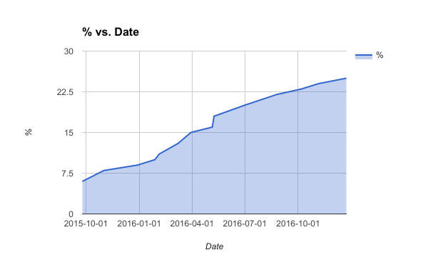
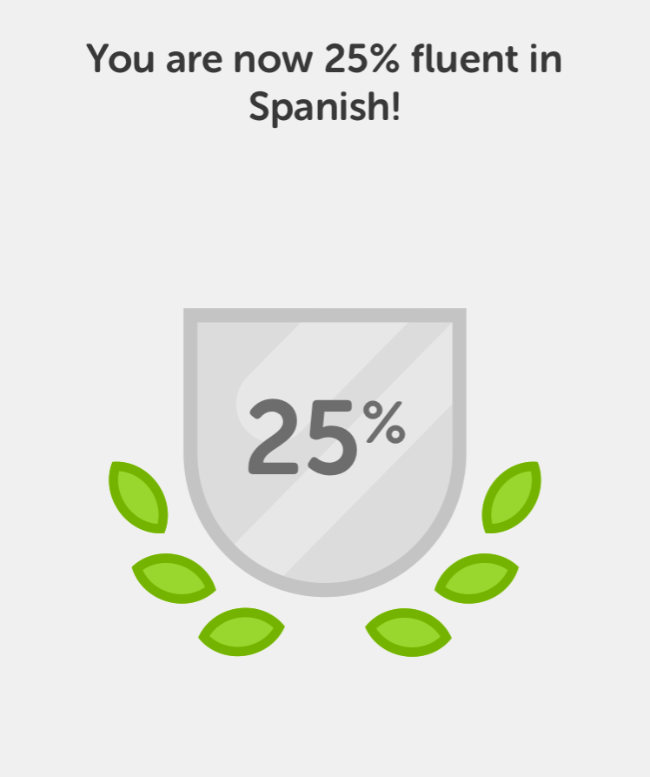

If you use Duolingo you will on occasion get a Fluency Estimate. I've talked with people and read forums online and there is a lot of mystery on how it is calculated. I know of people that got 50% or more fluency that were nowhere near that level. Conversely, I know people near fluent that had lower scores. I have no clue how it is calculated or if it is an accurate measure. What I am providing in this post is my data for other Duolingo users to look at. Maybe it will help them make sense of their own progression. I began Duolingo on May 5, 2015, and have been using it almost every day. On two days when I was driving all day, I used the streak freeze feature. In early December 2015, Duolingo robbed me of my streak. _(Boring story that I won't tell)._ Currently, I am at a streak of 393 days. My level is 21 at 18,644 points. My first fluency estimate came in at 6% on September 5, 2015, which was 143 days after starting. It may have been a new feature then, so I'm not sure if it really took me that many days to reach 6%.  _Duolingo Fluency in Spanish (September 5, 2015 - December 23, 2016)_ NOTE: Whenever I've earned a new milestone fluency level, Duolingo will immediately drop me back down 1-3%. Then I need to re-earn the levels again and ultimately reach a higher fluency score. I find this discouraging, but at least be aware they are doing this. _**UPDATE April 12, 2017:** Since I posted this my account has been capped between a range of 22-25% fluency, despite never missing a day and blasting through most lessons without missing a single question._ _**UPDATE April 19, 2017:** What happened today? My fluency which was frozen in the 22-25% spiked to **36%**! I saw another user on Instagram that jumped 12% today with the Swedish program._

### Duolingo is a Great Tool to Start

Every morning I do my Memrise and Duolingo lessons. Today I discovered that Duolingo is now showing ads when you complete a lesson. The worst part about the display of the ad is they are playing the same sound I would hear whenever I achieved a new higher Fluency Level. They've hijacked my Pavlovian queue. Not cool. _**UPDATE April 19, 2017:** They removed the sound and replaced it with a pause that forces you to look at the ad._  Today I decided to quit Duolingo when I hit my 400-day streak next week. I would have paid for an ad-free version, but now I'm just going to walk away. It was a great tool to get started, but Memrise is a far superior learning tool, especially at this stage. Duolingo is good for beginners, but the marginal benefits decrease over time. If I ever decide to pick up a different language I'll likely do a jump start of 200 days or so with Duolingo, but not as much as I did for Spanish. Until then, I'll be over on Memrise. Follow me [here](http://www.memrise.com/user/digitalcolony/) if you join.  _**UPDATE:** I've decided not to quit as the new chatbots are providing value._

---

## Comments

### Peter
*January 7 at 2017 at 5:19 AM*

I've been using Memrise to study Mandarin Chinese for 30-60 minutes every day for just over a year. Unfortunately Duolingo, which I think is more polished in some ways, doesn't have Mandarin. The Memrise UI is not great, and it has some other irritating issues, but it's the only thing I've found so far that makes me want to study every day, so I guess it's working.

---

### DHammy
*January 9 at 2017 at 7:28 PM*

My fluency is estimated at 59% by duolingo which 'feels' about right to me.  I've had spanish in college and high school.  I used the browser and not the app and don't have to see ads.  Tried to use memrise (on the web as well) and found it extremely repetitive in trying to shove the same complicated sentences down my throat lesson after lesson.  Maybe the app is better?

---

### MAS
*January 9 at 2017 at 8:53 PM*

@Dhammy - Memrise can only be as good as the course you pick. That won't change if you use the app and not the browser. Some courses are much better than others. Not all are sentence based. Some have outstanding audio pronunciation, some sound like they were recorded at a bus stop and some have no audio.

I love the pronunciation on the Spanish (Mexico) series. I started on 3, completed 4 and am currently on 5. A2 Spanish - Beyond Beginner is solid as well.

---

