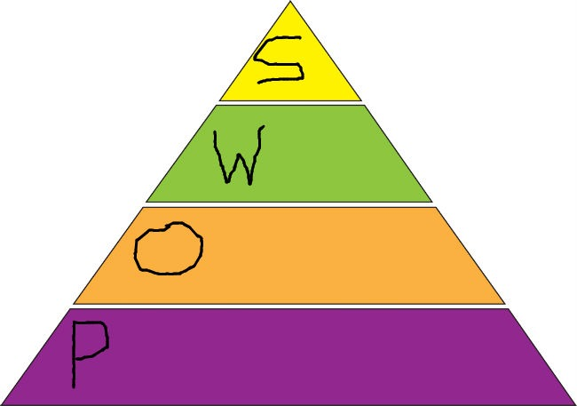

In my [previous post](/2017/01/eat-dont-eat-2017-edition/), I explained how I like the idea of having an expansive approach to food. Still, I also recognize that it can lead to consuming too many bad foods or too many calories. I wanted an eating strategy that I didn't have to think about that kept me full and kept me lean. I not only succeeded, but I did it in a way that saved me time and money.

I developed my 5-level food pyramid.

1.  Peasant Diet
2.  Old School Bodybuilder
3.  World Cuisine
4.  Super Foods
5.  (optional) Modern indulgences

I took the first letter of the first 4 levels and named this the POWS Food Pyramid. The levels are in order from consuming the most to consuming the fewest, so from the bottom of the pyramid to the top. Let us drill into it.

### #1 Peasant Diet

The base of my food pyramid is the Peasant Diet, which I described in the post [Designing a Modern Peasant Diet](/2016/11/designing-modern-peasant-diet/). There I made the case for consuming a large portion of your calories using foods traditionally associated with peasants. Think potatoes, beans, oats, etc. Nutritious and dirt cheap. I do want to stress these are traditional peasant foods, not the foods consumed by poor people today. So no french fries and Mountain Dew.

Legumes can be time-consuming to make for true peasants, but we all have pressure cookers. [Right?](/2014/09/pressure-cooker-game-changer/)

### #2 Old School Bodybuilder

There was a time before the Internet when a group of mostly men worked hard on developing some of the most amazing physiques to ever walk this planet. I'm thinking of the bodybuilding era from the 1950s up to the 1980s. Not the steroid monsters we see today, but the classic physiques.

Without access to the information we have today, they figured out how to sculpt amazing bodies. They weren't in chat rooms arguing about the most minute details. They were hammering out the basics day in and day out. And they got damn good results. Let us set aside the training debates for now. On food, they consumed a lot of protein. Eggs, tuna, cottage cheese, ground beef, chicken breasts, turkey, and seafood.

Most people associate higher protein intake with building muscle, but higher [protein suppresses appetite](/2014/07/just-count-protein-fat-loss/). It helps you get lean and getting lean makes your muscles look bigger.

There is a lot of crossover between the Peasant Diet and the Old School Bodybuilder. For my clarity, I envision the Peasant Diet as more carbohydrate-based and the Old School Bodybuilder more focused on protein. Whenever I don't separate the two in my mind, I tend to under-consume protein.

### #3 World Cuisine

If one only ate food consumed by peasants and 1970s bodybuilders, life would be pretty miserable. One of the things I love most about modern life is that I have access to foods consumed by people all over the world for hundreds or even thousands of years. Thanks to the internet and globalization, I can try so many different cuisines via restaurants and ethnic grocery stores that were not around when I was a kid in Central Ohio. Now add ideas from YouTube, cookbooks, and food shows and the number of food possibilities is enormous.

There are two keys to this section of the POWS Food Pyramid. First, the cuisines need to be as traditional as possible. Just because some deep-fried flour thing is the rage somewhere in Asia now, doesn't make it a candidate for this tier. Ask if it was popular 50, 100, or 200 years ago. Aim for dishes that have been altered less since industrialization. In other words, avoid the high heat foods cooked in oils. Favor soups and slower-cooked foods. Those who follow a Weston A. Price diet are aware of how to make many traditional American dishes. Now take that thinking globally.

The second key is moderation. If I had the metabolism of an Olympic swimmer, almost 100% of my calories would be in this tier, but I'm not, so I need to be realistic. I need to consume a majority of my calories from the Peasant Diet and Old School Bodybuilder to create a calorie deficit that I will spend here.

### #4 Super Foods

If 60-70% of my calories are from staples that I'll consume repeatedly, there is a possibility that a few nutrients could become underrepresented and since there is no guarantee that I'll get them on my World Cuisine visits, I created this tier as extra insurance.

Super Foods are not going to be a high source of calories, but they will be a high source of nutrition. Bone broth, offal, oysters, natto, ginger, kelp, garlic, and mushrooms are the foods that first come to mind. [The 150 Healthiest Foods on Earth](/2008/03/150-superfoods-because-14-just-wasnt-enough/) is a book with more ideas.

Nutrient density is a topic that is popular in nutritional blogs. I like to also think of nutrient diversity. This means from the group of Super Foods, rotate your selection. This is the opposite of the staple approach used to get the bulk of our calories in the Peasant Diet and Old School Bodybuilder. That is by design. We should spend the least amount of time, thought, and energy with those calories.

### #5 Modern Indulgences (optional)

The least amount of your calories should go towards processed industrialized calories unless you desire to gain weight or feed a very active lifestyle. If I were one of those guys running 50-mile races in the desert, you can bet I'd be consuming a fair amount of calorie-dense processed foods. But I don't, so I keep this tier as small as possible.

### Using the POWS Food Pyramid

Unlike the USDA Food Pyramid, I am not assigning a number of portions to each tier. The reason is we all have different needs. For someone trying to lose weight, increase the percent of calories on the Peasant Diet and Old School Bodybuilder tiers. For someone more active who needs more calories, increase the calories from World Cuisines and Modern Indulgences.

### Why POWS Works

POWS takes advantage of three proven nutritional principles that work for fat loss and weight management.

1.  Higher-volume foods are more filling. Peasant foods such as potatoes and legumes are filling at a much lower calorie level than most foods. Displacing calorie-dense foods with high volume low-calorie food works at a hormonal level. (see [Eating for Volume to Loss Weight](/2015/05/eating-for-volume-to-lose-weight/) and [The Potato Diet is a Calorie Savings Account](/2016/11/potato-diet-calorie-savings-account/))
2.  Protein suppresses appetite. This is the Old School Bodybuilder tier of eggs and tuna working. (see [Just Count Protein For Fat Loss](/2014/07/just-count-protein-fat-loss/))
3.  By having a high percentage of weekly calories as "OK tasting", you greatly reduce your exposure to _hyper-palatable_ foods.

The POWS Pyramid saves you time and money and if you calibrate the ratios right you'll get fat loss without hunger. You can read the excellent book _Forever Fat Loss by Ari Whiten_ for the science that supports the statements above.

I've been doing a variation of the POWS for over a year and it works. I've saved money, calories, and time.

---

## Comments

### Jeremy
*January 23 at 2017 at 11:07 AM*

Michael,

This is such a fantastic approach to eating; for it takes into account the many variables and avoids getting stuck in the minutiae which too many people fall victim too. There are many lessons to be learned from previous generations which you correctly highlight and outline.

Whilst you have correctly aligned food choices to your preferences and own; the only note I would add is that POW's should be adapted for the individual. It should be viewed more as a template that needs be adapted to suit an individuals own biochemistry. For example, what the peasant diet may be for some - milk, eggs, cheese ( thinking northern European ancestry here), it may be entirely different for others - rice, seafood (thinking Asian populations). I think its about finding the optimal foods. Food intolerance, digestive upset and the like should be considered.  

All in all this is great and something we can all learn from.

Keep up the good work Michael, love you your work

Jeremy

---

### Øyvind
*January 23 at 2017 at 3:10 PM*

Great post, MAS! Enjoyed the simple, yet well thought out reasoning behind your pyramid. Food (pun intended) for thought!

As an aside, I really like your mobile site. Snazzy.

---

### MAS
*January 23 at 2017 at 7:21 PM*

@Jeremy - Thank you! When I started this post I thought it would be 500-700 words. Then it went to 900. Then to 1,200 and I was still fighting the urge to write more. Each section could probably be tripled in length, but I wanted to keep it accessible. 

@Øyvind - Thank you! Glad you like the mobile. Mobile traffic now makes up 40% of my traffic, so it is important to me that all my sites look sharp on mobile.

---

### Geoff
*January 24 at 2017 at 12:29 PM*

Love this model, MAS.  One thing that really appeals to me is the window it opens up very naturally on meal planning.  Many nutritional plans are ingredient-focused, but leave little guidance on how to actually plan a meal beyond a few proffered example dishes.  POWS seems to take a larger view.

While reading the image of a meal of cajun dirty rice with a small side of kimchi kept springing to my mind (P - rice and veggies, O - lean chicken muscle meat in the dirty rice, W - kimchi, S - offal in the dirty rice).  Other combinations are easy to fit into this template - a big bowl of bone broth-based split pea soup garnished with some crumbled seaweed and a side of cottage cheese was another image in my mind.  Thinking about POWS across a meal - or an entire day - is something that a lot of nutritional templates miss.  Great contribution.

---

### MAS
*January 27 at 2017 at 2:38 AM*

@Geoff - I've been thinking about your comment. In your example kimchi just happens to be very low calorie and filling. So it works in that example. However, usually World Cuisine meals should be separate and appreciated on their own. I'm thinking it is usually wise not to blur the lines. I want to build that deficit with Peasant and Old School BB first, so when i do sit down for a World Cuisine I can enjoy it as is without diluting that experience.

---

### Ondrej
*January 28 at 2017 at 10:34 PM*

Forever Fat Loss: Sleep, Move, Real food. Matt Stone: Sleep, Move, Train hard infrequently, Eat. Doug Mcguff: Sleep, Real Food, HIT. Alan Aragon: Count macros to get to your target body weight, lift 3x a week. 

There are only so many moving parts. My list is: Sleep, HIT 1x a week, walk 30 min 6x a week, Eat. 

That said I may try bodybuilding routine soon. New gym opened up 10 mins walking distance from my house, run by husband and wife who compete at international tournaments in bodybuilding and appear in magazines. Maybe the practised bodybuilding routine could be the ultimate recipe through it's effect on abdominal dat and myokine production, as well as calorie burn and post exercise consumption. 
I almost started to ruthlessly count macros in simple fashion after reading Lean Muscle Diet by Aragon/Schuler, but re-reading Matt Stone always stops me.

---

### tml_mpls
*February 3 at 2017 at 9:07 PM*

Great article (man I've missed this blog). I've always been focused on a wholefoods/wapf/paleo approach and this makes me want to learn more about the old school body builders and the body builder approach to diet in general. Can you recommend a good book length treatment of this? I'm probably going to try "Burn the Fat, Feed the Muscle" but would love to hear any suggestions.

---

### Ondrej
*February 3 at 2017 at 9:54 PM*

If you mean Tom Venuto's book, I have it. Not bad, but he's generally in the same camp as Schoenfeld, Aragon, Contreras...they mostly count macros. So it's not really the old bodybuilder approach. Also, the book has many little suggestions but I wasn't impressed. It's kind of generic to be honest.
Stephan Guyenet will publish The Hungry Brain on 7th Feb, that should be about food, satiety, designing your food exposure, environment etc. Ari Whitten's book Forever Fat Loss is pretty decent too.

---

### tml_mpls
*February 3 at 2017 at 10:39 PM*

Yeah, that's what a bit of searching on Amazon got me. Would be curious about something written earlier more inline with what Mas is talking about if its available. I'm less interested in adopting the approach wholesale and more curious to just have something to study and learn from. 

Hungry Brain and Forever Fat Loss are also now on my wishlist. Thanks for the suggestions

---

### MAS
*February 4 at 2017 at 3:32 AM*

@TML_MPLS - I don't have a book recommendation for the Old School Bodybuilder tier. My understand was they kept it simple. They did a higher protein diet with lots of staples they ate over and over again. They unknowingly figured out a lot of stuff that nutritional science continues to validate.

1- high volume food
2- more protein
3- less palatibilty

POWS aims to keep the Peasant and Old School Bodybuilding tiers as simple as possible.

---

