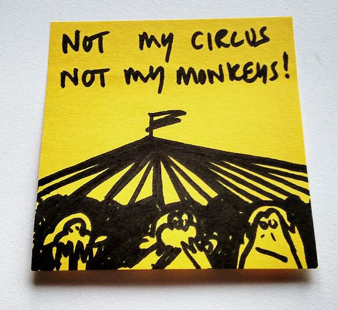

Over the years as my interests have changed so have the topics on my blog. From hiking to financial to fitness to nutrition to cooking to whatever sparked my curiosity. But there is one huge exception and that is economics. For the past 5 or 6 years I have spent a considerable amount of time learning more about economics. Podcasts, articles and books. I didn't have a goal in mind. It was just something I gravitated to as my interest in finance was fading. Yet I almost never post about economics unless it relates to a topic that is [connected to me personally](/2014/05/getting-nothing/). The [EconTalk](http://econtalk.org/) podcast continues to be my favorite source of economic knowledge. Often times I would end up reading the books by the guests to further my understanding of the topic. _([NPR's Planet Money](http://www.npr.org/sections/money/) is pretty good too. Never cared for Freakonomics.)_  _Photo by [Paul Downey](https://www.flickr.com/photos/psd/21654256458/)_ A while back someone asked my why I don't discuss economics on this blog. The reason is that early on I realized that people are biased to their core on their opinions of government and the free market and that will cloud how they will approach any economic topic. It is just like politics. Whatever your belief is you can certainly find data or information to support that belief. And that isn't just true with average people like us, but some of the top economists of the last 100 years. The [Keynes vs Hayek](https://www.youtube.com/watch?v=d0nERTFo-Sk) battle is still being debated. I have my own bias, which I am aware of, and I know that I'm not going to convince anyone of anything. And if I did, so what? As energy draining as all those fitness posts became, I'm certain that tackling topics on economics would be magnitudes worse. Trying to [convince a CrossFit enthusiast of SuperSlow HIT](/2012/02/responding-to-a-crossfit-enthusiast/) - as difficult as that sounds - would be much easier than trying to defend a free market principle to someone that doesn't trust free markets. So, why bother? Learning about economics has helped me become a better decision maker. Not just with matters of time and money, but also approaching topics such as nutrition where I believe I have incomplete information. And that is good enough for me. Opinions are becoming more and more dangerous. Hold the wrong one at the wrong time and you can expose yourself to serious backlash. If there is little to no upside in sharing a controversial viewpoint, but it does carry downside risk, why bother? It makes economic sense to stay silent.