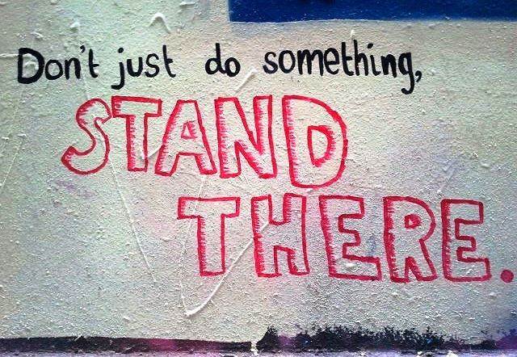

After the post [Is There a Metabolic Unicorn?](/2017/02/is-there-a-metabolic-unicorn/) I decided to revisit the topic of metabolism again as if I knew nothing. I'm also doing this at the same time that I'm reviewing some of my older posts about the role of exercise in fat loss.

Back in 2012, I did a [5 part series](/2012/04/walking-didnt-lean-me-out/) where I dismissed the role of exercise in fat loss based mostly upon my own experiences and what I was seeing with others. Without going back and reviewing those 5 articles, my belief in short was:

-   As we increase our exercise, appetite will rise to meet the additional energy demands. Maybe not initially, but over a longer time frame. This is a healthy response that makes total sense. But we can never out exercise our appetite.
-   Most of the studies that I saw back then that championed the role of exercise for fat loss I felt had flaws. The first was they were usually a short time frame. Weeks or months. Not years or decades. They also were often done with younger people who can recover faster from injuries and have other advantages. Which brings me to...
-   When we get sick or injured or life interrupts our training, appetite is slow to drop to our new energy output. So the gains we made early in our exercise program can easily get wiped out and more.

If my assumptions were accurate there are two ways to respond.

1.  Keep increasing calories and activity until you get to a high enough level that you can achieve [G-Flux](https://www.precisionnutrition.com/all-about-g-flux). For this to work you can't get injured, sick, or sidelined for too long. In G-Flux, the body finds it inefficient to carry around extra fat, even at a high-calorie level. This is different than Matt Stone's Metabolic Zone in that it requires a high level of activity. I don't see this option as realistic for 99% of us.
2.  Perform the most sustainable level of exercise you do that minimizes injury risk during the fat loss period. This would be something you can do on normal weeks, busy weeks or even travel weeks if you travel frequently.

Although I don't think my 5-year-old posts are wrong, I now feel based off my current reading that they are incomplete. Before we go further, I want to repeat that there are many great reasons to exercise. Just because it isn't the best for fat loss, doesn't mean I'm against exercise. I highly recommend exercise that is [safe and sustainable](/2012/04/fat-loss-and-high-intensity-exercise/).

### Fat Loss and Metabolism

What I was unaware of until recently is that humans have an energy conservation tendency when they lose weight. This is likely a survival technique. From [Why Is It So Easy To Regain Weight?](https://weightology.net/why-is-it-so-easy-to-regain-weight/) by James Krieger:

> We know that weight loss will decrease energy expenditure from the simple fact that you have less weight to move around.  However, the question is whether the decrease in energy expenditure is proportional to the weight lost, or if it is greater than what you would expect given the weight lost.  If the decrease is greater than what you would expect, then that means your body is adapting to the weight loss and trying to conserve energy.  In other words, you become more efficient.

The article digs through the numbers of a few studies to show that the **dieters are conserving energy**. So in addition to having a lower metabolism from losing weight, they are now in a position that makes weight regain much easier because they require even fewer calories than people at their same weight that never dieted - because they are conserving more energy output.

Read the entire article. It was eye-opening for me. The author makes a mathematical case that people that lose weight are likely to regain the weight unless they increase their activity, specifically NEAT. NEAT is Non-Exercise Activity Thermogenesis. Which [PubMed defines](https://www.ncbi.nlm.nih.gov/pubmed/12468415) as:

> ...is the energy expended for everything we do that is not sleeping, eating or sports-like exercise. It ranges from the energy expended walking to work, typing, performing yard work, undertaking agricultural tasks and fidgeting. Even trivial physical activities increase metabolic rate substantially...

I got some push back this weekend when I discussed this energy conservation theory on why regaining weight is common. I was told that when people lose weight they feel more energetic and exercise more. This may be true in some cases, but weight regain is real and these studies are convincing to me. They also make the case for focusing on the NEAT.

The times in my life when I exercised the most were also the times when I sat for long periods. I didn't think about it at the time, but it was like my body went into an energy conservation mode as soon as I left the gym. And as the article concludes, the decrease in activity came from NEAT not exercise.

Krieger followed up that article with another titled [Physical Activity and Weight Regain](https://web.archive.org/web/20170713101253/http://weightology.net:80/weightologyweekly/index.php/free-content/free-content/volume-1-issue-10-insulin-physical-activity-and-weight-regain/physical-activity-and-weight-regain/). Both are excellent and worth reading.

_[Photo](https://www.flickr.com/photos/mc_speedy/7471866830/) by MC Speedy. Don't sit so much. Standing is a start. Walk a bit. Take the stairs._ 

### Reconciling My Views with NEAT

When one starts a fat loss plan it is important to know what can cause failure. If we know that NEAT declines and that we can greatly increase the chances of keeping off lost weight, then **gradually building habits that increase our NEAT throughout the diet is an essential strategy.**

Focus on the food first. Then as the pounds start coming off direct your attention more towards increasing movement.

---

## Comments

### Audacity17
*March 14 at 2017 at 6:06 AM*

I recently read Ray Cronise's paper on oxidative priority. 

http://online.liebertpub.com/doi/full/10.1089/met.2016.0108

Fuel type usage is inversely correlated to storage capacity.  If the body has a hard time storing it(alcohol, amino acids), it will burn those first, storing glucose in glycogen and fatty acids on the hips.
Further, it seems that the more intense an exercise is, the more glycogen one uses.  It also increases hunger.   Of course, this is not why most people exercise.   So it seems to me that walking a lot offers the best way to burn fat, without becoming hungry.

---

### MAS
*March 14 at 2017 at 6:08 PM*

@Audacity17 - Interesting. I just heard the opposite in a podcast with Lyle McDonald. One his site he has this article.

http://www.bodyrecomposition.com/fat-loss/steady-state-versus-intervals-training-and-fat-loss-explaining-the-disconnect-pt-2.html/

<blockquote>...at least one data point shows rather clearly that high intensity activity tends to blunt hunger more than low-intensity activity.</blockquote>

That has been my experience. My hunger was much more in check when I did a Big 5 Body By Science workout 1-2 times per week than when I was running, even though my body composition was better on the lower BBS workout.

---

### MAS
*March 14 at 2017 at 6:34 PM*

And this... https://sigmanutrition.com/episode65/

---

### Audacity17
*March 14 at 2017 at 7:03 PM*

I actually had a huge question all lined up for Lyle regarding his excellent article:

http://www.bodyrecomposition.com/fat-loss/how-we-get-fat.html/

And then Ray dropped his paper,  confirming pretty much what Lyle said in his article.

     I then asked Ray about lowering glycogen levels through weight lifting, in an attempt to prevent excess glucose from being burned instead of fat.  It seemed to me that glycogen levels are a bit like fuel in your car.  99% of the time your car is neither full, nor empty.  So, keeping it lower would result in glucose being shuttled into stores, so the body can keep burning a mix of glucose/fatty acids.   There is an old paper that seems to show when glycogen stores are lower in the morning, the respiratory quotient(RQ) stays in the fat burning range when consuming carbs.

https://www.cambridge.org/core/services/aop-cambridge-core/content/view/S[phone removed]000374

Ray claims that the area under the curve(AUC) is greater for fat loss if one avoids depleting/repleting glycogen stores, eating just enough to stay out of ketosis.

---

### MAS
*March 15 at 2017 at 1:08 AM*

@All - This is another excellent resource on the topic of weight regain. 
http://sigmanutrition.com/episode158/

---

### Pauline
*March 19 at 2017 at 11:25 PM*

This article on why women were slimmer in the 1950s really struck me.  The amount of physical activity that was actually done in a day was much higher alongside a different eating pattern.  General activity levels are markedly lower nowadays because life has changed and become so different that we have to create more activity consciously :

http://www.dailymail.co.uk/health/article-191200/How-1950s-women-stayed-slim.html#ixzz4Y2MAfAFQ

---

