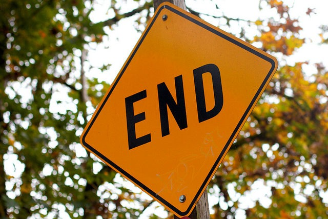

The deeper I get into nutrition, the more I realize I have no business blogging about it. There are nutritional researchers and bloggers online that are far more knowledgeable than me. There are also some charlatans that appear to be experts. I no longer want people to trust that this blog can tell the difference between the two groups. I've been fooled a few times and although I'd like to think I'm smarter now and won't be fooled by others, I can't promise that. Something CarbSane said on a podcast really struck me. She said that health bloggers have a tendency to over report their successes and under report their failures. As much as I wish that wasn't true with me, it has been. When things were going their best were the times I posted the most. I had things figured out. When things didn't go as well, I spent more time looking for answers and less time posting. But the reader doesn't see both sides and this could be problematic if they were inspired to take the same path as me based on my writing. I don't want that to happen. My journey went from finding the optimal diet to constructing a diet that was likely not "too wrong". The funny thing is when I go through 15 years of data, I see that I was weight stable within 10% and usually 5% despite following wildly different diets. So I'm thinking my energy would be better spent focusing on something else. Best of luck meeting your nutritional goals and not getting fooled by the charlatans.  [Photo](https://www.flickr.com/photos/cogdog/14969158593/) by Alan Levine

---

## Comments

### Ondrej
*March 24 at 2017 at 6:15 PM*

Well at least you settled on what is best supported by current science. Although you'd be surprised how many doctors dismiss studies as well, money dictates the outcome more often than not and we saw in the past that tradition sometimes overrides progress, although progress eventually wins (example: After years of cardio-centred recommendations, resistance training is now part of the guidelines, but it's not the priority and it's not standardized. )

---

### Jim
*March 26 at 2017 at 1:50 AM*

@MAS

As Chris Highcock wrote over at Conditioning research in 2014:

"I've become somewhat disillusioned by much of the drama in the online fitness/health/diet world. The debates are religious in nature with heretics fighting strange arcane battles while 90% of the world just get fatter and less active. 

"I am also less inclined to give much attention to the alternative, new or faddish approaches. Ecclesiastes has it right - there is nothing new under the sun. Certainly the science is interesting and is discovering things, but there is little justification for the tabloid excitement about some new diet or exercise.

---

### Ondrej
*March 26 at 2017 at 12:39 PM*

Also, whether you eat POWS, Paleo, Real Food, the plate is kind of the same, half animal, half plant, unsweetened beverage. I don't see much difference between what you eat and the HIT crowd eats. Were they right all along?

---

### MAS
*March 26 at 2017 at 2:30 PM*

@All - To be clear this post was just about nutrition, not fitness. I still think the vast majority of the fitness community is getting it wrong, by not solving for safety first and dismissing injury risk as something that can be be avoiding by always having perfect form . (aka The Myth of the Perfect Rep)

@Jim - Chris was always ahead of me. Sometimes months. Sometimes years. :) 

@Ondrej - I don't know. That is the point. I don't have the counter factual data. There isn't a version of me that stayed mostly vegetarian or a version of me that stayed lower carb by which I can compare outcomes. I'm guessing that difference is likely small, but I don't know. 

What troubles me is that the difference might not be small for someone reading this blog and their outcome could become worse. 

Reading those comments over at 180D recently just made me sad. These people are in an awful state following advice that I now deeply question and I suspect that their outcome is going to get worse. But sprinkled into the comments are positive stories. Just enough to give the reader in poor health hope that maybe - just maybe - that blog holds their answer. 

I figured a clean break from the topic was necessary.

---

### Geoff
*March 26 at 2017 at 3:01 PM*

MAS -

While I completely understand your motivation to cease nutrition blogging, I hope that you will still continue to blog about food - the experience of preparing it, sharing it, and eating it.  I've enjoyed your posts on Korean food, fermentation, and intermittent fasting and learned a lot from them that I tested in my own life.

Also, while I imagine the quotes around "too wrong" were intentionally tongue in cheek, might it be better to say "good enough"?  "Not 'too wrong'" suggests to me that there is no good way of eating.

---

### MAS
*March 26 at 2017 at 3:15 PM*

@Geoff - Thanks. I doubt I will be covering IF again. There are much smarter supporters and critics than me. 

I use the term "too wrong" because I'm viewing my decisions like an investor putting together a portfolio. The investor wants and believes that their allocation is solid, but they also know they won't get every pick right. So their goal is don't be "too wrong". By not being too wrong year in and year out, you win. "Good enough" to me sounds like a kid a that completes their homework at the last minute just to get credit. :)

---

### Ondrej
*March 26 at 2017 at 4:20 PM*

The problem with Matt Stone is his advice probably doesn't lead to being lean or at least normal BMI. And it seems that real food partially overrides the starvation response. Skyler Tanner, Doug McGuff, James Steele have had lean bodies for years now and we don't see it hurting their career through adverse effects etc. 
Also I always think...if real food is bad for you long term because too little calories, deprivation, orthorexia...why the tribes are ok and lean? Just because they don't know hamburger?  I personally eat what I want and this kept my body decent but not lean and I want to be lean. I don't want to wait three more years for magical unicorn. Likely won't happen. Some restraint has to be implemented, probably what I said: protein/plants and water.

---

### Carolyn
*April 2 at 2017 at 2:00 AM*

Protein/plants and water. I keep saying that is the way for me but why is it so hard?
As I get older I want the nutrition debate in my head to stop and I want to chill out with food and enjoy every bite. So far, I haven't been able to, but I keep trying.
I totally understand the step back in blogging about nutrition and health. There are apparently many good ways to be healthy except spending a major part of your life thinking about it which it doesn't deserve.

---

