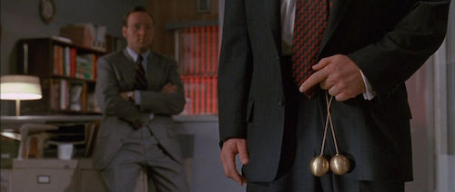

Tim Steele, the author of The Potato Hack, has created an event called End of Summer Potato Hack. It begins tomorrow (Monday, August 14, 2017) and lasts 3 to 5 days or whatever works best for you.

> As summer winds down, I thought this would be a great time to get everyone together for a couple days of potato hackin’. Who’s in?

I'm in!

Back in November 2015, I did my first Potato Hack day. I detailed that experience and the math in the post [No Hunger Games - A Day of Just Boiled Potatoes](/2015/11/no-hunger-games-a-day-of-just-boiled-potatoes/), Since then I have completed 2 extended Potato Hacks of 3 and 4 days. I'm hoping to make 5 days this time. For the record, Day 2 is the hardest for me.

In a normal week, I spread out my meals of cold-boiled potatoes. This is a great maintenance strategy for weight, but not nearly as powerful as doing the full day or a multi-day hack.

It is so much more than calories.

You are building mental toughness by forgoing food flavor novelty. Think of this as a muscle most people will never exercise. Building that muscle will have benefits beyond your physique. It will make other challenges of willpower seem less difficult or even trivial

If you want all the details about The Potato Hack, read the book by Tim Steele. I own the Kindle version. The book is both informative and motivating.

_The Potato Hack: Weight Loss Simplified_

In the post, [The Potato Diet is a Calorie Savings Account](/2016/11/potato-diet-calorie-savings-account/), I gave the logical argument on why a potato hack is such a benefit in an environment of foods engineered to be increasingly more and more flavorful.

Now I want to make the case from a different angle. But before I do, I need to clear the room. If you already are at your perfect Adonis weight, have perfect food willpower, or still hold delusions that carbs are evil, you can stop ready now. This post isn't for you.

### The Potato Hack Mindset

Most of us have been in a situation where we were having a meal at a nicer restaurant where someone brought along young children. Maybe they were your kids. Then those children proceeded to throw a tantrum when the place didn't serve chicken nuggets or macaroni or whatever they demanded at that moment.

We forgive the children. They are growing. Both physically and emotionally. But we're no different as adults. We just hide it better. **Instead of throwing spoons on the floor for not getting the one dish we want, we insist that every meal we have must be something that tastes good.** But because so many foods now taste good to us and we control our own money, we never have to experience that internal tantrum. In many ways we are as emotionally weak about food as the toddler, we are just able to hide it better.

Food is for survival first. Your survival does not depend on how much you like the food. If you are carrying extra weight it is because you took more calories and more flavor from the environment than you needed. **Your silent tantrum was to keep eating more and more flavors.** You got heavy. You got weak.

The Potato Hack is much more than a means to lose a few pounds. It is about resetting your relationship with food. You will recognize the power flavorful food has over your thinking. It is time to get the upper hand.

Most people laugh when I tell them about The Potato Hack. It is a defensive laugh. We laugh at ideas that threaten our identity and those that might expose our own weaknesses. **The weakness here is how our brains have been wired by modern society to seek out highly flavorful food at every damn meal.** **It is time to kill the weakness. The potato is our weapon!** 

### Research Later, Start Now!

People like us that read and write health blogs have this tendency to research things to death. Unless it is a difficult problem, it usually isn't necessary. It is often an avoidance strategy. We haven't started, but we're looking into it. Maybe next week or after this milestone. Research some more.

My advice is to start now. Go get your potatoes now and start. Research during the hack. It will be more motivating that way. You'll be fine. You'll be better than fine.

Need some motivation? A kick in the ass? Watch this speech from the movie _Glengarry Glen Ross_. It is about sales and excuses. For me, it is about toughening up and taking charge. Stop being weak.

_[Always Be Closing (HD)](https://youtu.be/GrhSLf0I-HM) \- Language NSFW._ 

Whose with me? Who will earn their Brass Potatoes? I'm starting on Tuesday. Calories are for Closers!

---

## Comments

### norlee
*August 13 at 2017 at 9:09 PM*

I'm in - cooking potatoes now. I think I will start this evening.

---

### Scott
*August 15 at 2017 at 11:47 AM*

I've been in. When people see me on my 'hack' days and question a meal of potatoes (The Potato Express Microwave bag is also a trusted friend) I try to explain the diet and they look at me puzzled. I point them to this book but also the video by Dr. John McDougall that explains the benefits of Potatoes. They still are puzzled. What they cannot question is the weight loss. 

Get to hackin'  :)

---

### Darren
*August 16 at 2017 at 1:18 AM*

I'm in!

---

### Tim
*August 16 at 2017 at 2:28 AM*

Good job, guys!  I work at a big hospital. Almost every day, around lunchtime, someone will hold up a ziplock baggie full of potatoes and say something corny to me, "Eatin' my spuds, Tim!" "Potato on!" "Down 43 pounds!"

You can't argue with results, that's for sure.  I really never get excited about people's weight loss journey until they've lost a lot of body fat and kept it off for over a year.  I think I see more successes with the potato hack than any other diet.

---

### Jeremy
*August 17 at 2017 at 9:36 AM*

I'm really enjoying your posts on the Potato Hack Michael; particularly all the different avenues in which you are exploring as to their effectiveness. A few quick questions for you, which may help me decide as to whether to pursue it personally:
- how have you found your digestion/elimination to be on just potatoes? 
- have you experienced any muscle wasting?

Thanks in advance Michael, continue to enjoy the site as always.
Jeremy.

---

### MAS
*August 17 at 2017 at 2:15 PM*

@Jeremy - Unlike Tim, I have discovered that I need to cook the potatoes fully or I can sometimes get gut discomfort. 

I'm not monitoring muscle right now. It isn't a concern though because muscle can always be regained easily. Earning muscle is hard. Thanks to muscle memory, getting it back should not be an issue.  

https://criticalmas.org/2009/01/how-mickey-rourke-gained-27-pounds-of-muscle-for-the-wrestler/

---

### Blake
*March 30 at 2025 at 12:53 PM*

We're adding a little something to this month's sales contest. As you all know, first prize is a Cadillac Eldorado. Anybody wanna see second prize? Second prize is a potato peeler. Third prize is you're fired.

You get the picture? You laughing now?

You got potatoes. Mitch and Murray paid good money. Get those potatoes and boil them. You can boil the potatoes you're given? You can't boil squat! You are squat! Hit the bricks, pal, and beat it, because you are going out!

A. B. C.

A. Always
B. Be
C. Cooking

Always Be Cooking Potatoes!

---

