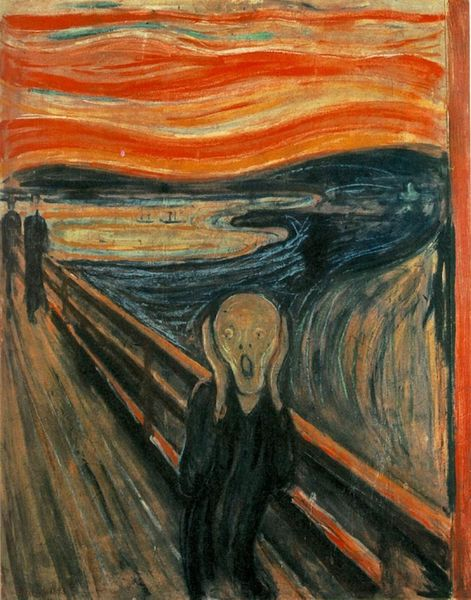

Shortly after I posted [5 Foods That Were Key to My Fat Loss](/2017/08/5-foods-key-fat-loss/), I realized I had forgotten to include a food I never thought I would buy, let alone become a staple.

#### Fat-Free Plain Greek Yogurt

The people in my non-defunct Weston A. Price Group would be in shock if they knew I changed my position on a food I once reviled.

_[The Scream](https://en.wikipedia.org/wiki/The_Scream) via Wikipedia_

### When Health Goals Collide

Right now two of my current health goals are to lose weight and to eat traditional whole food. Fat-free yogurt is hardly traditional. It is a product of industrialization that I am able to eat Greek Yogurt stripped of fat.

Even though the fat in Greek yogurt is perfectly healthy, the fat-free version has much more protein. And increasing protein is an effective tool to reducing appetite to lose weight.

See the chart on [Whole milk yogurt vs. fat free yogurt](https://nutritionovereasy.com/2016/02/whole-milk-yogurt-vs-fat-free-greek/)

> Greek yogurt kills it on protein, with 2.5 times as much per serving.

In this scenario, I decided to side with my primary goal of losing weight over my goal of eating traditionally. The reason is I see the fat-free yogurt as a tool to get to a target quicker. Once I've achieved and maintained that lower weight, I can reassess my yogurt decision, which I suspect means I would return to eating the full-fat varietals.

### How I Eat Fat-Free Greek Yogurt

When I'm away from the house is the time I am most likely to be tempted to go to a restaurant. Since my goal is to both save money and calories, I needed something that would crush my appetite and do it cheaply. Two little containers of Fat-Free Plain Greek Yogurt works out to 30 grams of protein and I never spend more than $2. This buys me a few hours. Enough time to get back to my kitchen.

Running into grocery stores and eating 2 little containers of fat-free yogurt has saved me thousands of calories. All you need is a spoon and I grab a plastic one in the deli area.

I wish the whole fat yogurts had more protein, but they don't. I don't dislike the taste of fat-free yogurt because it really doesn't have any taste. That is likely working in my favor as well. Fat-Free Greek Yogurt is an effective tool for keeping calories low, especially when you are away from home.

---

## Comments

### Stephen
*August 17 at 2017 at 2:31 PM*

I like the Harris teeter fat free Greek yogurt. I mix in a pinch of sea salt and put a spoonful or two of unsweetened apple sauce on top. I might put a dollop or two of siracha sauce on top if I'm in the mood for savory. I think mixing in the salt reduces the odd fat free funk. I also eat full fat Faye Greek yogurt- this is the best tasting

---

### Katie
*September 4 at 2017 at 3:04 PM*

It was during my time in a WAP group that I realized they might be wrong about low-fat dairy.  I agree with them that dairy fat is beneficial and shouldn't be avoided but I also like the idea of a fat ration.   

Dairy fats are rationed by design.  If you are given a gallon of fresh milk and skim off the cream this can be made into butter.  What remains will be a lower/non-fat milk that could be cultured into yogurt.  If you buy whole milk yogurt AND butter you are eating a double portion of dairy fat that was naturally rationed prior to industrialization of food.  

I think that there is reason to believe that non-fat cultured dairy CAN be viewed as a traditional food :)

---

### MAS
*September 4 at 2017 at 3:35 PM*

@Katie - Excellent point.

---

### tml_mpls
*October 6 at 2017 at 8:51 PM*

I wonder sometimes if fat-free dairy may be more traditional than we believe. The Siggi's skyr container states that Skyr was traditionally made from skimmed milk after the cream had been extracted to produce butter. 

I haven't really been able to verify the truth of this through other sources, but there is something intuitive about peasants processing milk and using the different components for food products. Just a thought.

---

### MAS
*October 6 at 2017 at 11:38 PM*

@tml_mpls - That makes total sense. There are so many things I need to relearn (or unlearn) from my Paleo/WAPF days.

---

