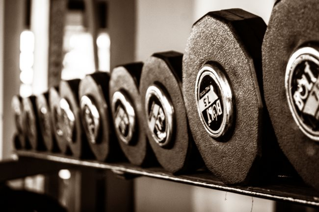

In previous posts, I explored two successful strategies for losing fat. Those are eating foods that are high in volume and low in calories and eating foods high in protein. There are other obvious strategies such as avoiding processed foods and minimize the number of calories you drink, but really those are just extensions of the high volume and high protein methods. Processed foods and liquid calories tend to have very little volume and protein (unless it is a protein shake of course). The high volume approach works by tricking the brain into being more satisfied and less hungry as the stomach fills with volume. This is the genesis on why [The Potato Hack](/2017/08/math-behind-potato-hack/) works so well. Boiled potatoes fill the belly better and with fewer calories than any other food. Legumes and vegetables are also great options to use to lose fat on a high volume approach. I've posted this graphic before. The visual is worth repeating.  _From the article [Here’s why you’re always hungry](https://www.precisionnutrition.com/all-about-dietary-displacement)._ The high protein approach works as well, as appetite drops on higher levels of protein. Many believe that the magic of low carb diets has more do to with increasing protein than reducing carbs. _See my 2014_ post _[Just Count Protein For Fat Loss](/2014/07/just-count-protein-fat-loss/)._ I doubt the first person to come up with this idea. . Until last week, I saw these two strategies as two tools in my fat loss toolbox. Depending on how I felt, I could use the one I wanted. It didn't matter which tool I selected. Turns out that approach was flawed and incomplete. Readers of this blog will know that I have had a strong bias towards using the volume strategy. I love the Potato Hack and the [Peasant Diet](/2016/11/designing-modern-peasant-diet/).

### Learning About the P-Ratio

Last week I listened to Lyle McDonald on the Sigma Nutrition podcast. It was his third time on the show. He is always a wealth of information and I always learn something new. This show was no different. I learned about P-Ratios and mathematically why I should now be favoring a high protein over a high volume approach at this stage in my fat loss. **[SNR #193: Lyle McDonald – Nutrient Partitioning & Fuel Utilization](https://sigmanutrition.com/episode193/)** The P-Ratio is a value that describes the rate at which you gain or lose fat and muscle when dieting or bulking. A 1:3 ratio says that for every 1 pound of muscle gained, 3 pounds of fat will be gained. On the flip side, it also means that when dieting, a pound of muscle is lost for every 3 pounds of fat. The ideal situation is to have high a P-Ratio when gaining and a low P-Ratio when dieting. Besides genetics, which we can't control, a big factor in determining our P-Ratio will be where we are in our fat loss journey. The biggest predictor of our P-Ratio is our body fat percentage. The more fat we carry (higher BF%), the less muscle is lost in relation to fat. However, as we get leaner more muscle is lost as we get leaner. The P-Ratio is a numerical explanation for why the obese lose very little muscle when leaning out and why a lean fitness professional will find it difficult to lose additional fat without sacrificing muscle. The body is primed to store fat at leaner levels.

### Protein to the Rescue

Higher protein during dieting spares muscle loss and this gets more important as you get leaner. In the program, Lyle estimates the protein dieting needs of an obese individual at 1.5 grams per kilo of lean body mass and 3+ grams for lean individuals. Exercise impacts the P-Ratio and sends a signal to the body to build muscle if extra calories are provided. And if there is a calorie deficit to keep muscle and target fat. However, losing fat and building muscle simultaneously is less likely to happen as you get leaner. Lyle explained the math of fat loss and how breaking down a pound of fat is different than a pound of muscle. A pound of fat holds approximately 3,500 calories. A pound of muscle, which requires 2,700 calories to build, only provides 600 calories of fuel broken down. This is why the scale can be deceptive, especially as we get leaner. If you are losing muscle to make the scale move, you are probably less likely to maintain that weight loss and you'll have a reduced LBM. This is why I use a tape measure 3-4 times a week and step on a scale just once a week.

### Revisiting High Volume and High Protein

The lesson I learned here was that although the Potato Hack is a great tool for dieters, it appears the math favors those with higher body fat percentages. Remember potatoes will not only displace bad foods but good foods as well. On a day that I eat nothing but boiled potatoes, I might eat 4 pounds. That works out to just 52 grams of protein a day. Although I'm sure there are benefits to going low in protein from time to time, it likely isn't the best approach for me at this stage in my fat loss. I've already gone from 222 to 198 since March (height = 6 ft 2.5 in). I'm in my upper boundary of ideal. Now I need to increase my protein to lock in my gains. This means scaling back on the potatoes or adding cottage cheese or [fat-free yogurt](/2017/08/fat-free-plain-greek-yogurt-food-hate-love/) to the potatoes to push up the protein. In conclusion, if you have a lot of weight to lose, use both high volume and high protein strategies**\*\*\***. As you get leaner, favor the protein strategy and make sure you are lifting weights. I hope this post wasn't too obvious and of value to someone. Sometimes I need to stare at the math in order to learn a new lesson. **\*\*\* UPDATE:** I altered my view on this sentence. See the post [More Thoughts on High Volume or High Protein For Fat Loss](/2017/08/thoughts-high-volume-high-protein-fat-loss/).  _Photo by [Rishi Barbhaya](https://unsplash.com/@rishi93)_

---

## Comments

### Ondrej
*August 28 at 2017 at 5:45 PM*

Stu Phillips does great research on protein. With high enough protein, they were able to essentially stop muscle loss when dieting, instead of usual 25% loss. Also, if protein leverage hypothesis is true, body needs a certain amount of protein a day a doesn't stop until it's met. If it's via low protein diet, you take more calories in.

---

### MAS
*August 28 at 2017 at 5:49 PM*

@Ondrej - True unless you've tricked your brain via volume foods. Personally, I've lost more weight from a low protein approach (reduced eating window, massive amounts of potatoes, some fasting). This blog post was me coming to the end of that road. Now I need to build new habits.

---

### Jim
*August 28 at 2017 at 11:54 PM*

Interesting.  Seems like P-Ratio is more of a "description" of what happens than an "explanation."  In any event, it's a nice mental framework for looking at the process, and realizing that our reactions to certain diets are dependent on many factors, including how lean we are at the time.

---

