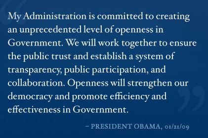
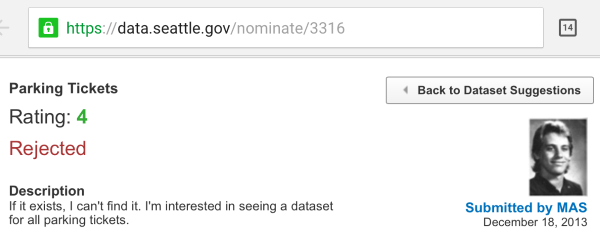
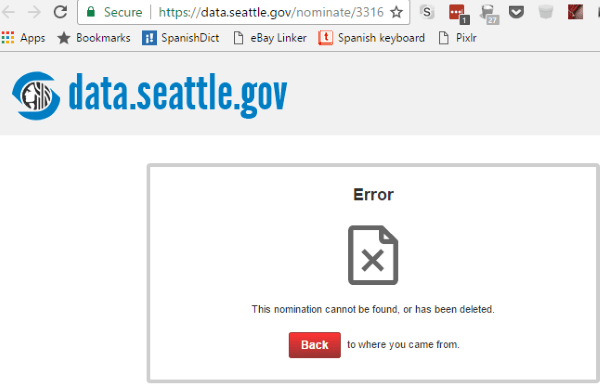

Back in 2013, I was having a discussion with someone about voting. I took the position that mathematically voting was unimportant. I went further to say that we confuse being an informed citizen with being a good citizen. As if the very act of stepping into a voting booth improves the quality of our city, state, or country. It doesn't. During that conversation, I put forth an idea. **What if every person that loved their community, but saw the futility in voting decided to perform an action that actually made their community better?** I theorized that those actions had the potential to greatly improve the quality of life for all citizens. Much more than passive voting. The question I began thinking about was how a citizen could directly make government better. Not by voting, but by doing something. It didn't take me long to come up with my idea for improving my city of Seattle. Since the day I moved to Seattle, I have felt the signage for parking has been atrocious. I've lived in six major metropolitan areas and Seattle is by far the worst. As a result of the confusing signage and signage that wasn't being maintained, I saw a lot of parking tickets being written. Many times I felt empathy for the person getting the ticket if it looked like it wasn't their fault. I felt I could help with the parking problem.  _I took this photo on a sunny day. As tough as it is to read now, imagine trying to read it at night or when it is raining from your car driving by slowly. Welcome to Seattle._ 

### Open Data Initiative

During the Obama presidency, there was a big push for Open Data. From [Data.gov](https://www.data.gov/open-gov/):

> Data.gov is the federal government’s open data site, and aims to make government more open and accountable. Opening government data increases citizen participation in government, creates opportunities for economic development, and informs decision making in both the private and public sectors.

The Open Data initiative wasn't just for the Federal Government, but for all levels of government. States, counties, and cities. There are thousands of databases that are made available to the public. 911 calls to restaurant permits to almost anything you can think of that is related to government. Even volcano vents. 

### My Idea to Make Seattle Better

I was inspired. My idea was to use Open Data to figure out where the citizens of Seattle (and tourists) were getting parking tickets and for what reasons. My theory was that by querying this data set you could drill into the places where the signage was missing or obstructed because the number of tickets written should be higher where the signs are hardest to read or confusing. On my street in Ballard, I often saw cars getting ticketed for being too close to a specific fire hydrant. That fire hydrant was painted green, set back from the street, and was surrounded by bushes on two sides. How many other fire hydrants were obstructed? How many more tickets were being written for this infraction? I could query a database and answer that question and with that answer make recommendations on which curbs should be painted or bushes trimmed. This could reduce the risk that the fire department is delayed in putting out a fire. **In a scenario where seconds count, data could save people, pets, and property.**

### Nominate a Database

The City of Seattle has numerous databases available to the public, but the full parking citations database was not one of them. If a database is not available, there is a procedure in place to nominate one. I followed that procedure and nominated the Parking Citations database on December 19, 2013. (record 3316) At first, it appeared my nomination would be approved. There was a small discussion thread between a few city officials.  Then nothing. Months went by. A year. Other developers voted up my nomination. I sent a reminder to push the nomination back to the top of the queue. Nothing. Two years went by. More developers were asking as well. I sent another reminder.

### Frustration and Fury

Meanwhile, my frustration was growing. Now every time I went on one of my urban hikes, I would see citizens getting tickets for parking infractions that were clearly not their fault. **It was becoming more and more obvious that the city did not want this database made available to the public.** At this point, I want to pause and say that the government is us. The data belongs to the people. City employees do not own the parking citations database. Both Los Angeles and New York City have made their parking citation databases public. Why would Seattle want to hide their Parking Citations database? What is in that data? Look what happened in NYC. Some developers using Open Data discovered that the [NYPD was writing millions of dollars in parking tickets to cars that legally parked for years](http://iquantny.tumblr.com/post/144197004989/the-nypd-was-systematically-ticketing-legally). If you want to see the power of data, follow that link.

### Rejected and Removed

On June 28, 2016, I received an email from the city saying my nomination for Open Data had been Rejected. There was no explanation.  When I went to the website later to gather more information, I discovered that the city deleted my nomination. Like it never happened. So I went back to my phone, which had a cached version of the site taken immediately after the rejection and right before the removal to take the screenshots you see in this post. If you go into the nominate section of Seattle's Open Data site you will see several Rejected nominations. **Why did they reject my nomination without comment and then why did they remove the evidence from their database?** Until someone can convince me otherwise, I believe the City of Seattle is knowingly hiding data they don't want the public to see. Why else would they delete my nomination? My nomination was considered and commented on when I first submitted it. Now it is gone. 

### No One Cares

It has now been almost 4 years since I attempted to make my city of Seattle a better place. During this time I explained my project idea to many people. I explained my vision for what we could learn from the data. I also talked about my frustration with the city for not making the database available. **Overwhelmingly, people didn't seem to care.** They viewed the money that the parking department was stealing from the people - because they aren't maintaining the signage - as money that belongs to the city, not the people. You know, to pay the salaries of the people writing the tickets. This logic baffled me. When I tried to explain that for every $50 parking ticket a citizen pays that is $50 that is not going to be spent in the local community they nod in agreement, but seemed resigned to accept the situation we have.

### Not My Circus, Not My Monkeys

As frustrating as my experience with Seattle Open Data was, my discussions with apathetic citizens bothered me more. I wanted to use my database skills to make Seattle a better place for citizens and tourists. But it didn't happen. They shut me down. I'm confident that someday the _full parking citations database\*_ will be made available to the public. It might be tomorrow or in a decade. When it does, **I hope other developers drill the hell out of that data and look for patterns of fraud**, because I suspect they are there. But, I'm out. All that motivation I had in 2013 to make Seattle better is gone. I still support and believe in the Open Data cause championed by President Obama. I have other ideas on how to make life better for my fellow citizens, but I won't be directing my energy towards improving life in Seattle. _\* There is a 911 parking citations database available, but not the full data set. Other users have pointed this out as well. The most recent being Andy on March 29, 2016 (#5870)._